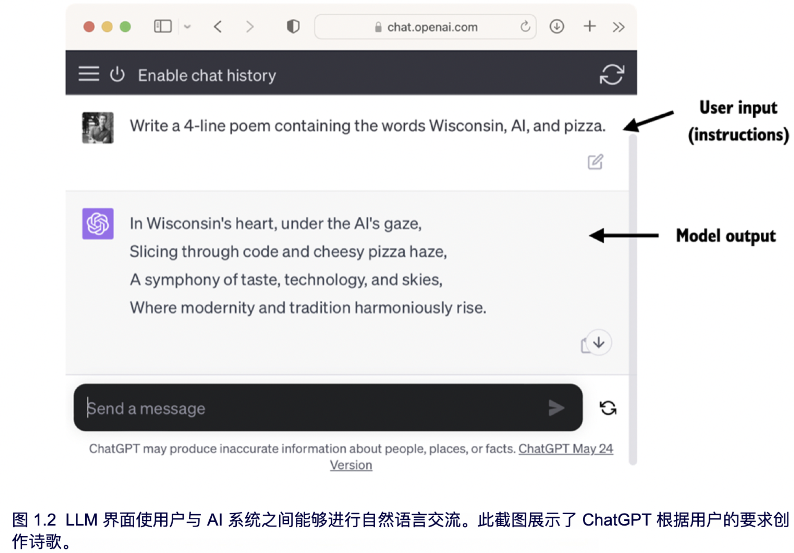
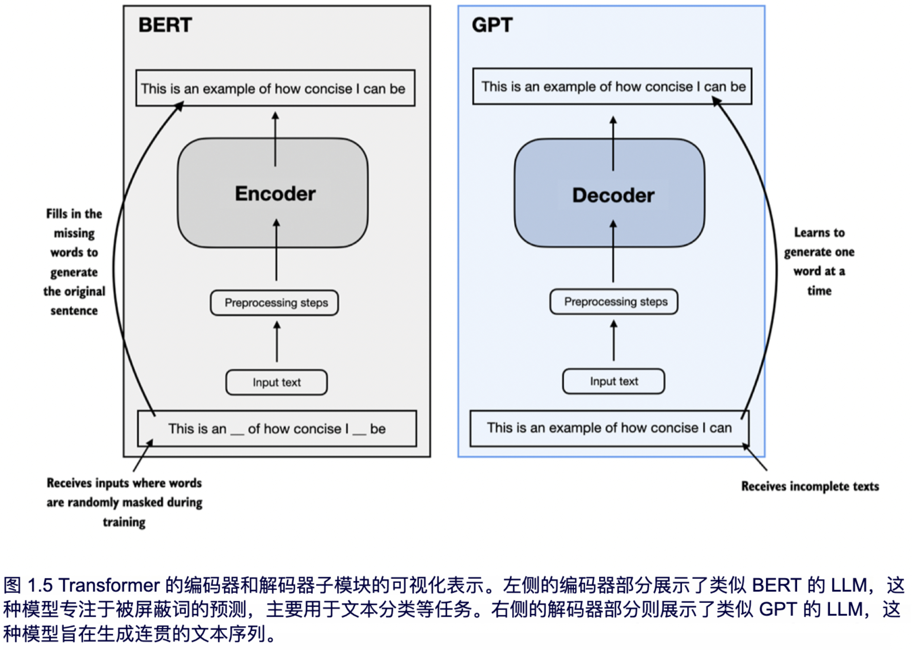
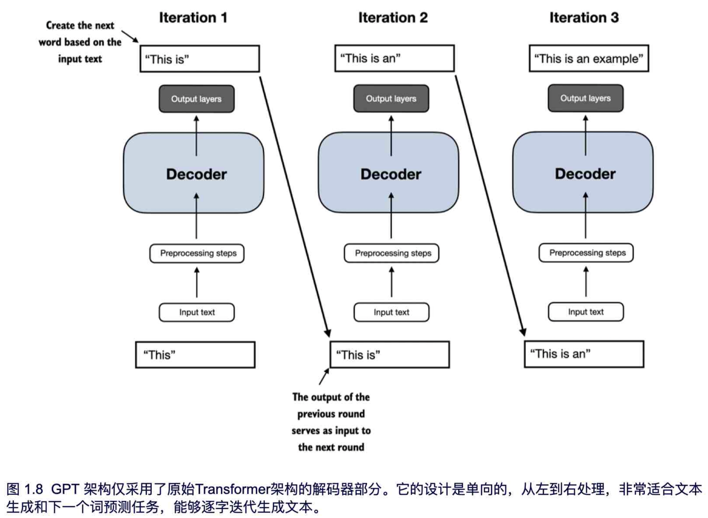

# 1.理解大语言模型

本章涵盖以下内容：

- **大语言模型（LLM）背后基本概念的高级解释**
- **对大语言模型（如 ChatGPT 平台上使用的模型）所源自的 Transformer 架构的深入了解**
- **从零开始构建大语言模型的计划**

------

- [1.1 LLM 是什么？](#11-llm-是什么)
- [1.2 LLM 的应用](#12-llm-的应用)
- [1.3 构建和使用 LLM 的步骤](#13-构建和使用-llm-的步骤)
- [1.4 介绍 Transformer 架构](#14-介绍-transformer-架构)
- [1.5 利用大型数据集](#15-利用大型数据集)
- [1.6 深入剖析GPT架构](#16-深入剖析gpt架构)
- [1.7 构建大语言模型](#17-构建大语言模型)
- [1.8 本章摘要](#18-本章摘要)

------

大语言模型 (LLM)，如 OpenAI 的 ChatGPT，是近年来发展起来的深度神经网络模型。这些模型为自然语言处理 (NLP) 开辟了一个新时代。在大语言模型出现之前，传统方法在电子邮件垃圾分类等分类任务中表现良好，但通常在需要复杂理解和生成能力的语言任务上表现不佳，例如解析详细指令、进行上下文分析，或生成连贯且符合上下文的原创文本。例如，早期的语言模型无法根据关键词列表撰写电子邮件，而这个任务对现代 LLM 来说却非常简单。

LLM 具备理解、生成和解释人类语言的卓越能力。然而，我们需要澄清的是，当我们说语言模型“理解”时，并不是说它们具有人类的意识或理解能力，而是指它们能够以看起来连贯且符合上下文的方式处理和生成文本。

得益于深度学习的进展，深度学习是机器学习和人工智能 (AI) 的一个子集，主要关注神经网络，LLM 可以基于深度学习理论在海量文本数据上进行训练。这使得 LLM 能够捕捉到比以往方法更深层的上下文信息和人类语言的细微差别。因此，LLM 在各种自然语言处理 (NLP) 任务中的表现得到了显著提升，包括文本翻译、情感分析、问答等。

当代 LLM 与早期 NLP 模型之间的另一个重要区别在于，早期的 NLP 模型通常是为特定任务而设计的，例如文本分类、语言翻译等。虽然这些早期模型在其特定应用中表现出色，但 LLM 在各种自然语言处理 (NLP) 任务中展现了更广泛的能力。

LLM 的成功可以归因于支撑 LLM 的 Transformer 架构，以及 LLM 训练所用的海量数据。这使得它们能够捕捉到多种语言的细微差别、上下文和模式，而这些都是难以手动编码的。

这种转向基于 Transformer 架构的模型和大规模训练数据集来训练 LLM，已经从根本上改变了自然语言处理 (NLP) 领域，为理解和与人类语言互动提供了更强大的工具。

从本章开始，我们将奠定实现本书主要目标的基础：通过逐步在代码中实现一个基于 transformer 架构的类似 ChatGPT 的 LLM，以帮助理解 LLM。

## 1.1 LLM 是什么？

LLM（大语言模型）是一个旨在理解、生成和响应人类文本的神经网络。这些模型是深度神经网络，在海量文本数据上训练，基本涵盖了互联网上大部分公开可用的文本数据集。

“大语言模型”中的“大”指的是模型的参数规模和用于训练的庞大数据集。这类模型通常包含数十亿甚至数百亿的参数，这些参数是网络中的可调节权重，训练过程中通过优化来预测序列中的下一个单词。预测下一个单词是合理的，因为这利用了语言的序列特性，帮助模型理解文本中的上下文、结构和关系。然而，这只是一项非常简单的任务，因此许多研究人员对其能够产生如此强大的模型感到惊讶。我们将在后面的章节中逐步讨论并实现下一个单词的训练过程。

LLM 采用了一种称为 Transformer 的架构（在第 1.4 节中将详细讨论），这使得它们在做预测时能够对输入的不同部分进行选择性关注，因此特别擅长处理人类语言的细微差别和复杂性。

由于 LLM 能够生成文本，因此它们通常被称为一种生成式人工智能 (AI)，常缩写为生成 AI 或 GenAI。如图 1.1 所示，人工智能涵盖了创造能执行类似人类智能任务的更广泛领域，包括理解语言、识别模式和做出决策，并包括机器学习和深度学习等子领域。

用于实现人工智能的算法是机器学习领域的核心。机器学习往往不需要明确的编程实现，而是涉及可以从数据中学习并基于数据做出预测或决策的算法研究。举例来说，垃圾邮件过滤器就是机器学习的一个实际应用。与其手动编写规则来识别垃圾邮件，不如将标记为垃圾邮件和合法邮件的电子邮件示例输入给机器学习算法。通过最小化训练数据集上的预测误差，模型能够学习识别垃圾邮件的模式和特征，从而将新邮件分类为垃圾邮件或合法邮件。

如图 1.1 所示，深度学习是机器学习的一个子集，专注于使用三层或更多层的神经网络（即深度神经网络）来建模数据中的复杂模式和抽象。与深度学习不同，传统机器学习需要手动提取特征。这意味着人类专家需要识别并选择最相关的特征供模型使用。

虽然当前人工智能领域主要由机器学习和深度学习主导，但它也涵盖了其他方法，例如基于规则的系统、遗传算法、专家系统、模糊逻辑和符号推理。

回到垃圾邮件分类的例子，在传统机器学习中，人类专家会手动提取电子邮件文本中的特征，例如某些触发词的频率（“奖品”、“获胜”、“免费”）、感叹号的数量、全大写单词的使用，或者是否存在可疑链接。基于这些专家定义的特征创建的数据集随后用于训练模型。与传统机器学习不同，深度学习不需要手动提取特征，这意味着人类专家不需要为深度学习模型识别和选择最相关的特征。（不过，无论是在传统机器学习还是深度学习的垃圾邮件分类中，仍然需要收集标签，如垃圾邮件或非垃圾邮件，而这些标签需要由专家或用户进行收集。）

接下来的章节将介绍 LLM 能解决的问题、LLM 面临的挑战，以及我们将在本书中实现的通用 LLM 架构。

## 1.2 LLM 的应用

由于具备解析和理解非结构化文本数据的高级能力，LLM 在多个领域有着广泛的应用。目前，LLM 被广泛用于机器翻译、新文本生成（见图 1.2）、情感分析、文本摘要等多种任务。最近，LLM 还被用于内容创作，比如撰写小说、文章，甚至计算机代码。

LLM 还可以支持复杂的聊天机器人和虚拟助手，例如 OpenAI 的 ChatGPT 或谷歌的 Gemini（以前称为 Bard），这些助手能够回答用户的问题，并提升传统搜索引擎的功能，如 Google Search 和 Microsoft Bing。

此外，LLM 还可以有效地从医学或法律等专业领域的大量文本中检索知识。这包括筛选文档、总结长段落以及回答技术性问题。

总之，LLM 在自动化几乎所有涉及文本解析和生成的任务中都是不可或缺的。它们的应用几乎是无限的，随着我们不断创新和探索这些模型的新用法，LLM 显然有潜力重新定义我们与技术的关系，使其变得更加对话式、直观和易于访问。

在本书中，我们将重点了解 LLM 的工作原理，从基础开始，编码一个能够生成文本的 LLM。我们还将学习使 LLM 执行查询的技术，包括回答问题、总结文本、将文本翻译成不同语言等。换句话说，在本书中，我们将通过一步步构建的方式，学习复杂的 LLM 助手（如 ChatGPT）的工作原理。

## 1.3 构建和使用 LLM 的步骤

为什么我们应该构建自己的 LLM？从头开始编码一个 LLM 是理解其工作机制和局限性的绝佳练习。同时，这也使我们具备了对现有开源 LLM 架构进行预训练或微调的知识，以便将其应用于我们特定领域的数据集或任务。

研究表明，在建模性能方面，专为特定任务或领域定制的 LLM 通常能超过通用的 LLM，比如 ChatGPT，这些通用模型设计用于多种应用场景。例如，BloombergGPT 是一个专门针对金融领域的模型，还有针对医学问答定制的 LLM（有关更多细节，请参阅附录 B 的进一步阅读和参考文献部分）

使用定制的 LLM 有多个优势，尤其是在数据隐私方面。例如，公司可能因为保密问题而不愿与像 OpenAI 这样的第三方 LLM 提供商分享敏感数据。此外，开发定制的 LLM 可以直接在客户的设备上部署，比如笔记本电脑和智能手机，这是像 Apple 这样的公司当前正在探索的方向。这种针对LLM的本地部署实现能够显著降低响应延迟和服务器相关的成本。同时，定制的 LLM 使开发者拥有完全的自主权，能够根据需要控制模型的更新和修改。

创建 LLM 的一般过程包括预训练和微调。术语 "pre" 在 "pretraining" 中指的是初始阶段，此时模型（如 LLM）在一个大型且多样化的数据集上进行训练，以便获得对语言的广泛理解。预训练模型随后作为基础资源，可以通过微调进一步优化。微调是指模型在一个更针对特定任务或领域的数据集上进行专门训练。包含预训练和微调的这种两阶段训练方法在图 1.3 中进行了说明。

> [!TIP]
>
> **个人思考：** 预训练的数据集已经学习好了语言模型的基础能力，包括语法、词汇、语言结构，可以相对准确的预测下一个token。而微调则是利用特定领域的数据来让模型适应某些特定的任务。微调一般有两种方式：
>
> + 全权重的微调，这种方式会在训练过程中对模型的所有预训练权重进行调整，但由于权重已经经过预训练，大多数情况下，微调只会对预训练权重进行微小调整，而不是大幅度改变。这种方式能够让模型保持原有的语言生成能力，同时使其在特定任务上表现得更好。
> + 冻结部分权重的微调，一般冻结低层（往往是学习到的基础语言特征），对高层的权重进行调整。这种微调方式常在需要加速训练，或者数据量较小，全权重微调可能导致过拟合的情况下使用。

如图 1.3 所示，创建 LLM 的第一步是用大量文本数据进行训练，这些数据一般被称为原始文本。这里的 "raw" 指的是这些数据只是普通文本，没有任何标注信息[^1] 。（可以进行过滤，比如去除格式字符或未知语言的文档。）

LLM 的第一阶段训练被称为预训练，旨在创建一个初始的预训练 LLM，通常称为基础模型。GPT-3 模型是一个典型例子（ChatGPT 中原始模型的前身）。该模型可以完成文本补全，即对用户写了一半的句子进行续写。同时，它还具有有限的少量示例学习能力，这意味着它可以在仅有少量示例的情况下学习执行新任务，而不需要大量的训练数据。下一节“介绍 transformer 架构”将对此进行进一步说明。

在从大型文本数据集上训练得到预训练的 LLM 后，该LLM会学习预测文本中的下一个单词。我们可以在优质的标注数据上对 LLM 进行进一步训练，这个过程称为微调。

微调 LLM 的两个最流行的类别是指令微调和分类任务微调。在指令微调中，标注数据集包含指令和答案对，例如用于翻译文本的查询及其正确翻译。在分类微调中，标注数据集由文本及其对应的类别标签组成，比如与垃圾邮件和非垃圾邮件标签相关的电子邮件。

在本书中，我们将介绍 LLM 的预训练和微调的代码实现，并将在预训练基础 LLM 后，深入探讨指令微调和分类微调的具体细节。

## 1.4 介绍 Transformer 架构

大多数现代 LLM 基于 transformer 架构，这是一种深度神经网络架构，首次在 2017 年的论文《Attention Is All You Need》中提出。为了理解 LLM，我们需要简要回顾一下最初为机器翻译开发的原始 Transformer，该架构用于将英文文本翻译成德文和法文。图 1.4 显示了 Transformer 架构的简化版本。

图 1.4 中的 Transformer 架构由两个子模块组成：编码器和解码器。编码器模块处理文本输入，将其编码为一系列数值表示或向量，以捕捉输入的上下文信息。然后，解码器模块利用这些编码向量生成输出文本。例如，在翻译任务中，编码器将源语言文本编码为向量，而解码器则将这些向量解码为目标语言的文本。编码器和解码器都由多个层通过自注意力机制相连。您可能会对输入的预处理和编码过程有许多疑问，这些将在后续章节的逐步实现中详细解答。

Transformers 和 LLM 的一个关键组成部分是自注意力机制（图中未显示），它使模型能够相对地权衡序列中不同单词或标记的重要性。这个机制帮助模型捕捉输入数据中的远程依赖关系和上下文关系，从而提高生成连贯且与上下文相关的输出的能力。不过，由于自注意力机制的复杂性，我们将在第三章中逐步讨论和实现它。此外，第二章《处理文本数据》中，我们也将讨论并实现创建模型输入所需的数据预处理步骤。

> [!TIP]
>
> **个人思考：** 早期用于翻译任务的模型一般使用RNN，RNN的核心是循环结构，也就是会把当前的输出和之前的状态结合起来，再输入到下一步。这样，网络就可以记住前面输入的信息，并把这些信息应用到后续的预测中。例如，当你输入一段文字时，RNN会记住前面的单词，以帮助理解后面的单词。但这种机制也有一个非常明显的不足：长距离依赖问题。虽然RNN能“记住”前面的信息，但它对非常长的序列记忆能力有限。随着序列变长，早期信息会逐渐被“遗忘”，导致长距离依赖的问题。这就像你在听一长段话，可能会逐渐忘记开头说的内容。而Transformer架构通过自注意力机制（后面详细介绍实现机制）实现能够关注序列中的任意位置，而不需要经过层层传递。因此，无论信息在序列中距离多远，Transformer都能有效地捕捉和利用长距离的依赖关系。

Transformer 架构的后续变体，包括 BERT（双向编码器表示来自 Transformers 的缩写）和各种 GPT 模型（生成预训练变换器的缩写），都是基于这一概念进行构建的，以适应不同的任务。（参考文献见附录 B。）

BERT 是基于原始 Transformer 架构的编码器子模块，与 GPT 的训练方法有所不同。GPT 主要用于生成任务，而 BERT 及其变体则专注于掩码词预测，即模型在给定句子中预测被掩码或隐藏的词，如图 1.5 所示。这种独特的训练策略使得 BERT 在文本分类任务中具备优势，包括情感预测和文档分类。作为应用实例，截至目前，Twitter 正在使用 BERT 来检测有害内容。

> [!TIP]
>
> **个人思考：** 为什么BERT适合用于文档分类或情感预测，这主要是基于BERT的训练模式，BERT也是基于Transformer架构，但它采用的是 **masked language model (MLM)** 训练方式，即在训练过程中，它会随机遮掩输入句子中的一些词（称为“masked”），并让模型预测这些被遮掩的词。这种训练策略被称为**掩蔽词预测**。这一独特的训练方法使得 BERT 能够更好地理解句子的上下文，因为它需要根据整句话的前后部分来预测被遮掩的词。这种双向（bidirectional）的训练使得 BERT 更适合处理需要全局上下文理解的任务，而文档分类或情感预测正是两种对于上下文语义理解要求非常高的场景。

另一方面，GPT 专注于原始 Transformer 架构中的解码器部分，被设计用于需要生成文本的任务。这些任务包括机器翻译、文本摘要、小说创作和编写代码等。在本章接下来的部分，我们将更详细地讨论 GPT 架构，并在本书中从零开始实现它。

GPT 模型主要是为文本补全任务设计和训练的，但它们在能力上展现出显著的多样性。这些模型擅长执行zero-shot 和few-shot 学习任务。zero-shot 学习指的是在没有先前具体示例的情况下，能够处理完全未见过的任务。而few-shot 学习则是指模型可以从用户提供的极少量示例中进行学习，如图 1.6 所示。

> [!NOTE]
>
> **TRANSFORMERS 与 LLM**
>
> 如今的 LLM 大部分是基于上一节提到的 Transformer 架构来实现。因此，在文献中，Transformers 和 LLM 常常被视为同义词。然而，值得注意的是，并非所有的 Transformers 都是 LLM，因为它们也可以用于计算机视觉。同时，并非所有的 LLM 都是基于 Transformers 的，市场上也有一些基于递归和卷积架构的大语言模型。这些替代方法的主要目的是提高 LLM 的计算效率。不过，这些替代架构能否与基于 Transformer 的 LLM 的能力相竞争，以及它们是否会在实际中得到应用，还需要进一步观察。为了简单起见，本书将“LLM”一词用来指代类似于 GPT 的基于 Transformer 的 LLM。（感兴趣的读者可以在本章末尾的进一步查找找到相关文献阅读。）

## 1.5 利用大型数据集

流行的 GPT 和 BERT 类模型的大型训练数据集代表了丰富而全面的文本语料库，涵盖数十亿个单词，涉及各种主题以及自然语言和计算机语言。为了提供一个具体的例子，表 1.1 总结了用于预训练 GPT-3 的数据集，这个模型是第一版 ChatGPT 的基础。

通过表1.1能得出的主要结论是，这个训练数据集的规模和多样性使得这些模型在各种任务中表现优异，包括不同语言的语法、语义和上下文信息，甚至还可以处理一些需要通用知识的任务。

> [!NOTE]
>
> **GPT-3 数据集细节**
>
> 表 1.1 展示了用于 GPT-3 的数据集。表中的“占比列（最后一列）”经过四舍五入误差调整后总和为 100%。尽管“token数量”这一列中的总计达到 5090 亿，但模型实际只在 3000 亿个token上进行训练。GPT-3 论文的作者没有解释为何模型没有在所有 5090 亿个token上进行训练。
>
> 对于上下文来说，考虑 CommonCrawl 数据集的规模，该数据集单独包含 4100 亿个token，存储需要大约 570 GB。相比之下，像 GPT-3 这样的模型后续版本，例如 Meta 的 LLaMA，已经扩展了其训练范围，加入了额外的数据来源，比如 Arxiv 的研究论文（92 GB）和 StackExchange 的代码相关问答（78 GB）。
>
> GPT-3 论文的作者没有公开训练数据集，但有一个与其相当的公开数据集名为 Dolma：由 Soldaini 等人在 2024 年发布的《用于 LLM 预训练研究的三万亿token开放语料库》（https://arxiv.org/abs/2402.00159）。不过，该数据集可能包括受版权保护的作品，其具体使用条款可能会根据预期的使用场景和国家有所不同。

这些模型的预训练特性使它们在后续任务中的微调变得非常灵活，因此它们也被称为基础模型或基模。预训练 LLM 需要消耗大量资源，且成本非常高。例如，GPT-3 的预训练费用估计为 460 万美元，通过云计算积分来计算[^2]。

好消息是，已经有许多经过预训练的开源LLM，可以作为通用工具来撰写、提取和编辑不在训练数据中的文本。此外，LLM可以在相对较小的数据集上进行微调，以减少所需的计算资源并提高特定任务的性能。

在本书中，我们将一步步实现预训练代码，并利用它来预训练一个 LLM。所有的计算都将在普通消费级硬件上进行。在实现预训练LLM的代码后，我们将学习如何重用公开可用的模型权重，并将这些权重加载到我们所实现的架构中，这样在本书后续微调 LLM 时，我们就可以跳过昂贵的预训练阶段。

## 1.6 深入剖析GPT架构

在本章之前，我们提到了GPT类模型、GPT-3和ChatGPT。现在让我们更深入地了解通用的GPT架构。首先，GPT 是“生成预训练变换器”（Generative Pretrained Transformer）的缩写，最初是在以下论文中提出的：

+ 《通过生成预训练改善语言理解（2018）》是由 OpenAI 的 Radford 等人撰写的，链接：http://cdn.openai.com/researchcovers/language-unsupervised/language_understanding_paper.pdf

GPT-3 是该模型的增强版，具有更多参数，并在更大的数据集上进行训练。而在 ChatGPT 中提供的原始模型是通过在一个大型指令数据集上微调 GPT-3 而创建的，这一过程使用了 OpenAI 的 InstructGPT 论文中的方法，我们将在第 7 章“使用人类反馈进行微调以遵循指令”中详细介绍。如图 1.6 所示，这些模型在文本完成方面表现出色，并且还能够进行拼写纠正、分类和语言翻译等其他任务。考虑到 GPT 模型是在相对简单的下一个单词预测任务上进行预训练的，这一点确实非常惊人，如图 1.7 所示。

下一个单词预测任务是一种自监督学习的方法，这是一种自我标注的形式。这意味着我们不需要专门收集训练数据的标签，而是可以利用数据本身的结构：我们可以把句子或文档中的下一个单词作为模型需要预测的标签。由于下一个单词预测任务允许我们“动态”生成标签，因此我们可以利用大量未标记的文本数据集来训练 LLM，这在第 1.5 节中也有讨论，即利用大型数据集。

与我们在 1.4 节讨论的原始 Transformer 架构相比，通用 GPT 架构相对简单。实际上，它仅包含解码器部分，而没有编码器，如图 1.8 所示。由于像 GPT 这样的解码器模型是通过逐字预测生成文本，因此它们被视为一种自回归模型。自回归模型会将之前的输出作为未来预测的输入。因此，在 GPT 中，每个新词的选择都是基于之前的文本序列，这样可以提高生成文本的连贯性。

像 GPT-3 这样的模型架构明显大于原始的 Transformer 模型。例如，原始的 Transformer 将编码器和解码器块重复了六次，而 GPT-3 具有 96 层 Transformer，总共有 1750 亿个参数。

GPT-3 于 2020 年推出，按照深度学习和大语言模型（LLM）开发的标准，如今看来，已经是很久以前了。然而，像 Meta 的 Llama 模型这样的最新架构依然基于相同的基本原理，仅做了些许修改。因此，理解 GPT 的重要性依旧不减。本书将专注于实现 GPT 背后的核心架构，并提供有关其他 LLM 所采用的特定调整的参考。

最后，值得注意的是，原始的 Transformer 模型由编码器和解码器块组成，专为语言翻译设计，但 GPT 模型虽然架构更大且仅包含解码器，却主要用于下一个词预测，但同时也具备执行翻译任务的能力。这一能力最初让研究人员感到意外，因为它出现在一个主要针对下一个词预测任务的模型中，而这个任务并没有专门针对翻译。

模型能够执行未明确训练的任务被称为“涌现行为”。这种能力不是通过明确的训练获得的，而是模型接触大量多语言数据和多样化上下文后自然而然涌现的结果。GPT 模型能够“学习”不同语言之间的翻译模式，并执行翻译任务，尽管它们并没有专门针对这些任务进行训练，这展示了这些大语言模型的优势和能力。我们可以在不需要为每个任务使用不同模型的情况下，完成多种任务。

## 1.7 构建大语言模型

在本章中，我们为理解LLM打下了基础。在本书的其余部分，我们将从零开始编码一个 LLM，使用 GPT 的基本理念作为框架，并分为三个阶段进行，如图 1.9 所示。

首先，我们将学习基本的数据预处理步骤，并编写 LLM 核心的注意力机制代码。

接下来，在第二阶段，我们将学习如何编写代码并预训练一个类似 GPT 的 LLM，能够生成新的文本。同时，我们还会介绍评估 LLM 的基本原理，这对开发强大的 NLP（自然语言处理）系统至关重要。

请注意，从头开始预训练一个 LLM 是一项庞大的工程，对于类似 GPT 的模型，计算成本可能高达数千到数百万美元。因此，第二阶段的重点是进行教学目的的训练，使用小型数据集。此外，本书还将提供关于如何加载公开可用的模型权重的代码示例。

最后，在第三阶段，我们将使用一个预训练好的 LLM，对其进行微调，使其能够执行指令，例如回答查询或进行文本分类——这些是在许多现实世界应用和研究中最常见的任务。

希望你能期待踏上这段激动人心的旅程！

## 1.8 本章摘要

+ LLM 已经彻底改变了自然语言处理的领域，之前自然语言处理主要依赖于显式的规则系统和较为简单的统计方法。LLM 的出现引入了新的深度学习驱动的方法，推动了对人类语言的理解、生成和翻译的进步。
+ 现代 LLM 的训练通常分为两个主要步骤：
  + 首先，它们在一个大型未标注的文本语料库中进行预训练，通过使用句子中下一个单词的预测作为“标签”。
  + 这些模型接下来会在一个较小的、有标签的目标数据集上进行微调，以遵循指令或执行分类任务。
+ LLM 基于Transformer架构。Transformer架构的核心理念是注意力机制，这使得 LLM 在逐字生成输出时，能够选择性地访问整个输入序列。
+ 原始的Transformer架构由一个用于解析文本的编码器和一个用于生成文本的解码器组成。
+ 生成文本和执行指令的 LLM，例如 GPT-3 和 ChatGPT，仅实现解码器模块，这使得架构更加简化。
+ 由数十亿个单词构成的大型数据集对预训练 LLM 至关重要。在本书中，我们将实现并在小型数据集上训练 LLM，以便用于教学，同时也会探讨如何加载公开可用的模型权重。
+ 类似 GPT 的模型的普遍预训练任务是预测句子中的下一个单词，但这些 LLM 显示出了“涌现”特性，例如具备分类、翻译或文本总结的能力。
+ 一旦 LLM 完成预训练，得到的基础模型就可以更高效地微调，以应对各种下游任务。
+ 在自定义数据集上微调过的 LLM 能够在特定任务上超越通用 LLM。

[^1]:  拥有机器学习背景的读者可能会注意到，传统机器学习模型和通过常规监督学习训练的深度神经网络通常需要标注数据。但在 LLM 的预训练阶段情况并非如此。在这一阶段，LLM 采用自监督学习，模型可以从输入数据中自动生成标签。这个概念将在本章后面的内容中进一步讨论。
[^2]:  GPT-3，价值 4,600,000 美元的语言模型，https://www.reddit.com/r/MachineLearning/comments/h0jwoz/d_gpt3_the_4600000_language_model/

