# 2.处理文本数据

本章涵盖以下内容：

+ **为大语言模型的训练准备文本数据集**
+ **将文本分割成词和子词token**
+ **字节对编码（Byte Pair Encoding，BPE）：一种更为高级的文本分词技术**
+ **使用滑动窗口方法采样训练示例**
+ **将tokens转换为向量，输入到大语言模型中**

-----

- [2.1 理解词嵌入](#21-理解词嵌入)
- [2.2 文本分词](#22-文本分词)
- [2.3 将 tokens 转换为token IDs](#23-将-tokens-转换为token-ids)
- [2.4 添加特殊上下文token](#24-添加特殊上下文token)
- [2.5 字节对编码（Byte pair encoding）](#25-字节对编码byte-pair-encoding)
- [2.6 使用滑动窗口进行数据采样](#26-使用滑动窗口进行数据采样)
- [2.7 构建词嵌入层](#27-构建词嵌入层)
- [2.8 位置编码](#28-位置编码)
- [2.9 本章摘要](#29-本章摘要)

-----


在上一章中，我们介绍了大语言模型（LLM）的基本结构，并了解到它们会基于海量的文本数据集进行预训练。我们特别关注的是仅使用通用 Transformer 架构中解码器部分的 LLM，这也是 ChatGPT 和其他流行的类似 GPT 的 LLM 所依赖的模型。

在预训练阶段，LLM 逐字处理文本。通过使用下一个单词预测任务训练拥有数百万到数十亿参数的 LLM，最终能够生成具有出色能力的模型。这些模型随后可以进一步微调，以遵循指令或执行特定目标任务。然而，在我们接下来几章中实现和训练 LLM 之前，我们需要准备训练数据集，这也是本章的重点，如图 2.1 所示。


在本章中，您将学习如何为训练 LLM 准备输入文本。这包括将文本拆分为单个单词和子词token，并将这些token编码为 LLM 的向量表示。您还将了解一些先进的token分割方案，比如字节对编码，这种方法在像 GPT 这样的流行 LLM 中得到应用。最后，我们将实现一个采样和数据加载策略，以生成后续章节中训练 LLM 所需的输入输出数据对。


## 2.1 理解词嵌入

深度神经网络模型，包括 LLM，往往无法直接处理原始文本。这是因为文本是离散的分类数据，它与实现和训练神经网络所需的数学运算不兼容。因此，我们需要一种方法将单词表示为连续值向量。（对计算中向量和张量不熟悉的读者，可以在附录 A 的 A2.2 节中了解更多关于张量的内容。）

将数据转换为向量格式的过程通常被称为嵌入（Embedding）。我们可以通过特定的神经网络层或其他预训练的神经网络模型来对不同类型的数据进行嵌入，比如视频、音频和文本，如图 2.2 所示。

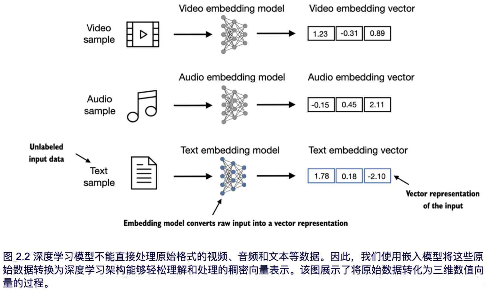

如图 2.2 所示，我们可以使用嵌入模型来处理多种不同的数据格式。然而，需要注意的是，不同的数据格式需要使用不同的嵌入模型。例如，专为文本设计的嵌入模型并不适用于音频或视频数据的嵌入。

> [!TIP]
>
> **个人思考：** 不同格式的数据源（如文本、图像、音频、视频）在处理和嵌入时，需要不同的模型和技术，原因在于它们的数据结构、特征和处理方式各不相同，因此需要针对性的方法将这些不同的数据类型转换为适合神经网络处理的向量表示。以下总结了不同数据源在嵌入时的一些区别：
>
> | 数据类型 |          数据特征          |              嵌入模型              |          主要特征          |
> | :------: | :------------------------: | :--------------------------------: | :------------------------: |
> |   文本   |  离散的、序列化的符号数据  |   Word2Vec, GloVe, BERT, GPT 等    |    语义关系、上下文理解    |
> |   图像   | 二维像素网格，具有空间特征 |      CNN（ResNet、VGG）、ViT       | 形状、纹理、颜色等视觉特征 |
> |   音频   |        一维时序信号        |    CNN+频谱图、RNN、Transformer    |    频率、音调、时序依赖    |
> |   视频   |        时空序列数据        | 3D CNN、RNN+CNN、Video Transformer |     时空特征、动作捕捉     |

嵌入的本质是将离散对象（如单词、图像或整个文档）映射到连续向量空间中的点。嵌入的主要目的是将非数值数据转换为神经网络能够处理的格式。

虽然单词嵌入是最常用的文本嵌入形式，但也存在句子、段落或整篇文档的嵌入。句子和段落嵌入常被用于检索增强生成技术。检索增强生成结合了文本生成与从外部知识库中检索相关信息的过程，这是一种超出本书讨论范围的技术。由于我们希望训练类似于GPT的LLM，这类模型以逐字的方式生成文本，因此本章将重点放在单词嵌入上。

> [!TIP]
>
> **个人思考：** 这里聊一下检索增强技术（RAG），目前已经广泛应用于特定领域的知识问答场景。尽管GPT在文本生成任务中表现强大，但它们依赖的是预训练的知识，这意味着它们的回答依赖于模型在预训练阶段学习到的信息。这种方式导致了几个问题：
>
> + **知识的时效性：** 模型的知识基于它的预训练数据，因此无法获取最新的信息。比如，GPT-3 的知识截止到 2021 年，无法回答最新的事件或发展。
> + **模型大小的限制：** 即使是大型模型，所能存储和运用的知识也是有限的。如果任务涉及特定领域（如医学、法律、科学研究），模型在预训练阶段可能没有涵盖足够的信息。
> + **生成的准确性：** 生成模型可能会凭空编造信息（即“幻觉现象”），导致生成内容不准确或虚假。
>
> 而检索增强技术正是为了解决上述不足，它大致原理为将外部知识库（如文档、数据库、互联网等）进行向量化后存入到向量数据库中。当用户提交一个查询时，首先将这个查询也编码成一个向量，然后去承载外部知识库的向量数据库中检索（检索技术有很多种）与问题相关的信息。检索到的信息被作为额外的上下文信息输入到LLM中，LLM会将这些外部信息与原始输入结合起来，以更准确和丰富的内容生成回答。想要进一步了解RAG技术及其应用，可以参考：[RAG 专区](https://waytoagi.feishu.cn/wiki/PUUfwNkwqielBOkbO5RcjnTQnUd)

生成单词嵌入的算法和框架有很多。其中，Word2Vec是较早且最受欢迎的项目之一。Word2Vec通过预测给定目标词的上下文或反之，训练神经网络架构以生成单词嵌入。Word2Vec的核心思想是，出现在相似上下文中的词通常具有相似的含义。因此，当将单词投影到二维空间进行可视化时，可以看到相似的词汇聚在一起，如图2.3所示。

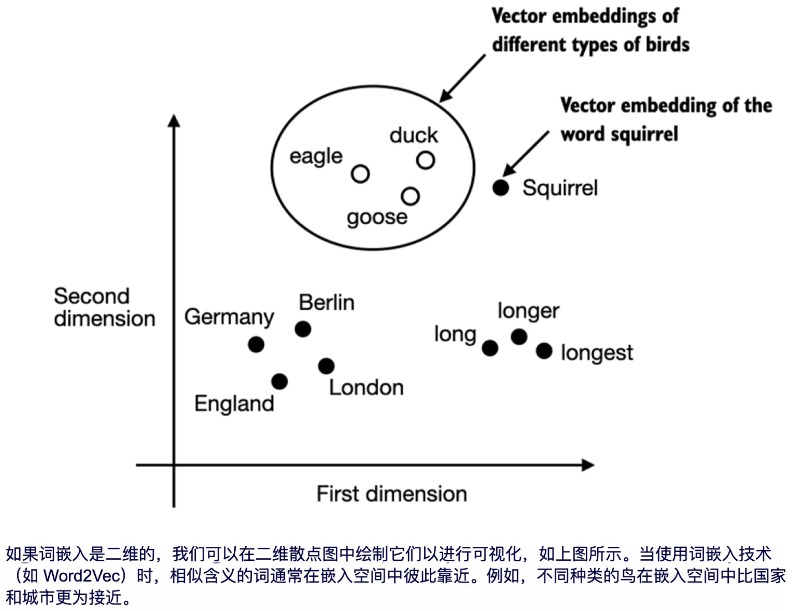

词嵌入可以具有不同的维度，从一维到数千维。如图2.3所示，我们可以选择二维词嵌入进行可视化。更高的维度可能捕捉到更细微的关系，但代价是计算效率的降低。

虽然我们可以使用预训练模型（例如 Word2Vec）为机器学习模型生成嵌入，但 LLM 通常会生成自己的嵌入，这些嵌入是输入层的一部分，并在训练过程中进行更新。将嵌入作为 LLM 训练的一部分进行优化，而不直接使用 Word2Vec，有一个明确的优势，就是嵌入能够针对特定的任务和数据进行优化。我们将在本章后面实现这样的嵌入层。此外，LLM 还能够创建上下文化的输出嵌入，这一点我们将在第三章中讨论。

高维嵌入在可视化中面临挑战，因为我们的感官感知和常见的图形表示本质上只限于三维或更少的维度，这也是图 2.3 采用二维散点图展示二维嵌入的原因。然而，在处理 LLM 时，我们通常使用的嵌入的维度远高于图 2.3 所示的维度。对于 GPT-2 和 GPT-3，嵌入的大小（通常称为模型隐状态的维度）会根据具体的模型变体和大小而有所不同。这是性能与效率之间的权衡。以具体示例为例，最小的 GPT-2 模型（117M 和 125M 参数）使用 768 维的嵌入大小，而最大的 GPT-3 模型（175B 参数）则使用 12,288 维的嵌入大小。

本章接下来的部分将系统地介绍准备 LLM 使用的嵌入所需的步骤，这些步骤包括将文本拆分为单词、将单词转换为token，以及将token转化为嵌入向量。


## 2.2 文本分词

本节将讨论如何将输入文本拆分为单个token，这是创建 LLM 嵌入所需的预处理步骤。这些token可以是单个单词或特殊字符，包括标点符号，具体如图 2.4 所示。

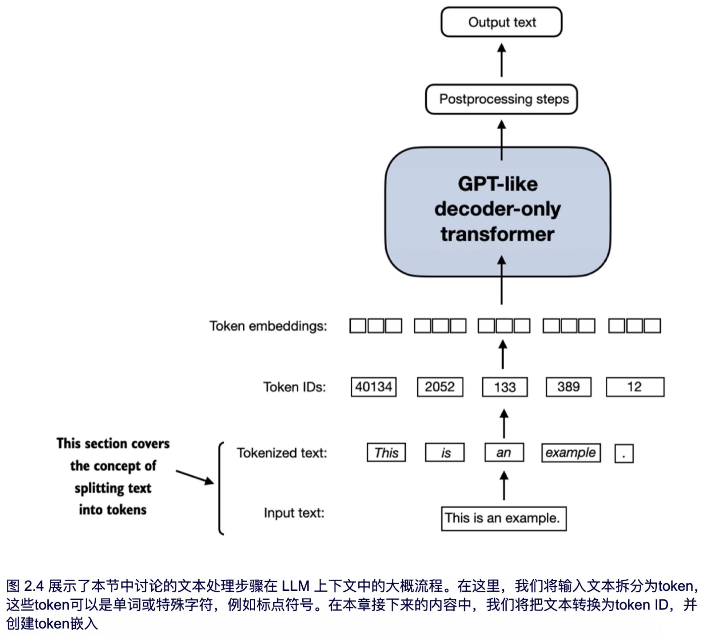

我们即将用于 LLM 训练的文本数据集是一部由 Edith Wharton 创作的短篇小说《判决》，该作品已在网上公开，因此允许用于 LLM 训练任务。该文本可在 Wikisource 上找到，网址是 [https://en.wikisource.org/wiki/The_Verdict](https://en.wikisource.org/wiki/The_Verdict)，您可以将其复制并粘贴到文本文件中。我已将其复制到名为 "the-verdict.txt" 的文本文件中，以便使用 Python 的标准文件读取工具进行加载。

```python
# Listing 2.1 Reading in a short story as text sample into Python
with open("the-verdict.txt", "r", encoding="utf-8") as f:
		raw_text = f.read()
print("Total number of character:", len(raw_text))
print(raw_text[:99])
```

另外，您可以在本书的 GitHub 仓库中找到名为 "the-verdict.txt" 的文件，网址是 [https://github.com/rasbt/LLM-from-scratch/tree/main/ch02/01_main-chapter-code](https://github.com/rasbt/LLM-from-scratch/tree/main/ch02/01_main-chapter-code)

便于演示的目的，print命令输出文件的总字符数以及前100个字符。

```
Total number of character: 20479
I HAD always thought Jack Gisburn rather a cheap genius--though a good fellow enough--so
it was no
```

我们的目标是将这篇 20,479 个字符的短篇小说拆分为单词和特殊字符（统称为token），然后在接下来的章节中将这些token转换为 LLM 训练所需的嵌入。

> [!NOTE]
>
> **样本规模**
>
> 请注意，在处理 LLM 时，通常会处理数百万篇文章和数十万本书——也就是几 GB 的文本。然而，为了教学目的，使用像单本书这样的小文本样本就足够了，这样可以阐明文本处理步骤的主要思想，并能够在消费级硬件上合理地运行。

要如何做才能最好地拆分这段文本以获得token列表呢？为此，我们来进行一个小小的探讨，使用 Python 的正则表达式库 re 进行说明。（请注意，您不需要学习或记住任何正则表达式语法，因为在本章后面我们将使用一个预构建的分词器。）

使用一些简单的示例文本，我们可以使用 re.split 命令，按照以下语法拆分文本中的空白字符：

```python
import re
text = "Hello, world. This, is a test."
result = re.split(r'(\s)', text)
print(result)
```

执行结果是一个包含单词、空白和标点符号的列表：

```
['Hello,', ' ', 'world.', ' ', 'This,', ' ', 'is', ' ', 'a', ' ', 'test.']
```

请注意，上述简单的分词方案仅仅用于将示例文本拆分为单个单词，然而有些单词仍然与我们希望单独列出的标点符号相连。我们也无需将所有文本转换为小写字母，因为大写字母有助于 LLM 区分专有名词和普通名词，理解句子结构，并学习生成正确的大写文本。

让我们修改正则表达式，将空白字符（\s）、逗号和句点（[,.]）单独拆分出来：

```python
result = re.split(r'([,.]|\s)', text)
print(result)
```

我们可以看到，单词和标点符号现在已经成为单独一项，跟我们预期一致：

```
['Hello', ',', '', ' ', 'world', '.', '', ' ', 'This', ',', '', ' ', 'is', ' ', 'a', ' ', 'test', '.', '']
```

一个剩余的小问题是列表仍然包含空白字符。我们可以按如下方式安全地删除这些多余的字符：

```python
result = [item for item in result if item.strip()]
print(result)
```

```
['Hello', ',', 'world', '.', 'This', ',', 'is', 'a', 'test', '.']
```

> [!NOTE]
>
> **关于是否删除空白字符的探讨**
>
> 在开发一个简单的分词器时，是否将空白字符编码为单独的字符，或者直接将其删除，取决于我们的应用和需求。删除空白字符可以减少内存和计算资源的消耗。然而，如果我们训练的模型对文本的确切结构敏感（例如，Python 代码对缩进和空格非常敏感），那么保留空白字符就很有用。在这里，为了简化和缩短分词化输出，我们选择删除空白字符。稍后，我们将切换到一个包含空白字符的分词化方案。

我们上面设计的分词方案在简单的示例文本中表现良好。让我们进一步修改它，使其能够处理其他类型的标点符号，如问号、引号，以及在 Edith Wharton 短篇小说的前 100 个字符中看到的双破折号，还有其他特殊字符：

```python
text = "Hello, world. Is this-- a test?"
result = re.split(r'([,.:;?_!"()\']|--|\s)', text)
result = [item.strip() for item in result if item.strip()]
print(result)
```

执行后输出如下：

```
['Hello', ',', 'world', '.', 'Is', 'this', '--', 'a', 'test', '?']
```

如图 2.5 所示，我们的分词方案现在能够成功处理文本中的各种特殊字符。

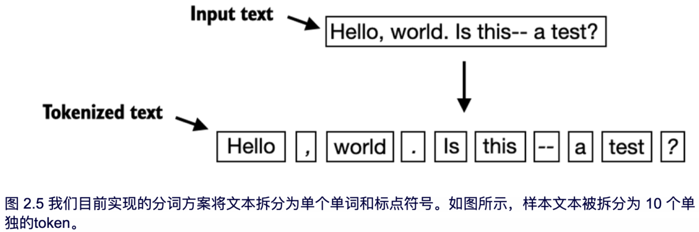

现在我们已经有了一个基本的分词器，接下来让我们将其应用于艾迪丝·沃顿的整篇短篇小说：

```python
preprocessed = re.split(r'([,.:;?_!"()\']|--|\s)', raw_text)
preprocessed = [item.strip() for item in preprocessed if item.strip()]
print(len(preprocessed))
```

上述代码的输出是4690，这是小说的token数量（不包含空白字符）。

让我们检查一下前30个token：

```python
print(preprocessed[:30])
```

生成的输出显示，我们的分词器似乎很好地处理了文本，因为所有单词和特殊字符都被很好地分开了：

```
['I', 'HAD', 'always', 'thought', 'Jack', 'Gisburn', 'rather', 'a', 'cheap', 'genius', '--', 'though', 'a', 'good', 'fellow', 'enough', '--', 'so', 'it', 'was', 'no', 'great', 'surprise', 'to', 'me', 'to', 'hear', 'that', ',', 'in']
```


## 2.3 将 tokens 转换为token IDs

在前一章节中，我们将艾迪丝·华顿的短篇小说分词为单独的token。在本节中，我们将把这些token从字符串转换为整形，以生成所谓的token ID。这一步是将token ID 转换为嵌入向量的中间步骤。

为了将先前生成的token映射到token ID，我们首先需要构建一个词汇表。这个词汇表定义了每个独特单词和特殊字符与唯一整数的映射，如图 2.6 所示。

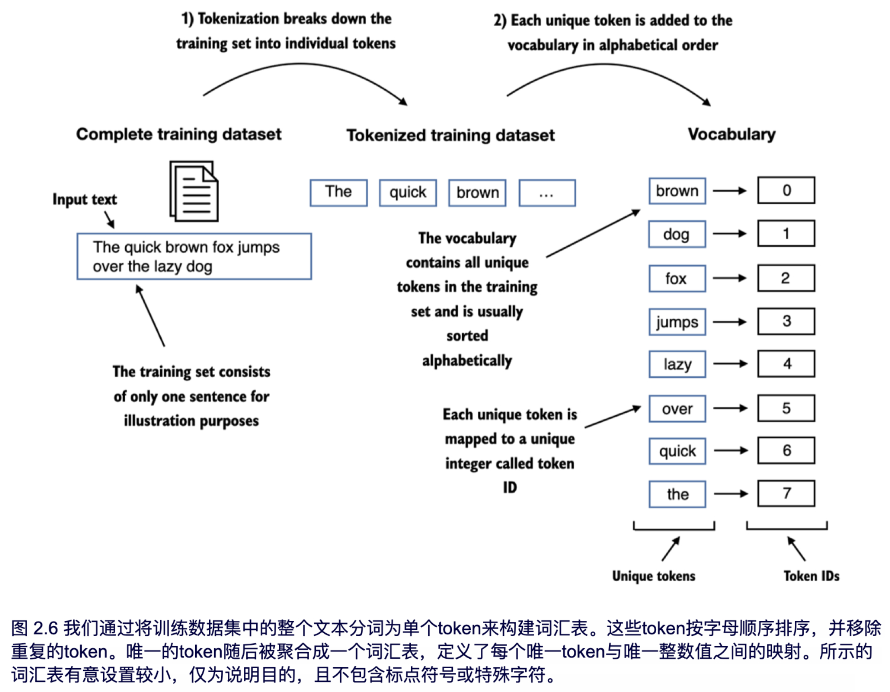

在前一章节中，我们将艾迪丝·华顿的短篇小说进行分词，并将其存储在名为 preprocessed 的 Python 变量中。现在，让我们创建一个包含所有唯一token的列表，并按字母顺序对其进行排序，以确定词汇表的大小：

```python
all_words = sorted(set(preprocessed))
vocab_size = len(all_words)
print(vocab_size)
```

在通过上述代码确定词汇表的大小为 1,130 后，我们通过以下代码创建词汇表并打印其前 51 个条目以便于说明：

```python
vocab = {token:integer for integer,token in enumerate(all_words)}
for i, item in enumerate(vocab.items()):
  	print(item)
    if i > 50:
      	break
```

输出如下：

```
('!', 0)
('"', 1)
("'", 2)
...
('Her', 49)
('Hermia', 50)
```

根据输出可知，词汇表包含了与唯一整数标签相关联的单个token。我们接下来的目标是利用这个词汇表，将新文本转换为token ID，如图 2.7 所示。


在本书后面，当我们想将 LLM 的输出从数字转换回文本时，我们还需要一种将token ID 转换为文本的方法。为此，我们可以创建一个词汇表的反向版本，将token ID 映射回相应的文本token。

让我们在 Python 中实现一个完整的分词器类，其中包含一个 encode 方法，该方法负责将文本拆分为token，并通过词汇表进行token字符串到整数（token ID）的映射，以通过词汇表生成token ID。此外，我们还将实现一个 decode 方法，该方法则负责进行整数到字符串的反向映射，将token ID 转换回文本。

该分词器的代码实现如下:

```python
# Listing 2.3 Implementing a simple text tokenizer
class SimpleTokenizerV1:
  	def __init__(self, vocab):
      	self.str_to_int = vocab                                                   #A
        self.int_to_str = {i:s for s,i in vocab.items()}                          #B

    def encode(self, text):                                                       #C
      	preprocessed = re.split(r'([,.?_!"()\']|--|\s)', text)
        preprocessed = [item.strip() for item in preprocessed if item.strip()]
        ids = [self.str_to_int[s] for s in preprocessed]
        return ids

    def decode(self, ids):                                                        #D
      	text = " ".join([self.int_to_str[i] for i in ids])

        text = re.sub(r'\s+([,.?!"()\'])', r'\1', text)                           #E
        return text


#A 将词汇表作为类属性存储，以方便在 encode 和 decode 方法中访问
#B 创建一个反向词汇表，将token ID 映射回原始的文本token
#C 将输入文本转换为token ID
#D 将token ID 还原为文本
#E 在指定的标点符号前去掉空格
```

使用上述的 SimpleTokenizerV1 Python 类，我们现在可以使用现有的词汇表实例化新的分词器对象，并利用这些对象对文本进行编码和解码，如图 2.8 所示。

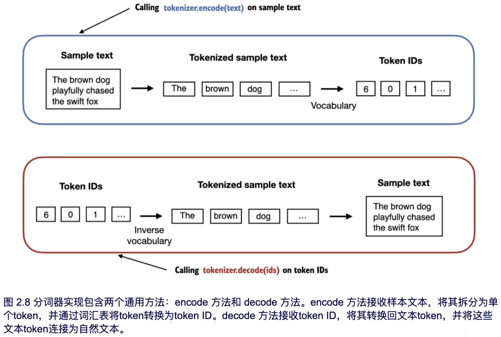

让我们通过 SimpleTokenizerV1 类实例化一个新的分词器对象，并对艾迪丝·华顿的短篇小说中的一段文本进行分词，以便在实践中进行尝试：

```python
tokenizer = SimpleTokenizerV1(vocab)
text = """"It's the last he painted, you know," Mrs. Gisburn said with pardonable pride."""
ids = tokenizer.encode(text)
print(ids)
```

上面的代码打印出以下token ID：
```
[1, 56, 2, 850, 988, 602, 533, 746, 5, 1126, 596, 5, 1, 67, 7, 38, 851, 1108, 754, 793, 7]
```

接下来，让我们看看能否通过 decode 方法将这些token ID 转换回文本：

```python
print(tokenizer.decode(ids))
```

输出如下：

```
'" It\' s the last he painted, you know," Mrs. Gisburn said with pardonable pride.'
```

根据以上的输出，我们可以看到 decode 方法成功将token ID 转换回了原始文本。

到目前为止，一切都很顺利。我们实现了一个分词器，能够根据训练集中的片段对文本进行分词和去分词。现在让我们将其应用于训练集中未包含的新文本样本：

```python
text = "Hello, do you like tea?"
print(tokenizer.encode(text))
```

执行上述代码将导致以下错误：

```
...
KeyError: 'Hello'
```

问题在于短篇小说《判决》中没有使用“Hello”这个词。因此，它不包含在词汇中。这突显了在处理大型语言模型时，需要考虑大型和多样化的训练集以扩展词汇的必要性。

在下一节中，我们将进一步测试分词器在包含未知词汇的文本上的表现，并且我们还将讨论可以用于在训练期间为LLM提供更多上下文的额外特殊tokens。


## 2.4 添加特殊上下文token

在上一节中，我们实现了一个简单的分词器，并将其应用于训练集中的一段文本。在本节中，我们将修改这个分词器来处理未知单词。

具体来说，我们将修改在前一节中实现的词汇表和分词器类（修改后的类命名为SimpleTokenizerV2），以支持两个新的token：<|unk|> 和 <|endoftext|>，具体见图 2.9。

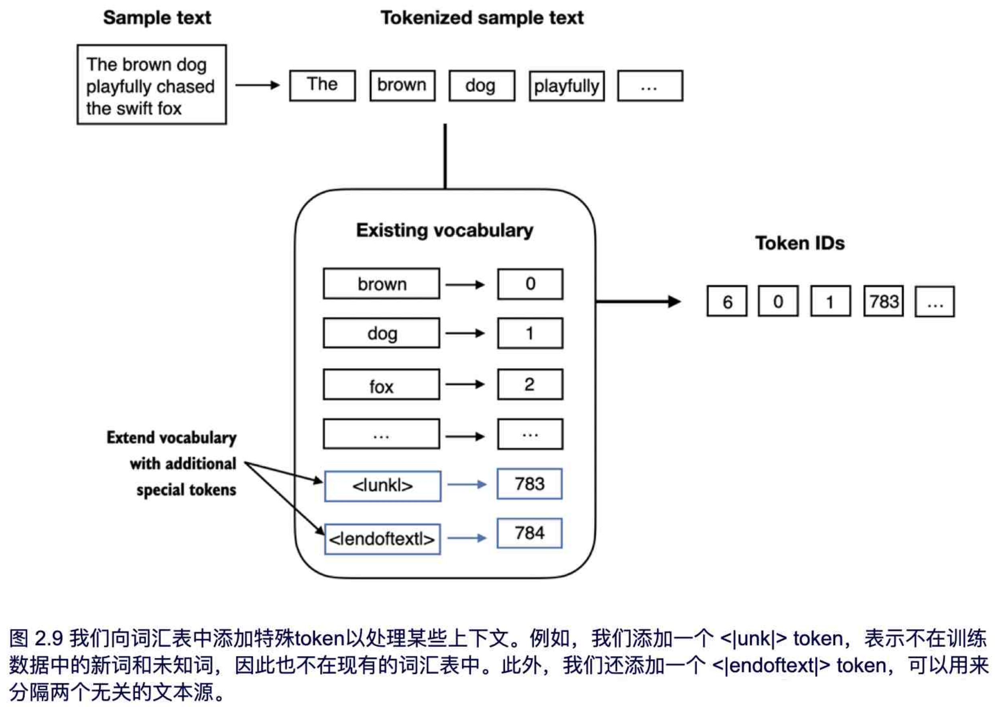

如图2.9所示，我们可以修改分词器，以便在遇到不在词汇表中的单词时使用一个<|unk|> token。此外，我们还会在不相关的文本之间添加一个特殊的<|endoftext|> token。例如，在对多个独立文档或书籍进行GPT类大语言模型的训练时，通常会在每个文档或书籍之前插入一个token，以连接前一个文本源，如图2.10所示。这有助于大语言模型理解，尽管这些文本源在训练中是连接在一起的，但它们实际上是无关的。

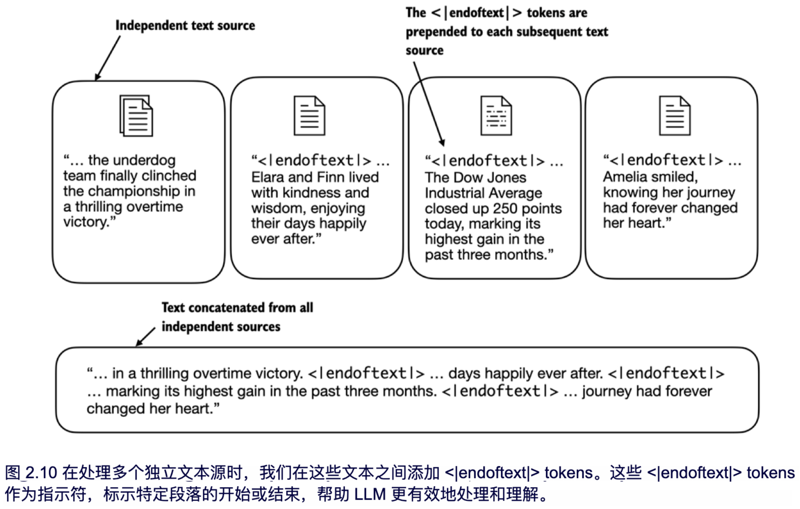

现在，让我们修改词汇表，将这两个特殊token <|unk|> 和 <|endoftext|> 包含在内，方法是将它们添加到我们在上一节中创建的唯一单词列表中：

```python
all_tokens = sorted(list(set(preprocessed)))
all_tokens.extend(["<|endoftext|>", "<|unk|>"])
vocab = {token:integer for integer,token in enumerate(all_tokens)}

print(len(vocab.items()))
```

基于上述打印语句的输出，新词汇表的大小为1161（上一节的词汇表大小为1159）。

为了快速检查，让我们打印更新后词汇表的最后5个条目：

```python
for i, item in enumerate(list(vocab.items())[-5:]):
  	print(item)
```

执行上述代码，输出结果如下：

```
('younger', 1156)
('your', 1157)
('yourself', 1158)
('<|endoftext|>', 1159)
('<|unk|>', 1160)
```

根据上述代码的输出，我们可以确认这两个新的特殊token确实成功地被纳入了词汇表。接下来，我们相应地调整代码清单2.3中的分词器，如清单2.4所示：

```python
# Listing 2.4 A simple text tokenizer that handles unknown words
class SimpleTokenizerV2:
  	def __init__(self, vocab):
      	self.str_to_int = vocab
        self.int_to_str = { i:s for s,i in vocab.items()}

    def encode(self, text):
      	preprocessed = re.split(r'([,.?_!"()\']|--|\s)', text)
        preprocessed = [item.strip() for item in preprocessed if item.strip()]
        preprocessed = [item if item in self.str_to_int                    #A
                        else "<|unk|>" for item in preprocessed]

        ids = [self.str_to_int[s] for s in preprocessed]
        return ids

  	def decode(self, ids):
      	text = " ".join([self.int_to_str[i] for i in ids])

        text = re.sub(r'\s+([,.?!"()\'])', r'\1', text)                    #B
        return text


#A 用 <|unk|> tokens替换未知词汇
#B 在指定标点符号前替换空格
```

与我们在上一节的代码清单 2.3 中实现的 SimpleTokenizerV1 相比，新的 SimpleTokenizerV2 用 <|unk|> token 替换未知词。

```python
text1 = "Hello, do you like tea?"
text2 = "In the sunlit terraces of the palace."
text = " <|endoftext|> ".join((text1, text2))
print(text)
```

输出如下：

```
'Hello, do you like tea? <|endoftext|> In the sunlit terraces of the palace.'
```

接下来，让我们使用在之前的代码清单 2.2 中创建的词汇表，通过 SimpleTokenizerV2 对示例文本进行分词：

```python
tokenizer = SimpleTokenizerV2(vocab)
print(tokenizer.encode(text))
```

这将输出以下token ID列表：

```
[1160, 5, 362, 1155, 642, 1000, 10, 1159, 57, 1013, 981, 1009, 738, 1013, 1160, 7]
```

从上面的内容可以看出，token ID 列表中包含了 1159 ,它对应于 <|endoftext|> 分隔token，以及两个 1160 ，用于表示未知单词。

```python
print(tokenizer.decode(tokenizer.encode(text)))
```

输出如下：

```
'<|unk|>, do you like tea? <|endoftext|> In the sunlit terraces of the <|unk|>.'
```

通过将上面的去token化文本与原始输入文本进行比较，我们可以得知训练数据集，即艾迪丝·华顿的短篇小说《判决》，并不包含单词 "Hello" 和 "palace"。

到目前为止，我们已经讨论了分词作为处理文本输入到 LLM 中的重要步骤。根据不同的 LLM，一些研究人员还考虑其他特殊token，例如以下几种：

+ [BOS]（序列开始）：这个token表示文本的起始位置，指示 LLM 内容的开始。
+ [EOS]（序列结束）：这个token位于文本的末尾，在连接多个无关文本时特别有用，类似于 <|endoftext|>。例如，在合并两个不同的维基百科文章或书籍时， [EOS] token指示一篇文章结束和下一篇文章开始。
+ [PAD]（填充）：在使用大于 1 的批量大小数据集训练 LLM 时，批量可能包含不同长度的文本。为了确保所有文本长度一致，较短的文本会用 [PAD] token进行扩展或填充，直到达到批量中最长文本的长度。

请注意，用于 GPT 模型的分词器不需要上述提到的任何token，而只使用 <|endoftext|> token以简化处理。<|endoftext|> 类似于上面提到的 [EOS] token。此外，<|endoftext|> 也用作填充。然而，正如我们将在后续章节中探讨的那样，在批量输入的训练中，我们通常使用掩码，这意味着我们不会关注填充的token。因此，选择用于填充的特定token变得无关紧要。

> [!TIP]
>
> **个人思考：** 在训练神经网络时，通常会将不同长度的句子或文本批处理为一个 batch 进行并行训练。然而，不同长度的句子需要补齐到同一长度（基于矩阵运算要求形状一致），这时就需要填充 token 来对齐所有序列的长度，使得模型能够有效处理不同长度的输入。掩码其实就是一个标志位，用来告诉大模型哪些位置需要关注，哪些可以忽略，例如考虑以下句子：
>
> + 句子1："I love NLP."
> + 句子 2："Transformers are powerful."
> + 句子 3："GPT is amazing."
>
> 为了将它们放入一个批次，我们需要将它们填充到相同的长度。假设最长句子的长度为 5（token 数量），因此每个句子需要填充到 5 个 token。填充时，GPT 使用 `<|endoftext|>` 作为填充标记。在输入批次时，我们为每个 token 位置创建一个**掩码矩阵**，用来标识哪些位置是有效 token（模型应该关注），哪些是填充 token（模型应该忽略）。假设 `1` 表示有效 token，`0` 表示填充 token，则掩码矩阵如下：
>
> + 句子1（掩码矩阵）：`[1, 1, 1, 1, 0]`
> + 句子2（掩码矩阵）：`[1, 1, 1, 1, 0]`
> + 句子3（掩码矩阵）：`[1, 1, 1, 1, 0]`
>
> 在这个掩码矩阵中，`1` 表示模型会关注的 token，`0` 表示模型会忽略的填充 token。通过这种掩码矩阵，模型知道在计算和训练时哪些 token 是有效内容，哪些 token 是填充部分，无需关注。

此外，用于 GPT 模型的分词器也不使用 <|unk|> 标记来表示词汇表之外的词。相反，GPT 模型采用字节对编码分词器，它将单词分解为子词单元，我们将在下一节中讨论这一点。


## 2.5 字节对编码（Byte pair encoding）

我们在前面的章节中实现了一个简单的分词方案以作说明。本节将介绍一种基于字节对编码（BPE）概念的更复杂的分词方案。BPE分词器曾用于训练大语言模型，如GPT-2、GPT-3以及最初用于 ChatGPT 的 LLM。

由于从零开始实现BPE可能相对复杂，我们将使用一个名为tiktoken的现有Python开源库（[https://github.com/openai/tiktoken](https://github.com/openai/tiktoken)），该库基于Rust中的源代码非常高效地实现了BPE算法。与其他Python库类似，我们可以通过Python的pip安装程序从终端安装tiktoken库：

```python
pip install tiktoken
```

本章中的代码基于 tiktoken 0.5.1。您可以使用以下代码来查看您当前安装的版本：

```python
from importlib.metadata import version
import tiktoken
print("tiktoken version:", version("tiktoken"))
```

安装完成后，我们可以按如下方式通过tiktoken实例化BPE分词器：

```python
tokenizer = tiktoken.get_encoding("gpt2")
```

这个分词器的用法类似于我们之前实现的 SimpleTokenizerV2，都是通过 encode 方法使用：

```python
text = "Hello, do you like tea? <|endoftext|> In the sunlit terraces of someunknownPlace."
integers = tokenizer.encode(text, allowed_special={"<|endoftext|>"})
print(integers)
```

上述代码输出以下token ID列表：

```
[15496, 11, 466, 345, 588, 8887, 30, 220, 50256, 554, 262, 4252, 18250, 8812, 2114, 286, 617, 34680, 27271, 13]
```

我们可以使用 decode 方法将token ID 列表转换回文本，类似于我们之前实现的 SimpleTokenizerV2 类的 decode 方法：

```python
strings = tokenizer.decode(integers)
print(strings)
```

上述代码输出以下内容：

```
'Hello, do you like tea? <|endoftext|> In the sunlit terraces of someunknownPlace.'
```

根据上面的token ID 和解码后的文本，我们可以观察到两点：首先，<|endoftext|> token被分配了一个相对较大的token ID，即 50256。实际上，用于训练诸如 GPT-2、GPT-3 以及最初用于训练 ChatGPT 的模型的 BPE 分词器，总词汇表大小为 50,257，其中 <|endoftext|> 被分配了最大的token ID。

其次，上述BPE分词器能够正确编码和解码未知词汇，例如“someunknownPlace”。BPE分词器可以处理任何未知词汇。它是如何在不使用 <|unk|> token的情况下实现这一点的？

BPE背后的算法将不在其预定义词汇表中的单词分解为更小的子词单元甚至单个字符，使其能够处理超出词汇表的单词。因此，得益于BPE算法，如果分词器在分词过程中遇到一个不熟悉的单词，它可以将其表示为一系列子词token或字符，如图2.11所示。

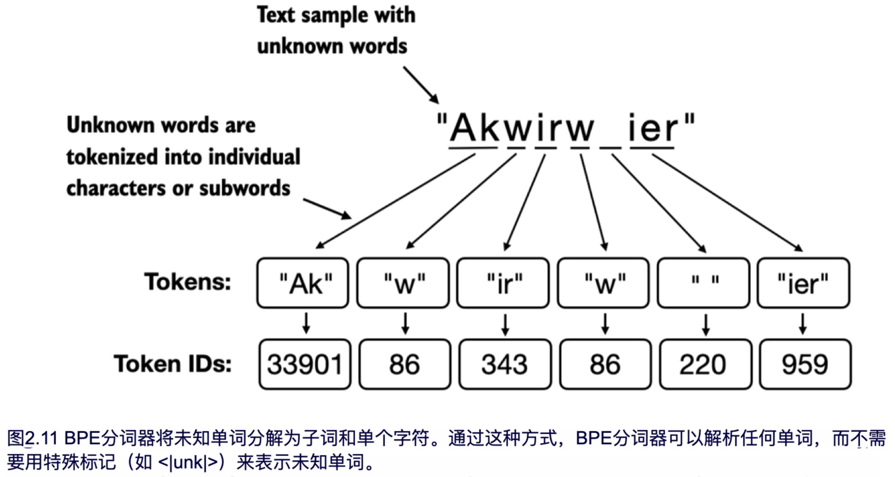

如图 2.11 所示，将未知单词分解为单个字符的能力确保了分词器以及随之训练的 LLM 能够处理任何文本，即使文本中包含训练数据中不存在的单词。

> [!NOTE]
>
> **练习 2.1 未知词的字节对编码**
>
> 尝试使用 tiktoken 库中的 BPE 分词器对未知单词 "Akwirw ier" 进行处理，并输出各个token ID。接着，对此列表中的每个结果整数调用 decode 函数，以重现图 2.11 中的映射。最后，调用token ID 的 decode 方法，检查它是否能够重建原始输入 "Akwirw ier"。

对 BPE 的详细讨论和实现超出了本书的范围，但简而言之，它通过反复合并频繁出现的字符和子词来构建词汇表。例如，BPE 首先将所有单个字符（“a”，“b”，等）添加到词汇表中。在下一阶段，它将经常一起出现的字符组合合并为子词。例如，“d”和“e”可能会合并成子词“de”，这个组合在许多英语单词中很常见，如“define”、“depend”、“made”和“hidden”。这些合并是通过频率截止值来确定的。

> [!TIP]
>
> **个人思考：** 字节对编码是一种基于统计的方法，它会先从整个语料库中找出最常见的字节对（byte pair），然后把这些字节对合并成一个新的单元。让我们用一个具体的示例来描述这个过程：
>
> 假如有句子：“The cat drank the milk because it was hungry”
>
> 1. **初始化：BPE会先将句子中每个字符视为一个单独的token**
>
>    ```
>    ['T', 'h', 'e', ' ', 'c', 'a', 't', ' ', 'd', 'r', 'a', 'n', 'k', ' ', 't', 'h', 'e', ' ', 'm', 'i', 'l', 'k', ' ', 'b', 'e', 'c', 'a', 'u', 's', 'e', ' ', 'i', 't', ' ', 'w', 'a', 's', ' ', 'h', 'u', 'n', 'g', 'r', 'y']
>    ```
>
> 2. **统计最常见的字节对**
>
>    BPE算法会在这些token中找到出现频率最高的“字节对”（即相邻的两个字符），然后将其合并为一个新的token。
>
>    例如这里最常见的字节对时（'t', 'h'），因为它在单词"the"和"that"中出现频率较高。
>
> 3. **合并字节对**
>
>    根据统计结果，我们将最常见的字节对（'t', 'h'）合并为一个新的token，其它类似
>
>    ```
>    ['Th', 'e', ' ', 'c', 'a', 't', ' ', 'dr', 'a', 'nk', ' ', 'th', 'e', ' ', 'm', 'i', 'l', 'k', ' ', 'be', 'c', 'a', 'u', 'se', ' ', 'it', ' ', 'wa', 's', ' ', 'hu', 'n', 'gr', 'y']
>    ```
>
> 4. **重复步骤2和3，得到最终的token序列**
>
>    ```
>    ['The', ' ', 'cat', ' ', 'drank', ' ', 'the', ' ', 'milk', ' ', 'because', ' ', 'it', ' ', 'was', ' ', 'hungry']
>    ```


## 2.6 使用滑动窗口进行数据采样

上一节详细介绍了分词步骤以及将字符串分词成token再转换为整数token ID 的过程。在我们最终为 LLM 创建嵌入之前，还要提前做的一件事是生成训练 LLM 所需的输入-目标对。

这些输入-目标对是什么样的呢？正如我们在第一章中所学，LLM通过预测文本中的下一个单词进行预训练，如图2.12所示。

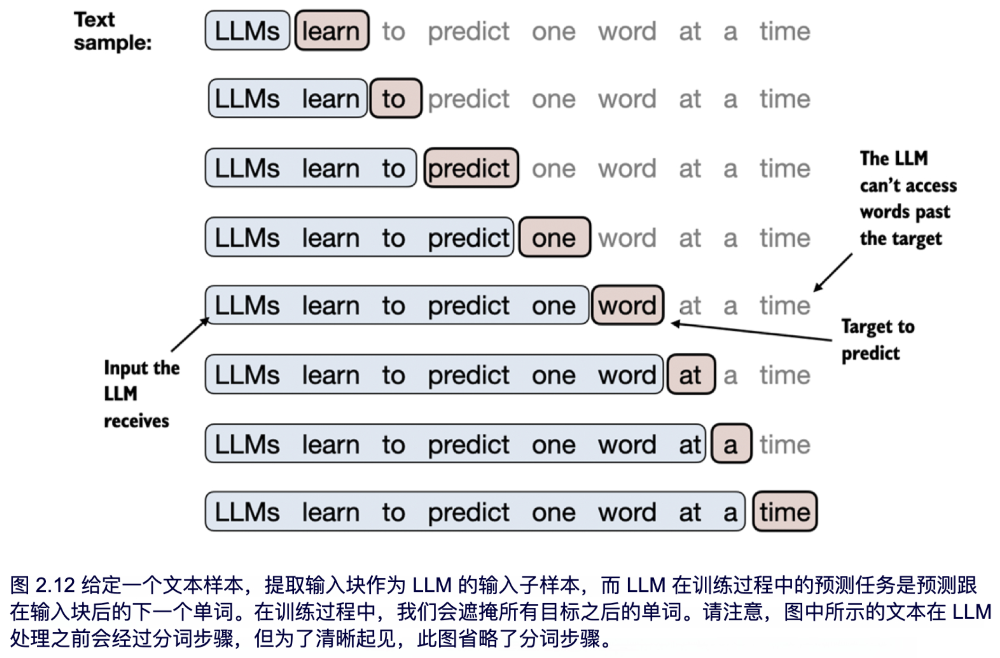

在本节中，我们将实现一个数据加载器，通过滑动窗口方法从训练数据集中提取图 2.12 所示的输入-目标对。

首先，我们将使用前一节中介绍的BPE分词器对我们之前处理的《判决》短篇小说进行分词：

```python
with open("the-verdict.txt", "r", encoding="utf-8") as f:
  	raw_text = f.read()

enc_text = tokenizer.encode(raw_text)
print(len(enc_text))
```

执行上述代码输出 5145，这表示在训练集上应用BPE分词器后，返回的token总数。

接下来，我们从数据集中移除前50个token以便演示，因为这会在接下来的步骤中产生稍微更有趣的文本段落。

```python
enc_sample = enc_text[50:]
```

创建输入-目标对以进行下一个单词预测任务的最简单和最直观的方法之一是创建两个变量x和y，其中x包含输入token，y包含目标，即输入向右移动1位的结果。

```python
context_size = 4                    #A
x = enc_sample[:context_size]
y = enc_sample[1:context_size+1]
print(f"x: {x}")
print(f"y:    {y}")

#A 上下文大小决定输入中包含多少个token
```

执行以上代码输出如下：

```
x: [290, 4920, 2241, 287]
y:       [4920, 2241, 287, 257]
```

在处理输入和目标（即输入向后移动一个位置）后，我们可以创建如图 2.12 所示的下一个单词预测任务，如下所示：

```python
for i in range(1, context_size+1):
  	context = enc_sample[:i]
    desired = enc_sample[i]
    print(context, "---->", desired)
```

执行后输出如下：

```
[290] ----> 4920
[290, 4920] ----> 2241
[290, 4920, 2241] ----> 287
[290, 4920, 2241, 287] ----> 257
```

箭头左侧（---->）的所有内容代表 LLM 将接收到的输入，而箭头右侧的token ID 则表示 LLM 应该预测的目标token ID。

为了演示，我们将重复之前的代码，但将token ID 转换为文本：

```python
for i in range(1, context_size+1):
  	context = enc_sample[:i]
    desired = enc_sample[i]
    print(tokenizer.decode(context), "---->", tokenizer.decode([desired]))
```

以下输出展示了输入和输出在文本格式下的样子：

```
and ----> established
and established ----> himself
and established himself ----> in
and established himself in ----> a
```

我们现在已经创建了输入-目标对，可以在接下来的章节中应用于 LLM 的训练。

在我们将token转换为嵌入之前，还有一个任务要完成，正如我们在本章开始时提到的：实现一个高效的数据加载器，该加载器遍历输入数据集并将输入和目标作为 PyTorch 张量返回，这些张量可以视为多维数组。

具体来说，我们的目标是返回两个张量：一个输入张量，包括 LLM 看到的文本，另一个目标张量，包含 LLM 需要预测的目标，如图 2.13 所示。

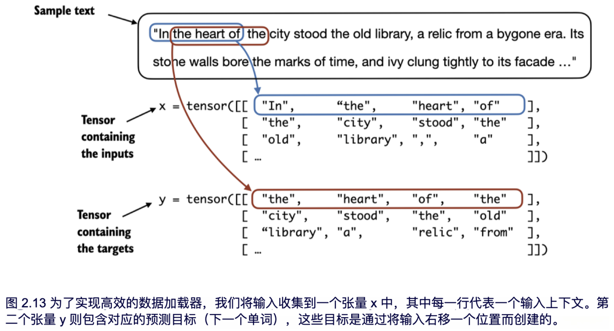

虽然图2.13展示了字符串格式的token以供说明，但代码实现将直接操作token ID，因为 BPE 分词器的 encode 方法将分词和转换为token ID 的过程合并为了一个步骤。

为了实现高效的数据加载器，我们将使用 PyTorch 内置的 Dataset 和 DataLoader 类。有关安装 PyTorch 的更多信息与指导，请参见附录 A 中的 A.1.3 节，安装 PyTorch。

代码清单 2.5 中展示了数据加载器类的实现细节：

```python
# Listing 2.5 A dataset for batched inputs and targets
import torch
from torch.utils.data import Dataset, DataLoader

class GPTDatasetV1(Dataset):
  	def __init__(self, txt, tokenizer, max_length, stride):
      	self.input_ids = []
        self.target_ids = []

        token_ids = tokenizer.encode(txt)                                #A

        for i in range(0, len(token_ids) - max_length, stride):          #B
          	input_chunk = token_ids[i:i + max_length]
            target_chunk = token_ids[i + 1: i + max_length + 1]
            self.input_ids.append(torch.tensor(input_chunk))
            self.target_ids.append(torch.tensor(target_chunk))

  def __len__(self):                                                     #C
    	return len(self.input_ids)

  def __getitem__(self, idx):                                            #D
    	return self.input_ids[idx], self.target_ids[idx]


#A 将整个文本进行分词
#B 使用滑动窗口将书籍分块为最大长度的重叠序列。
#C 返回数据集的总行数
#D 从数据集中返回指定行
```

清单 2.5 中的 GPTDatasetV1 类继承自 PyTorch Dataset 类，定义了如何从数据集中提取单行，其中每行由多个token ID（基于 max_length）组成，并赋值给 input_chunk 张量。target_chunk 张量则包含相应的目标。请继续阅读，以了解将此数据集与 PyTorch DataLoader 结合时返回的数据的样子——这将让我们更清晰的了解运作原理。

以下代码将使用刚创建的 GPTDatasetV1 类，通过 PyTorch DataLoader 以批量方式加载输入：

```python
# Listing 2.6 A data loader to generate batches with input-with pairs
def create_dataloader_v1(txt, batch_size=4, max_length=256,
                         stride=128, shuffle=True, drop_last=True, num_workers=0):
  	tokenizer = tiktoken.get_encoding("gpt2")                       #A
    dataset = GPTDatasetV1(txt, tokenizer, max_length, stride)      #B
    dataloader = DataLoader(
      	dataset,
      	batch_size=batch_size,
      	shuffle=shuffle,
      	drop_last=drop_last,                                        #C
      	num_workers=0                                               #D
    )

    return dataloader

#A 初始化分词器
#B 创建GPTDatasetV1类
#C drop_last=True会在最后一批次小于指定的batch_size时丢弃该批次，以防止训练期间的损失峰值
#D 用于预处理的CPU进程数量
```

让我们设置 batch_size = 1 和 max_length = 4，观察代码清单 2.5 中的 GPTDatasetV1 类和清单 2.6 中的 create_dataloader_v1 函数如何协同工作：

```python
with open("the-verdict.txt", "r", encoding="utf-8") as f:
		raw_text = f.read()

dataloader = create_dataloader_v1(
  	raw_text, batch_size=1, max_length=4, stride=1, shuffle=False)
data_iter = iter(dataloader)              #A
first_batch = next(data_iter)
print(first_batch)


#A 将数据加载器转换为 Python 迭代器，以便通过 Python 的内置 next() 函数获取下一个数据条目。
```

执行这段代码，输出如下：

```
[tensor([[ 40, 367, 2885, 1464]]), tensor([[ 367, 2885, 1464, 1807]])]
```

`first_batch` 变量包含两个张量：第一个张量存储输入token ID，第二个张量存储目标token ID。由于 `max_length` 设置为 4，因此这两个张量各包含 4 个token ID。请注意，输入大小为 4 相对较小，仅用于演示目的。通常，训练 LLM 的输入大小至少为 256。

为了阐明 `stride=1` 的含义，让我们从这个数据集中提取另一个批次：

```python
second_batch = next(data_iter)
print(second_batch)
```

第二个批次的具体内容如下：

```
[tensor([[ 367, 2885, 1464, 1807]]), tensor([[2885, 1464, 1807, 3619]])]
```

如果我们将第一个批次与第二个批次进行比较，可以看到第二个批次的token ID 相较于第一个批次右移了一个位置（例如，第一个批次输入中的第二个 ID 是 367，而它是第二个批次输入的第一个 ID）。步幅设置决定了输入在批次之间移动的位置数，模拟了滑动窗口的方法，如图 2.14 所示。

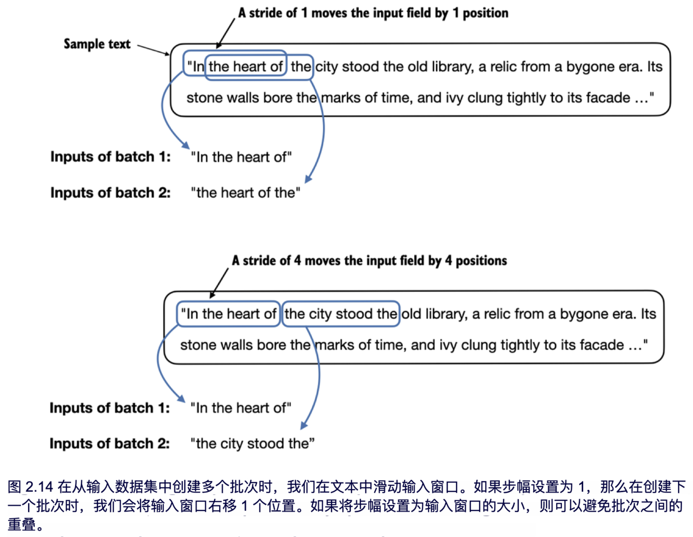

> [!NOTE]
>
> **练习 2.2 针对数据加载器（Data Loaders）设置不同步幅和上下文大小**
>
> 为了更好地理解数据加载器的工作原理，请尝试使用不同的设置进行测试，例如 `max_length=2` 和 `stride=2`，以及 `max_length=8` 和 `stride=2`。

迄今为止，我们从数据加载器中采样的批次大小都为1，这主要用于说明运作原理。如果你有深度学习的经验，你可能知道，小批次大小在训练时消耗内存较少，但会导致模型更新变得更加困难。就像在常规深度学习中一样，批次大小的设置是一个权衡，它作为超参数需要在训练 LLM 过程中进行实验和调整。

在我们继续本章最后两节之前（最后两节专注于从token ID 创建嵌入向量），先简要了解一下如何使用数据加载器以大于 1 的批次大小进行采样：

```python
dataloader = create_dataloader_v1(raw_text, batch_size=8, max_length=4, stride=4)

data_iter = iter(dataloader)
inputs, targets = next(data_iter)
print("Inputs:\n", inputs)
print("\nTargets:\n", targets)
This prints the following:
Inputs:
  tensor([[ 40, 367, 2885, 1464],
         [ 1807, 3619, 402, 271],
         [10899, 2138, 257,7026],
         [15632, 438, 2016, 257],
         [ 922, 5891, 1576, 438],
         [ 568, 340, 373,   645],
         [ 1049, 5975, 284, 502],
         [ 284, 3285, 326,   11]])

Targets:
  tensor([[ 367, 2885, 1464, 1807],
         [ 3619, 402,  271, 10899],
         [ 2138, 257, 7026, 15632],
         [ 438,  2016, 257,   922],
         [ 5891, 1576, 438,   568],
         [ 340,  373,   645, 1049],
         [ 5975, 284,   502,  284],
         [ 3285, 326,   11,   287]])
```

请注意，以上代码将步幅增加到了 4。这是为了全面利用数据集（我们不跳过任何单词），同时避免批次之间的重叠，因为更多的重叠可能会导致过拟合：

在本章的最后两个部分，我们将实现嵌入层，将token ID 转换为连续的向量表示，这些表示将用作 LLM 的输入数据格式。


## 2.7 构建词嵌入层

为 LLM 准备训练集的最后一步是将token ID 转换为嵌入向量，如图 2.15 所示，这将是本章最后两部分的主要内容。

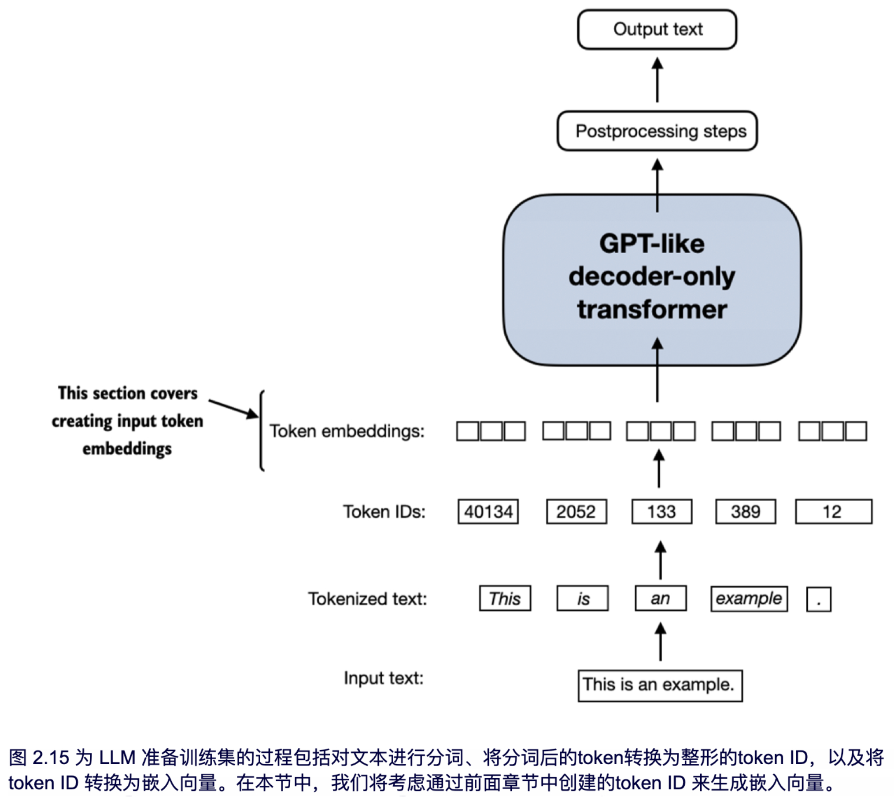

除了图 2.15 中概述的过程外，还需注意的是，我们首先会以随机值初始化这些嵌入权重。这一初始化为 LLM 的学习过程提供了起始点。我们将在第 5 章中优化嵌入权重，作为 LLM 训练的一部分。

对于GPT类大语言模型（LLM）来说，连续向量表示（Embedding）非常重要，原因在于这些模型使用深度神经网络结构，并通过反向传播算法（backpropagation）进行训练。如果你不熟悉神经网络是如何通过反向传播进行训练的，请参阅附录 A 中的 A.4 节，《自动微分简易教程》。

> [!TIP]
>
> **个人思考：** 上面一段描述说的有些笼统，为什么通过反向传播算法训练的大语言模型必须具有Embedding，让我们通过以下几个方面来分析和思考：
>
> 1. **深度神经网络和连续向量表示**
>
>    GPT 类模型（以及其他深度神经网络）是基于大量的矩阵运算和数值计算构建的，尤其是神经元之间的连接权重和偏置在训练过程中不断更新。这些运算要求输入的数据是**数值形式的向量**，因为神经网络只能对数值数据进行有效计算，而无法直接处理原始的离散文字数据（如单词、句子）。
>
>    + **向量表示： **通过将每个单词、句子或段落转换为连续向量（Embedding），可以在高维空间中表示文本的语义关系。例如，通过词嵌入（如 Word2Vec、GloVe）或上下文嵌入（如 GPT 中的词嵌入层），每个单词都被转换为一个向量，这个向量可以用于神经网络的计算。
>
> 2.  **向量嵌入的作用**
>
>    连续向量表示不仅让文本数据可以进入神经网络，还帮助模型捕捉和表示文本之间的语义关系。例如：
>
>    + **同义词或相似词**：在向量空间中，相似的单词可以有接近的向量表示。这种语义相似性帮助模型理解上下文，并在生成文本时提供参考。
>    + **上下文关系**：GPT 等 LLM 模型不仅依赖单词级别的向量表示，还会考虑句子或段落上下文，形成动态嵌入，从而生成更具连贯性的文本。
>
> 3. **反向传播算法的要求**
>
>    深度神经网络通过**反向传播算法**进行训练，反向传播的本质是利用梯度下降法来更新网络的权重，以最小化损失函数（loss function）。反向传播要求每一层的输入、输出和权重都能够参与梯度计算，而梯度计算只能应用于数值数据。
>
>    + **自动微分与梯度计算**：在反向传播中，神经网络会根据损失函数的导数来计算梯度，这个过程依赖于自动微分（automatic differentiation）。为了计算每层的梯度，输入的数据必须是数值形式（即向量），否则无法对离散的文本数据求导。
>    + **梯度更新权重**：每次更新网络权重时，神经网络会根据每一层的输入和输出来调整权重，以更好地学习数据的模式。如果输入不是数值形式，就无法实现梯度更新，从而无法通过反向传播训练网络。

让我们通过一个实际示例来说明token ID 到嵌入向量转换的工作原理。假设我们有以下四个输入token，它们的 ID 分别为 2、3、5 和 1：

```python
input_ids = torch.tensor([2, 3, 5, 1])
```

为了简化并起到说明的目的，假设我们有一个只有 6 个单词的小词汇表（而不是 BPE 分词器中的 50,257 个单词），并且我们希望创建大小为 3 的嵌入向量（在 GPT-3 中，嵌入大小为 12,288 维）：

```python
vocab_size = 6
output_dim = 3
```

我们可以使用 `vocab_size` 和 `output_dim`在 PyTorch 中实例化一个嵌入层，并将随机种子设置为 123，以便结果可重复：

```python
torch.manual_seed(123)
embedding_layer = torch.nn.Embedding(vocab_size, output_dim)
print(embedding_layer.weight)
```

前面代码示例中的 print 语句输出了嵌入层的基础权重矩阵:

```
Parameter containing:
tensor([[ 0.3374, -0.1778, -0.1690],
			 [ 0.9178, 1.5810, 1.3010],
			 [ 1.2753, -0.2010, -0.1606],
			 [-0.4015, 0.9666, -1.1481],
			 [-1.1589, 0.3255, -0.6315],
			 [-2.8400, -0.7849, -1.4096]], requires_grad=True)
```

可以看到，嵌入层的权重矩阵由比较小的随机值组成。这些值将在LLM训练过程中作为LLM优化的一部分被优化，正如我们将在接下来的章节中看到的。此外，权重矩阵有六行三列。嵌入矩阵的每一行代表词汇表中的一个token（每个token都有一个唯一的向量表示），而每一列代表嵌入空间中的一个维度（在这个例子中，嵌入维度为3，即每个token被表示为一个3维向量）。

实例化好嵌入层后，我们可以通过它获取指定token ID的嵌入向量：

```python
print(embedding_layer(torch.tensor([3])))
```

以上代码输出的嵌入向量如下：

```
tensor([[-0.4015, 0.9666, -1.1481]], grad_fn=<EmbeddingBackward0>)
```

如果我们将token ID 3 的嵌入向量与之前的嵌入矩阵进行比较，会发现它与第四行相同（Python 从零开始索引，因此它对应于索引 3 的行）。换句话说，嵌入层本质上是一个查找功能，通过token ID 从嵌入层的权重矩阵中检索行。

> [!NOTE]
>
> **嵌入层与矩阵乘法**
>
> 对于那些熟悉独热编码的人来说，上述嵌入层方法本质上只是实现独热编码后再进行矩阵乘法的一种更高效的方式，相关内容在 GitHub 的补充代码中进行了说明，链接为[https://github.com/rasbt/LLM-from-scratch/tree/main/ch02/03_bonus_embedding-vs-matmul](https://github.com/rasbt/LLM-from-scratch/tree/main/ch02/03_bonus_embedding-vs-matmul)。由于嵌入层只是独热编码和矩阵乘法方法的更高效实现，因此可以视为一个可以通过反向传播进行优化的神经网络层。

之前，我们已经看到如何将单个token ID 转换为三维嵌入向量。现在让我们将其应用于之前定义的所有四个输入 ID（`torch.tensor([2, 3, 5, 1])`）：

```python
print(embedding_layer(input_ids))
```

输出是一个4x3 的矩阵：

```
tensor([[ 1.2753, -0.2010, -0.1606],
				[-0.4015, 0.9666, -1.1481],
				[-2.8400, -0.7849, -1.4096],
				[ 0.9178, 1.5810, 1.3010]], grad_fn=<EmbeddingBackward0>)
```

输出矩阵中的每一行都是通过从嵌入权重矩阵进行查找操作获得的，如图2.16所示。

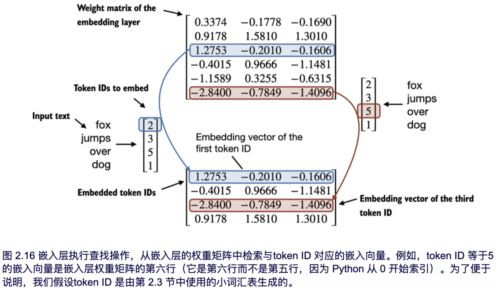

本节介绍了如何从token ID 创建嵌入向量。本章的下一节也是最后一节将对这些嵌入向量进行小的修改，以编码文本中token的位置信息。


## 2.8 位置编码

在上一节中，我们将token ID 转换为连续的向量表示，即所谓的token嵌入。原则上，这适合作为 LLM 的输入。然而，LLM的一个小缺点是它们的自注意力机制（将在第3章详细介绍）对序列中token的位置或顺序没有概念。

之前引入的嵌入层的工作方式是，无论token ID 在输入序列中的位置如何，相同的token ID 始终映射到相同的向量表示，如图 2.17 所示。

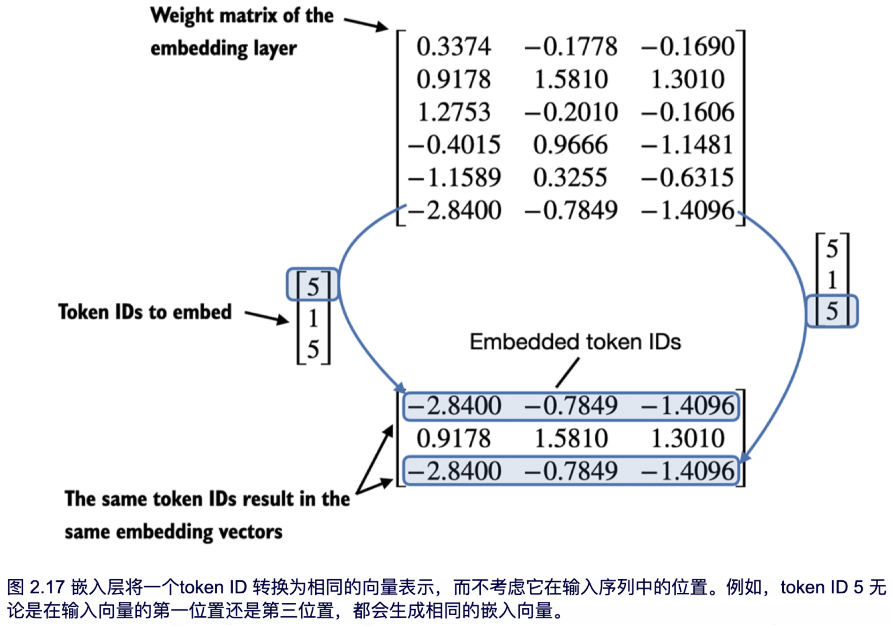

从原则上讲，确定性的、与位置无关的token ID 嵌入对于可重复性是有益的。然而，由于LLM的自注意力机制本身也是与位置无关的，因此向LLM注入额外的位置信息是有帮助的。

绝对位置嵌入与序列中的特定位置直接相关。对于输入序列中的每个位置，都会将一个唯一的绝对位置嵌入向量添加到token的嵌入向量中，以传达其确切位置。例如，第一个token将具有特定的位置嵌入，第二个token将具有另一个不同的嵌入，依此类推，如图2.18所示。


与关注token在序列中的绝对位置不同，相对位置嵌入强调的是token之间的相对位置或距离。这意味着模型学习的是“相隔多远”的关系，而不是“在什么确切位置”。这样的优势在于，即使模型在训练时没有接触过不同的长度，它也可以更好地适应各种长度的序列。

这两种类型的位置嵌入旨在增强 LLM 理解token顺序与关系的能力，从而确保在预测时能对上下文具有更准确的感知。选择哪种类型的位置嵌入通常取决于特定的应用和所处理数据的性质。

OpenAI 的 GPT 模型使用绝对位置嵌入，这些嵌入在训练过程中进行优化，而不是像原始 Transformer 模型中的位置编码那样是固定或预定义的。这个优化过程属于模型训练的一部分，我们将在本书后面的章节中实现。目前，让我们创建初始位置嵌入，以便为接下来的章节准备 LLM 输入。

之前，我们在本章中专注于非常小的嵌入大小以便于说明。我们现在考虑更现实和有用的嵌入大小，并将输入token编码为256维的向量表示。这比原始的GPT-3模型使用的要小（在GPT-3中，嵌入大小为12,288维），但对于实验仍然是合理的。此外，我们假设token ID 是由我们之前实现的BPE分词器创建的，该分词器的词汇量为50,257：

```python
vocab_size = 50257
output_dim = 256
token_embedding_layer = torch.nn.Embedding(vocab_size, output_dim)
```

使用上面的 `token_embedding_layer`，如果我们从数据加载器中采样数据，我们将每个批次中的每个token嵌入到一个 256 维的向量中。如果我们的批次大小为 8，每个批次有四个token，那么结果将是一个形状为 8 x 4 x 256 的张量。

首先，让我们实例化 2.6 节中创建的数据加载器，使用滑动窗口进行数据采样：

```python
max_length = 4
dataloader = create_dataloader_v1(
  	raw_text, batch_size=8, max_length=max_length, stride=max_length, shuffle=False)
data_iter = iter(dataloader)
inputs, targets = next(data_iter)
print("Token IDs:\n", inputs)
print("\nInputs shape:\n", inputs.shape)
```

输出如下：

```
Token IDs:
 tensor([[   40,   367,  2885,  1464],
 				[ 1807,  3619,   402,   271],
 				[10899,  2138,   257,  7026],
 				[15632,   438,  2016,   257],
 				[  922,  5891,  1576,   438],
 				[  568,   340,   373,   645],
 				[ 1049,  5975,   284,   502],
 				[  284,  3285,   326,    11]])


Inputs shape:
	torch.Size([8, 4])
```

我们可以看到，tokenID张量是8x4维的，这意味着数据批次由8个文本样本组成，每个样本有4个token。

现在，让我们使用嵌入层将这些token ID 转换为 256 维的向量：

```python
token_embeddings = token_embedding_layer(inputs)
print(token_embeddings.shape)
```

输出如下：

```
torch.Size([8, 4, 256])
```

从 8x4x256 维的张量输出中，我们可以看到，每个token ID 现在被嵌入为一个 256 维的向量。

对于 GPT 模型所使用的绝对嵌入方法，我们只需创建另一个嵌入层，其维度与 token_embedding_layer 的维度相同：

```python
context_length = max_length
pos_embedding_layer = torch.nn.Embedding(context_length, output_dim)
pos_embeddings = pos_embedding_layer(torch.arange(context_length))
print(pos_embeddings.shape)
```

如前面的代码所示， pos_embeddings 的输入通常是一个占位符向量torch.arange(context_length)，它包含一个从0到最大输入长度-1的数字序列。context_length 是一个表示LLM支持的输入大小的变量。在这里，我们设置它与输入文本的最大长度相同。在实际应用中，输入文本可能会超过支持的上下文长度，此时我们需要对文本进行截断。

上述代码输出结果如下：

```
torch.Size([4, 256])
```

正如我们所见，位置嵌入张量由四个 256 维向量组成。我们现在可以将这些直接添加到token嵌入中，在每个批次中，PyTorch 会将 4x256 维的 pos_embeddings 张量添加到每个 4x256 维的token嵌入张量中：

```python
input_embeddings = token_embeddings + pos_embeddings
print(input_embeddings.shape)
```

```
torch.Size([8, 4, 256])
```

我们创建的 input_embeddings，如图 2.19 所示，现在可作为LLM的核心模块的输入嵌入。我们将在第3章开始实现这些模块。

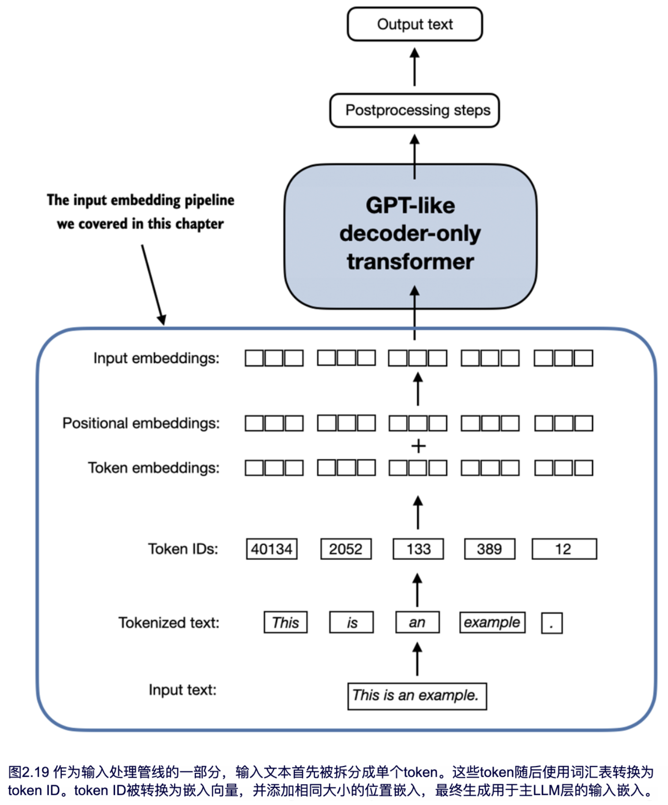


## 2.9 本章摘要

+ LLM 需要将文本数据转换为数值向量，这称之为嵌入，因为它们无法处理原始文本。嵌入将离散数据（如单词或图像）转化为连续的向量空间，从而使其能够与神经网络操作兼容。
+ 作为第一步，原始文本被分解为token，这些token可以是单词或字符。然后，这些token被转换为整数表示，称为token ID。
+ 可以添加特殊token，如 <|unk|> 和 <|endoftext|>，以增强模型的理解能力，并处理各种上下文，例如未知单词或无关文本之间的边界分隔。
+ 用于像 GPT-2 和 GPT-3 这样的 LLM 的字节对编码（BPE）分词器，可以通过将未知单词分解为子词单元或单个字符，高效地处理这些单词。
+ 我们在分词后的文本数据上采用滑动窗口方法，以生成用于 LLM 训练的输入-目标对。
+ 在 PyTorch 中，嵌入层作为一种查找操作，用于检索与token ID 对应的向量。生成的嵌入向量提供了token的连续表示，这在训练像 LLM 这样的深度学习模型时至关重要。
+ 虽然token嵌入为每个token提供了一致的向量表示，但它们并没有考虑token在序列中的位置。为了解决这个问题，存在两种主要类型的位置嵌入：绝对位置嵌入和相对位置嵌入。OpenAI 的 GPT 模型采用绝对位置嵌入，这些位置嵌入向量会与token嵌入向量相加，并在模型训练过程中进行优化。

