# 3.实现注意力机制

本章涵盖以下内容：

+ **探讨在神经网络中使用注意力机制的原因**
+ **介绍一个基本的自注意力框架，并逐步深入到改进的自注意力机制**
+ **实现一个因果注意力模块，使 LLM 能够一次生成一个token**
+ **使用 dropout 随机掩盖部分注意力权重，以减少过拟合**

-----

- [3.1 长序列建模的问题](#31-长序列建模的问题)
- [3.2 通过注意力机制捕捉数据依赖关系](#32-通过注意力机制捕捉数据依赖关系)
- [3.3 通过自注意力机制关注输入的不同部分](#33-通过自注意力机制关注输入的不同部分)
  - [3.3.1 一种不含可训练权重的简化自注意力机制。](#331-一种不含可训练权重的简化自注意力机制)
  - [3.3.2 为所有输入的 token 计算注意力权重](#332-为所有输入的-token-计算注意力权重)
- [3.4 实现带有可训练权重的自注意力机制](#34-实现带有可训练权重的自注意力机制)
  - [3.4.1 逐步计算注意力权重](#341-逐步计算注意力权重)
  - [3.4.2 实现一个简洁的自注意力机制 Python 类](#342-实现一个简洁的自注意力机制-python-类)
- [3.5 使用因果注意力机制来屏蔽后续词](#35-使用因果注意力机制来屏蔽后续词)
  - [3.5.1 应用因果注意力掩码](#351-应用因果注意力掩码)
  - [3.5.2 使用 dropout 遮掩额外的注意力权重](#352-使用-dropout-遮掩额外的注意力权重)
  - [3.5.3 实现一个简洁的因果注意力类](#353-实现一个简洁的因果注意力类)
- [3.6 从单头注意力扩展到多头注意力](#36-从单头注意力扩展到多头注意力)
  - [3.6.1 堆叠多层单头注意力层](#361-堆叠多层单头注意力层)
  - [3.6.2 通过权重分割实现多头注意力机制](#362-通过权重分割实现多头注意力机制)
- [3.7 本章摘要](#37-本章摘要)


-----


在上一章中，我们学习了如何准备输入文本以训练 LLM。这包括将文本拆分为单个单词和子词token，这些token可以被编码为向量，即所谓的嵌入，以供 LLM 使用。

在本章中，我们将关注 LLM 架构中的重要组成部分，即注意力机制，如图 3.1 所示。

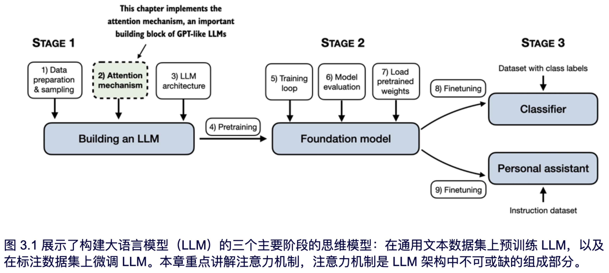

注意力机制是一个复杂的话题，因此我们将专门用一整章来讨论它。我们将注意力机制作为独立模块来研究，重点关注其内部的工作原理。在下一章中，我们将编写与自注意力机制相关的 LLM 的其他部分，以观察其实际运作并创建一个生成文本的模型。

本章中，我们将实现四种不同的注意力机制变体，如图 3.2 所示。

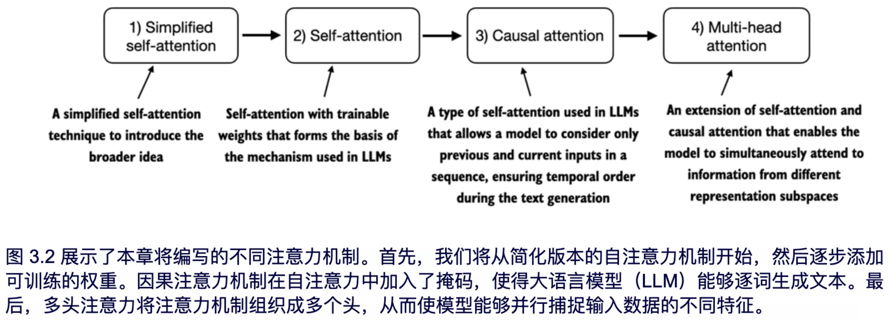

图 3.2 中展示的这些不同的注意力变体是逐步构建的，其目标是在本章末尾实现一个简单且高效的多头注意力机制，以便在下一章中可以将其整合到我们将编写的 LLM 架构中。


## 3.1 长序列建模的问题

在深入了解自注意力机制之前（这是大语言模型的核心），让我们先探讨一下缺乏注意力机制的架构存在哪些问题（这些架构在大语言模型之前已经存在）。假设我们想要开发一个将一种语言翻译成另一种语言的翻译模型。如图 3.3 所示，我们无法简单地逐词翻译文本，因为源语言和目标语言的语法结构往往存在差异。

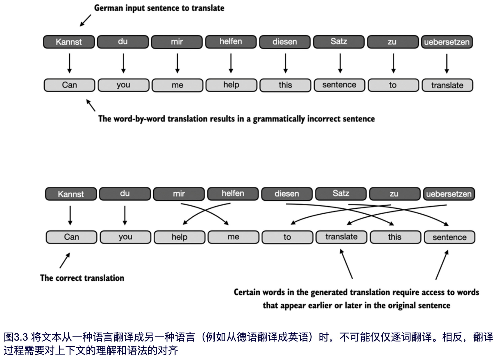

为了解决逐词翻译的局限性，通常使用包含两个子模块的深度神经网络，即所谓的编码器（encoder）和解码器（decoder）。编码器的任务是先读取并处理整个文本，然后解码器生成翻译后的文本。

在第 1 章（1.4 节，使用 LLM 进行不同任务）介绍 Transformer 架构时，我们已经简要讨论过编码器-解码器网络。在 Transformer 出现之前，循环神经网络（RNN）是最流行的用于语言翻译的编码器-解码器架构。

**循环神经网络（RNN）**是一种神经网络类型，其中前一步的输出会作为当前步骤的输入，使其非常适合处理像文本这样的序列数据。如果您不熟悉 RNN 的工作原理，不必担心，您无需了解 RNN 的详细机制也可以参与这里的讨论；这一节学习的重点更多是编码器-解码器架构的总体概念。

在编码器-解码器架构的 RNN 网络中，输入文本被输入到编码器中，编码器按顺序处理文本内容。在每个步骤中，编码器会更新其隐状态（即隐藏层的内部值），试图在最终的隐状态中捕捉整个输入句子的含义，如图 3.4 所示。随后，解码器使用该最终隐状态来开始逐词生成翻译句子。解码器在每一步也会更新其隐状态，用于携带生成下一个词所需的上下文信息。

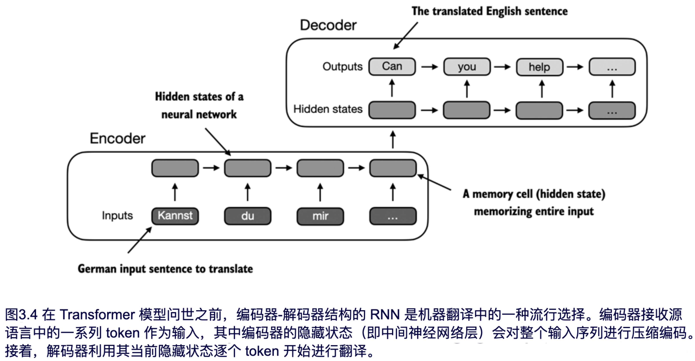

尽管我们不需要深入了解这些编码器-解码器架构的 RNN 的内部工作原理，但这里的关键思想在于，编码器部分将整个输入文本处理为一个隐藏状态（记忆单元）。解码器随后使用该隐藏状态生成输出。您可以将这个隐藏状态视为一个嵌入向量，这是我们在第 2 章中已讨论过的概念。

编码器-解码器架构的 RNN 的一个重大问题和限制在于，**在解码阶段 RNN 无法直接访问编码器的早期隐藏状态**。因此，它只能依赖当前隐藏状态来封装所有相关信息。这种设计可能导致上下文信息的丢失，特别是在依赖关系较长的复杂句子中，这一问题尤为突出。

对于不熟悉 RNN 的读者，不必深入理解或学习这种架构，因为本书中不会使用它。本节的重点是，编码器-解码器 RNN 存在一个缺点，这一缺点促使了注意力机制的设计。

> [!TIP]
>
> **个人思考：** 虽然本书没有涉及对RNN的过多讨论，但了解从RNN到注意力机制的技术变迁对于核心内容的理解至关重要。让我们通过一个具体的示例来理解这种技术变迁：
>
> 1. **RNN的局限性**
>
>    假设我们有一个长句子：“The cat, who was sitting on the windowsill, jumped down because it saw a bird flying outside the window.”
>
>    假设任务是预测句子最后的内容，即要理解“it”指的是“the cat”而不是“the windowsill”或其他内容。对于 RNN 来说，这个任务是有难度的，原因如下：
>
>    + **长距离依赖问题**：在 RNN 中，每个新输入的词会被依次传递到下一个时间步。随着句子长度增加，模型的隐状态会不断被更新，但早期信息（如“the cat”）会在层层传播中逐渐消失。因此，模型可能无法在“it”出现时有效地记住“the cat”是“it”的指代对象。
>    + **梯度消失问题**：RNN 在反向传播中的梯度会随着时间步的增加逐渐减小，这种“梯度消失”使得模型很难在长句中保持信息的准确传播，从而难以捕捉到长距离的语义关联。
>
> 2. **注意力机制的解决方法**
>
>    为了弥补 RNN 的这些不足，**注意力机制**被引入。它的关键思想是**在处理每个词时，不仅依赖于最后的隐藏状态，而是允许模型直接关注序列中的所有词**。这样，即使是较远的词也能在模型计算当前词的语义时直接参与。
>
>    在上例中，注意力机制如何帮助模型理解“it”指代“the cat”呢？
>
>    + **注意力机制的工作原理**：当模型处理“it”时，注意力机制会将“it”与整个句子中的其他词进行相似度计算，判断“it”应该关注哪些词。
>      + 由于“the cat”与“it”在语义上更相关，注意力机制会为“the cat”分配较高的权重，而其他词（如“windowsill”或“down”）则获得较低的权重。
>    + **信息的直接引用**：通过注意力机制，模型可以跳过中间步骤，直接将“it”与“the cat”关联，而不需要依赖所有的中间隐藏状态。
>
> 3. **示例中的注意力矩阵**
>
>    假设使用一个简单的注意力矩阵，模型在处理“it”时，给每个词的权重可能如下（至于如何计算这些权重值后文会详细介绍）：
>
>    | 词       | The  | cat  | who  | was  | sitting | ...  | it   | saw  | bird | flying | ...  | window |
>    | -------- | ---- | ---- | ---- | ---- | ------- | ---- | ---- | ---- | ---- | ------ | ---- | ------ |
>    | **权重** | 0.1  | 0.3  | 0.05 | 0.05 | 0.05    | ...  | 0.4  | 0.05 | 0.02 | 0.01   | ...  | 0.02   |
>
>    在这个注意力矩阵中，可以看到**“it”对“the cat”有较高的关注权重（0.3），而对其他词的关注权重较低**。这种直接的关注能力让模型能够高效捕捉长距离依赖关系，理解“it”与“the cat”的语义关联。


## 3.2 通过注意力机制捕捉数据依赖关系

在 Transformer 架构的大语言模型（LLM）出现之前，通常会使用循环神经网络（RNN）来完成语言建模任务，例如语言翻译。RNN 对于翻译短句表现良好，但在处理长文本时效果不佳，因为它们无法直接访问输入序列中的前面词语。

这一方法的一个主要缺陷在于，RNN 必须将整个编码后的输入信息存储在一个隐藏状态中，然后再将其传递给解码器，如上一节的图 3.4 所示。

因此，研究人员在 2014 年为 RNN 开发了所谓的 Bahdanau 注意力机制（该机制以论文的第一作者命名）。该机制对编码器-解码器架构的 RNN 进行了改进，使得解码器在每个解码步骤可以选择性地访问输入序列的不同部分，如图 3.5 所示。

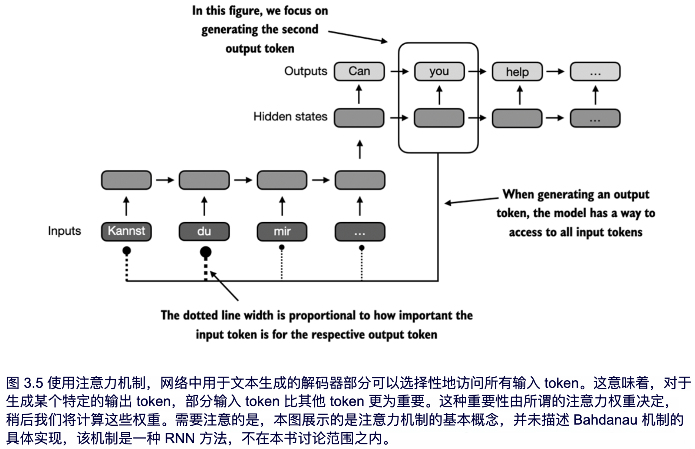

有趣的是，仅仅三年后，研究人员发现构建用于自然语言处理的深度神经网络并不需要 RNN 结构，随后提出了基于自注意力机制的原始 Transformer 架构（在第 1 章中讨论），其灵感来自 Bahdanau 提出的注意力机制。

自注意力机制是一种允许输入序列中的每个位置在计算序列表示时关注同一序列中所有位置的机制。自注意力机制是基于Transformer架构的当代大语言模型（如GPT系列模型）的关键组成部分。

本章将重点讲解并实现 GPT 类模型中使用的自注意力机制，如图 3.6 所示。在下一章中，我们将继续编码 LLM 的其它部分。

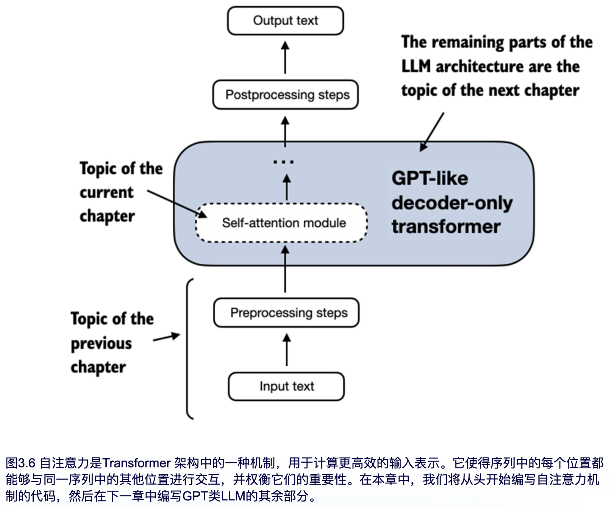


## 3.3 通过自注意力机制关注输入的不同部分

现在我们将深入了解自注意力机制的内部工作原理，并从零开始学习如何实现它。自注意力机制是基于 Transformer 架构的所有大语言模型的核心。需要注意的是，这一部分内容可能需要大量的专注与投入（无双关含义），但一旦掌握了它的基本原理，你就攻克了本书及大语言模型实现中最困难的部分之一。

> [!NOTE]
>
> **“自我”在自注意力机制中的含义**
>
> 在自注意力机制中，“self”指的是该机制通过关联同一输入序列中的不同位置来计算注意力权重的能力。它评估并学习输入内部各部分之间的关系和依赖性，例如句子中的单词或图像中的像素。这与传统注意力机制不同，传统机制关注的是两个不同序列间的关系，例如序列到序列模型中，注意力可能存在于输入序列和输出序列之间，这一点在图 3.5 中有示例说明。

由于自注意力机制对于初次接触的读者可能显得较为复杂，我们将在下一小节中首先介绍一个简化版的自注意力机制。随后，在第 3.4 节中，我们将实现带有可训练权重的自注意力机制，这种机制被用于大语言模型（LLM）中。


### 3.3.1 一种不含可训练权重的简化自注意力机制。

在本节中，我们实现了一个简化的自注意力机制版本，没有包含任何可训练的权重，如图 3.7 所示。本节的目标是先介绍自注意力机制中的一些关键概念，然后在 3.4 节引入可训练的权重。

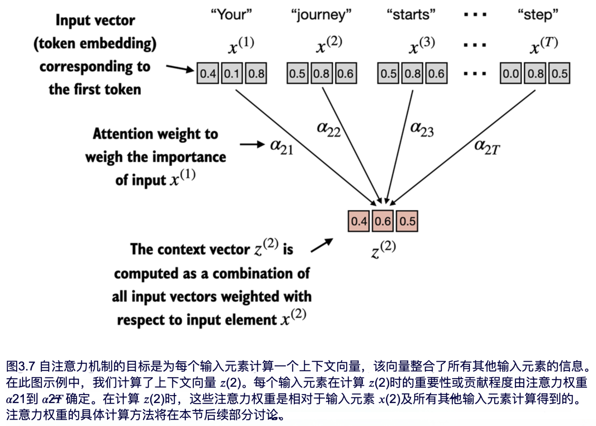

图 3.7 显示了一个输入序列，记作 x，由 T 个元素组成，表示为 x<sup>(1)</sup> 到 x<sup>(T)</sup>。该序列通常代表文本，例如一个句子，并且该文本已被转换为 token 嵌入（不记得嵌入概念的请回顾第 2 章）。

举例来说，假设输入文本为 “Your journey starts with one step”。在这个例子中，序列中的每个元素（如 x<sup>(1)</sup>）对应一个 `d` 维的嵌入向量，用于表示特定的 token，例如 “Your”。在图 3.7 中，这些输入向量显示为 3 维的嵌入向量。

在自注意力机制中，我们的目标是为输入序列中的每个元素 x<sup>(i)</sup> 计算其对应的上下文向量 z<sup>(i)</sup> 。上下文向量可以被解释为一种增强的嵌入向量（`别着急，后文会解释`）。

为了说明这个概念，我们聚焦于第二个输入元素 x<sup>(2)</sup> 的嵌入向量（对应于词 "journey"）以及相应的上下文向量 z<sup>(2)</sup>，如图 3.7 底部所示。这个增强的上下文向量 z<sup>(2)</sup> 也是一个嵌入向量，包含了关于 x<sup>(2)</sup> 以及序列中所有其他输入元素 x<sup>(1)</sup> 到 x<sup>(T)</sup> 的语义信息。

在自注意力机制中，上下文向量起着关键作用。它们的目的是通过整合序列中所有其他元素的信息（如同一个句子中的其他词），为输入序列中的每个元素创建丰富的表示，正如图 3.7 所示。这对大语言模型至关重要，因为模型需要理解句子中各个词之间的关系和关联性。之后的章节中，我们将添加可训练的权重，以帮助大语言模型学习构建这些上下文向量，用于执行生成下一个词的任务。

在本节中，我们将实现一个简化的自注意力机制，以逐步计算注意力权重和由此生成的上下文向量。

请考虑以下输入句子，该句子已经根据第 2 章的讨论转换为三维向量。为了便于说明和展示，我们选择了较小的嵌入维度，以确保句子在页面上可以完整地展示。

```python
import torch
inputs = torch.tensor(
  [[0.43, 0.15, 0.89], # Your     (x^1)
   [0.55, 0.87, 0.66], # journey  (x^2)
   [0.57, 0.85, 0.64], # starts   (x^3)
   [0.22, 0.58, 0.33], # with     (x^4)
   [0.77, 0.25, 0.10], # one      (x^5)
   [0.05, 0.80, 0.55]] # step     (x^6)

```

实现自注意力机制的第一步是计算中间值 **ω**，即注意力得分，如图 3.8 所示。（请注意，图 3.8 中展示的输入张量值是截断版的，例如，由于空间限制，0.87 被截断为 0.8。在此截断版中，单词 "journey" 和 "starts" 的嵌入向量可能会由于随机因素而看起来相似）。

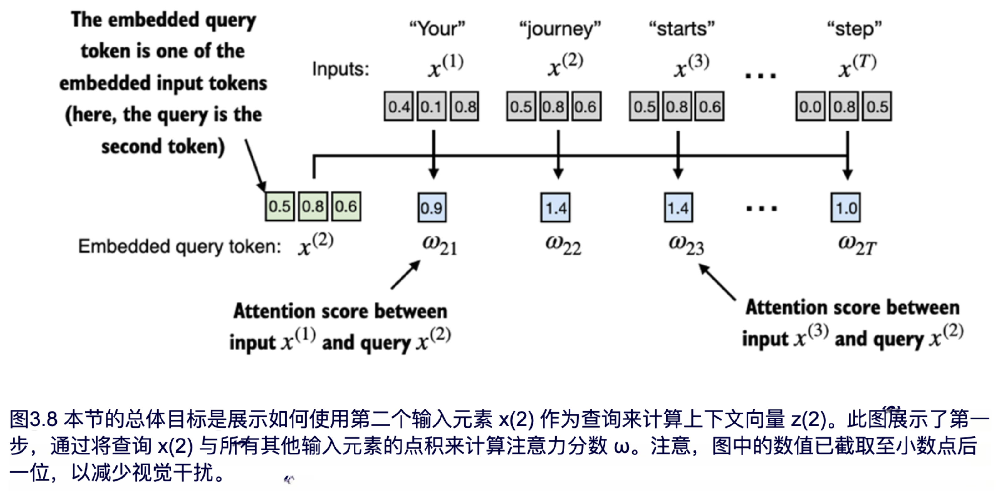

图 3.8 展示了如何计算查询 token 与每个输入 token 之间的中间注意力得分。我们通过计算查询 x<sup>(2)</sup> 与每个其他输入 token 的点积来确定这些得分：

```python
query = inputs[1]                                               #A
attn_scores_2 = torch.empty(inputs.shape[0])
for i, x_i in enumerate(inputs):
    attn_scores_2[i] = torch.dot(x_i, query)
print(attn_scores_2)


#A 第二个输入 token 用作查询向量
```

> [!TIP]
>
> **个人思考：** 这里对于注意力得分的计算描述的比较笼统，仅仅说明了将当前的输入Token向量与其它Token的向量进行点积运算计算注意力得分，实际上，每个输入Token会先通过权重矩阵W分别计算出它的Q、K、V三个向量，这三个向量的定义如下：
>
> + **Q向量（查询向量）**：查询向量代表了这个词在寻找相关信息时提出的问题
> + **K向量（键向量）**：键向量代表了一个单词的特征，或者说是这个单词如何"展示"自己，以便其它单词可以与它进行匹配
> + **V向量（值向量）**：值向量携带的是这个单词的具体信息，也就是当一个单词被"注意到"时，它提供给关注者的内容
>
> **更通俗的理解：** 想象我们在图书馆寻找一本书（`Q向量`），我们知道要找的主题（`Q向量`），于是查询目录（`K向量`），目录告诉我哪本书涉及这个主题，最终我找到这本书并阅读内容（`V向量`），获取了我需要的信息。
>
> 具体生成Q、K、V向量的方式主要通过线性变换：
>
> ```python
> Q1 = W_Q * (E1 + Pos1)
> K1 = W_K * (E1 + Pos1)
> V1 = W_V * (E1 + Pos1)
> ```
>
> 依次类推，为所有token生成`Q`，`K`，`V`向量，其中`W_Q`，`W_K`和`W_V`是Transformer训练出的权重（每一层不同）
>
> 针对每一个目标token，Transformer会计算它的 `Q向量` 与其它所有的token的 `K向量` 的点积，以确定每个词对当前词的重要性（即注意力分数）
>
> 假如有句子：“The cat drank the milk because it was hungry”
>
> 例如对于词 `cat` 的 `Q向量 Q_cat`，模型会计算：
>
> + `score_cat_the = Q_cat · K_the`   ---  与`the`的语义相关度
> + `score_cat_drank = Q_cat · K_drank` --- 与 `drank` 的语义相关度
> + `score_cat_it = Q_cat · K_it` --- 与 `it` 的语义相关度
> + 依此类推，得到`cat`与句子中其它所有token的注意力分数 `[score_cat_the、score_cat_drank、socre_cat_it、……]`

计算得到的注意力得分如下：

```python
tensor([0.9544, 1.4950, 1.4754, 0.8434, 0.7070, 1.0865])
```

> [!NOTE]
>
> **理解点积**
>
> 点积运算本质上是一种将两个向量按元素相乘后再求和的简单方式，我们可以如下演示：
>
> ```python
> res = 0.
> for idx, element in enumerate(inputs[0]):
>      res += inputs[0][idx] * query[idx]
> print(res)
> print(torch.dot(inputs[0], query))
> ```
>
> 输出结果确认，逐元素相乘的和与点积的结果相同。
>
> ```python
> tensor(0.9544)
> tensor(0.9544)
> ```
>
> 除了将点积运算视为结合两个向量并产生标量结果的数学工具之外，点积也是一种相似度的衡量方法，因为它量化了两个向量的对齐程度：较高的点积值表示向量之间有更高的对齐程度或相似度。在自注意力机制的背景下，点积决定了序列中元素之间的关注程度：点积值越高，两个元素之间的相似度和注意力得分就越高。

如图 3.9 所示，接下来，我们对先前计算的每个注意力分数进行归一化。

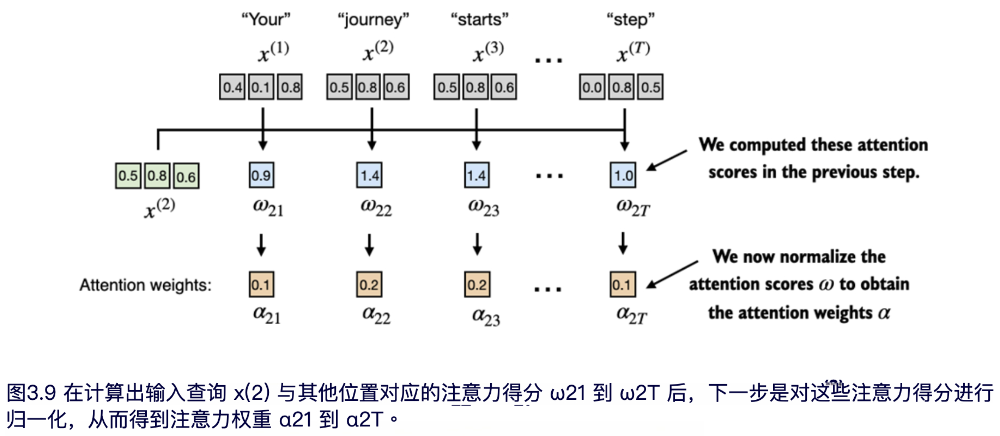

图3.9中所示的归一化的主要目的是使注意力权重之和为 1。这种归一化是一种有助于解释和保持LLM训练稳定性的惯例。以下是一种实现此归一化步骤的简单方法：

```python
attn_weights_2_tmp = attn_scores_2 / attn_scores_2.sum()
print("Attention weights:", attn_weights_2_tmp)
print("Sum:", attn_weights_2_tmp.sum())
```

如输出所示，现在注意力权重的总和为 1：

```python
Attention weights: tensor([0.1455, 0.2278, 0.2249, 0.1285, 0.1077, 0.1656])
Sum: tensor(1.0000)
```

在实践中，更常见且更推荐使用 softmax 函数来进行归一化。这种方法更擅长处理极端值，并且在训练过程中提供了更有利的梯度特性。以下是用于归一化注意力分数的 softmax 函数的基础实现。

```python
def softmax_naive(x):
    return torch.exp(x) / torch.exp(x).sum(dim=0)
attn_weights_2_naive = softmax_naive(attn_scores_2)
print("Attention weights:", attn_weights_2_naive)
print("Sum:", attn_weights_2_naive.sum())
```

从输出中可以看到，softmax 函数可以实现注意力权重的归一化，使它们的总和为 1：

```python
Attention weights: tensor([0.1385, 0.2379, 0.2333, 0.1240, 0.1082, 0.1581])
Sum: tensor(1.)
```

此外，softmax 函数确保注意力权重始终为正值。这使得输出可以被解释为概率或相对重要性，其中较高的权重表示更重要。

注意，这种简单的 softmax 实现（softmax_naive）在处理较大或较小的输入值时，可能会遇到数值不稳定性问题，例如上溢或下溢。因此，实际操作中，建议使用 PyTorch 的 softmax 实现，它经过了充分的性能优化：

```python
attn_weights_2 = torch.softmax(attn_scores_2, dim=0)
print("Attention weights:", attn_weights_2)
print("Sum:", attn_weights_2.sum())
```

可以看到，它与我们之前实现的 `softmax_naive` 函数产生的结果相同。

```python
Attention weights: tensor([0.1385, 0.2379, 0.2333, 0.1240, 0.1082, 0.1581])
Sum: tensor(1.)
```

> [!TIP]
>
> **个人思考：** 这里稍微延伸探讨一下`Softmax`, 它是一种常用的激活函数，尤其在神经网络的分类任务中被广泛使用。它的作用是将一个任意的实数向量转换为一个概率分布，且所有元素的概率之和为 1。下面通过例子来说明 softmax 的原理、好处，以及它在神经网络中的使用原因。
>
> 1. **Softmax 的原理**
>
>    Softmax 函数的公式如下：
>
>    $$ \text{softmax}\left(z_{i}\right)=\frac{e^{z_{i}}}{\sum_{j} e^{z_{j}}} $$
>
>    其中z<sub>i</sub>是输入的每个分数（即未激活的原始值），e 是自然对数的底。这个公式的作用是将输入向量中的每个元素转换为一个概率值，且所有值的和为 1。
>
> 2. **Softmax 的好处**
>
>    + **归一化输出为概率**：Softmax 将输出转换为 0 到 1 之间的概率，且所有类别的概率之和为 1，方便解释结果。例如，在分类任务中，输出可以直接表示模型对各类别的信心。
>    + **平滑和放大效果**：Softmax 不仅能归一化，还具有平滑和放大效果。较大的输入值会被放大，较小的输入值会被抑制，从而增强模型对最优类别的区分。
>    + **支持多分类问题**：与 sigmoid 不同，Softmax 适用于多类别分类问题。它可以输出每个类别的概率，使得模型可以处理多分类任务。
>
> 3. **神经网络为什么喜欢使用 Softmax**
>
>    在神经网络中，特别是分类模型（如图像分类、文本分类）中，Softmax 层通常用作最后一层输出。原因包括：
>
>    + **便于优化**：在分类任务中，Softmax 输出的概率分布可与真实的标签概率进行比较，从而计算交叉熵损失。交叉熵损失的梯度较为稳定，便于模型的优化。
>    + **概率解释**：Softmax 输出可以解释为“模型对每个类别的信心”，使得输出直观可理解。
>    + **与交叉熵的结合**：Softmax 与交叉熵损失函数结合效果特别好，可以直接将模型预测的概率分布与真实标签比较，从而更快收敛，效果更好。

现在我们已经计算出了归一化的注意力权重，接下来可以执行图 3.10 所示的最后一步：通过将嵌入后的输入 token x<sup>(i)</sup> 与相应的注意力权重相乘，再将所得向量求和来计算上下文向量 z<sup>(2)</sup>。

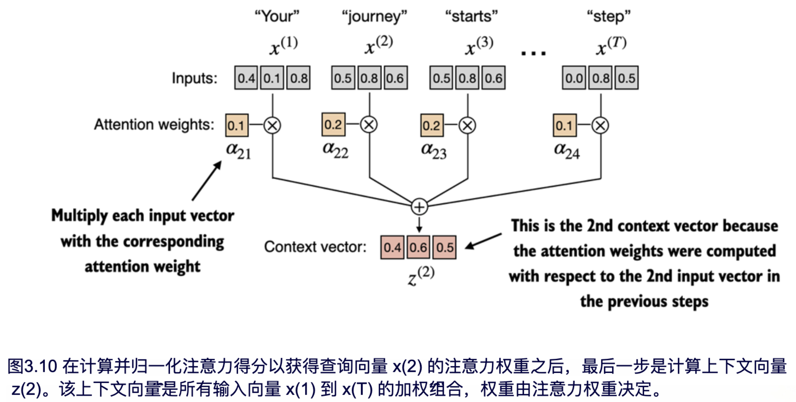

如图 3.10 所示，上下文向量 z<sup>(2)</sup> 是所有输入向量的加权和。其计算方法为将每个输入向量与对应的注意力权重相乘后相加。

```python
query = inputs[1] # 2nd input token is the query
context_vec_2 = torch.zeros(query.shape)
for i,x_i in enumerate(inputs):
    context_vec_2 += attn_weights_2[i]*x_i
print(context_vec_2)
```

结算结果如下：

```python
tensor([0.4419, 0.6515, 0.5683])
```

在接下来的章节，我们将把串行计算上下文向量的过程优化为并行计算所有输入token的上下文向量。


###  3.3.2 为所有输入的 token 计算注意力权重

在前一节中，我们计算了第二个输入元素的注意力权重和上下文向量（如图 3.11 中的高亮行所示）。现在，我们将扩展该计算，以对所有输入计算注意力权重和上下文向量。

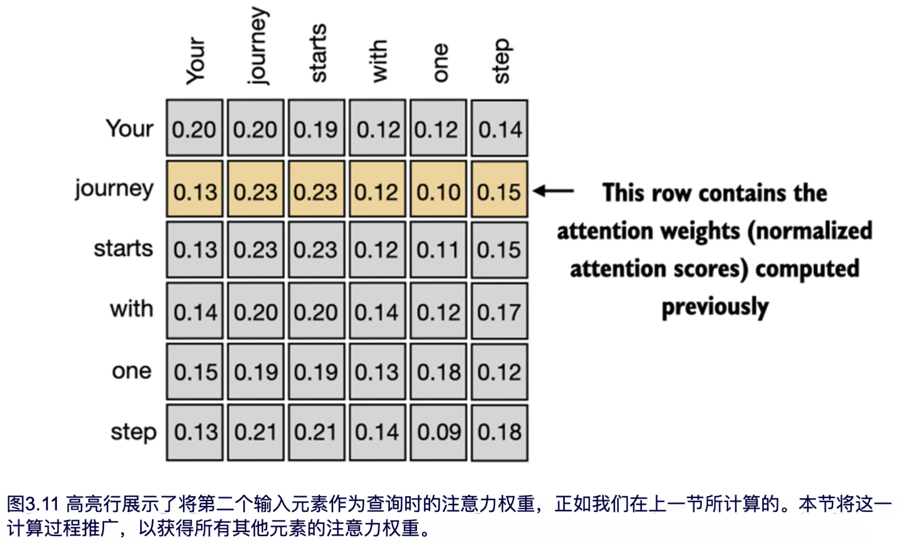

我们沿用之前的三个步骤（如图 3.12 所示），只是对代码做了一些修改，用于计算所有的上下文向量，而不仅仅是第二个上下文向量 z<sup>(2)</sup>。

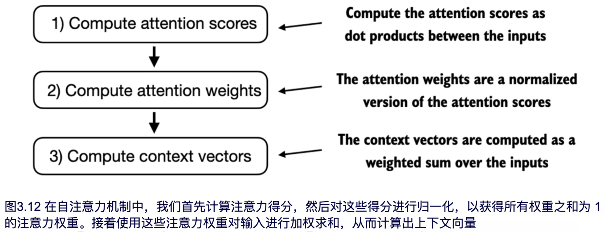

如图 3.12 所示，在第 1 步中，我们添加了一个额外的 for 循环，用于计算所有输入对之间的点积。

```python
attn_scores = torch.empty(6, 6)
for i, x_i in enumerate(inputs):
    for j, x_j in enumerate(inputs):
        attn_scores[i, j] = torch.dot(x_i, x_j)
print(attn_scores)
```

计算得到的注意力分数集合如下：

```python
tensor([[0.9995, 0.9544, 0.9422, 0.4753, 0.4576, 0.6310],
        [0.9544, 1.4950, 1.4754, 0.8434, 0.7070, 1.0865],
        [0.9422, 1.4754, 1.4570, 0.8296, 0.7154, 1.0605],
        [0.4753, 0.8434, 0.8296, 0.4937, 0.3474, 0.6565],
        [0.4576, 0.7070, 0.7154, 0.3474, 0.6654, 0.2935],
        [0.6310, 1.0865, 1.0605, 0.6565, 0.2935, 0.9450]])
```

以上张量中的每个元素都表示每对输入之间的注意力得分（正如图 3.11 中所示）。请注意，图 3.11 中的值已进行了归一化，因此它们与以上张量中的未经归一化的注意力得分不同。我们稍后会处理归一化。

在上述代码中，我们使用了 Python 中的 for 循环来计算所有输入对的注意力得分。然而，for 循环通常较慢，我们可以通过矩阵乘法实现相同的结果。

```python
attn_scores = inputs @ inputs.T
print(attn_scores)
```

可以看到，结果与之前一致：

```python
tensor([[0.9995, 0.9544, 0.9422, 0.4753, 0.4576, 0.6310],
        [0.9544, 1.4950, 1.4754, 0.8434, 0.7070, 1.0865],
        [0.9422, 1.4754, 1.4570, 0.8296, 0.7154, 1.0605],
        [0.4753, 0.8434, 0.8296, 0.4937, 0.3474, 0.6565],
        [0.4576, 0.7070, 0.7154, 0.3474, 0.6654, 0.2935],
        [0.6310, 1.0865, 1.0605, 0.6565, 0.2935, 0.9450]])
```

接下来开始执行步骤 2（如图 3.12 所示），我们现在对每一行进行归一化处理，使得每一行的值之和为 1。

```python
attn_weights = torch.softmax(attn_scores, dim=-1)
print(attn_weights)
```

执行上述代码返回的注意力权重张量与图 3.10 中显示的数值一致：

```python
tensor([[0.2098, 0.2006, 0.1981, 0.1242, 0.1220, 0.1452],
        [0.1385, 0.2379, 0.2333, 0.1240, 0.1082, 0.1581],
        [0.1390, 0.2369, 0.2326, 0.1242, 0.1108, 0.1565],
        [0.1435, 0.2074, 0.2046, 0.1462, 0.1263, 0.1720],
        [0.1526, 0.1958, 0.1975, 0.1367, 0.1879, 0.1295],
        [0.1385, 0.2184, 0.2128, 0.1420, 0.0988, 0.1896]])
```

在使用 PyTorch 时，像 `torch.softmax` 这样的函数中的 `dim` 参数指定了将在输入张量中的哪个维度上进行归一化计算。通过设置 `dim=-1`，我们指示 `softmax` 函数沿着 `attn_scores` 张量的最后一个维度进行归一化操作。如果 `attn_scores` 是一个二维张量（例如，形状为 `[行数, 列数]`），则 `dim=-1` 将沿列方向进行归一化，使得每一行的值（沿列方向求和）之和等于 1。

在继续执行第 3 步（即图 3.12 所示的最后一步）之前，我们先简单验证一下每一行的总和是否确实为 1：

```python
row_2_sum = sum([0.1385, 0.2379, 0.2333, 0.1240, 0.1082, 0.1581])
print("Row 2 sum:", row_2_sum)
print("All row sums:", attn_weights.sum(dim=-1))
```

结果如下：

```python
Row 2 sum: 1.0
All row sums: tensor([1.0000, 1.0000, 1.0000, 1.0000, 1.0000, 1.0000])
```

在第 3 步也是最后一步中，我们使用这些注意力权重通过矩阵乘法的方式来并行计算所有的上下文向量：

```python
all_context_vecs = attn_weights @ inputs
print(all_context_vecs)
```

可以看到，计算输出的张量中，每一行包含一个三维的上下文向量：

```python
tensor([[0.4421, 0.5931, 0.5790],
        [0.4419, 0.6515, 0.5683],
        [0.4431, 0.6496, 0.5671],
        [0.4304, 0.6298, 0.5510],
        [0.4671, 0.5910, 0.5266],
        [0.4177, 0.6503, 0.5645]])
```

我们可以通过将第二行与之前在第 3.3.1 节中计算的上下文向量 z<sup>(2)</sup> 进行对比，来再次确认代码的正确性。

```python
 print("Previous 2nd context vector:", context_vec_2)
```

根据结果，我们可以看到之前计算的 context_vec_2 与以上张量的第二行完全一致：

```python
 Previous 2nd context vector: tensor([0.4419, 0.6515, 0.5683])
```

以上内容完成了对简化自注意力机制的代码演示。在接下来的部分，我们将添加可训练的权重，使大语言模型能够从数据中学习并提升其在特定任务上的性能。


## 3.4 实现带有可训练权重的自注意力机制

在本节中，我们将实现一种在原始 Transformer 架构、GPT 模型以及大多数其他流行的大语言模型中使用的自注意力机制。这种自注意力机制也被称为缩放点积注意力。图 3.13 提供了一个概念框架，展示了这种自注意力机制如何应用在在大语言模型的架构设计中。

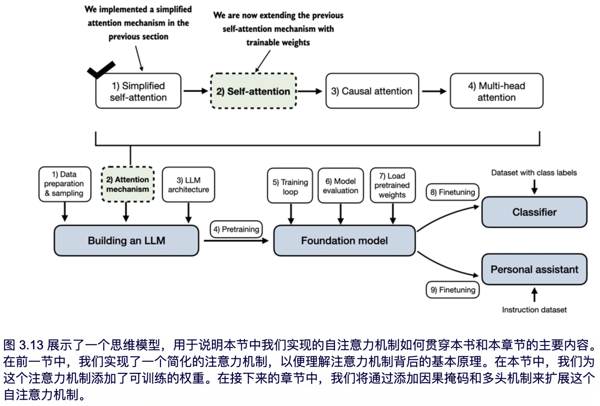

如图 3.13 所示，带有可训练权重的自注意力机制是基于之前简化自注意力机制的改进：我们希望计算某个特定输入元素的嵌入向量的加权和来作为上下文向量。您将看到，与我们在 3.3 节中编码的简化自注意力机制相比，只有细微的差别。

最显著的区别在于引入了在模型训练过程中不断更新的权重矩阵。这些可训练的权重矩阵至关重要，它们使模型（特别是模型内部的注意力模块）能够学习生成“优质”的上下文向量。（请注意，我们将在第 5 章训练大语言模型。）

我们将通过两个小节来深入讲解自注意力机制。首先，我们会像之前一样，逐步编写该机制的代码。然后，我们会将代码整理成一个紧凑的 Python 类，以便在之后第 4 章编写的大语言模型（LLM）架构中使用。


### 3.4.1 逐步计算注意力权重

我们通过引入三个可训练的权重矩阵：W<sub>q</sub>、W<sub>k</sub> 和 W<sub>v</sub> 来逐步实现自注意力机制。这三个矩阵用于将嵌入后的输入 token x<sup>(i)</sup> 映射为查询向量、键向量和值向量（如图 3.14 所示）。

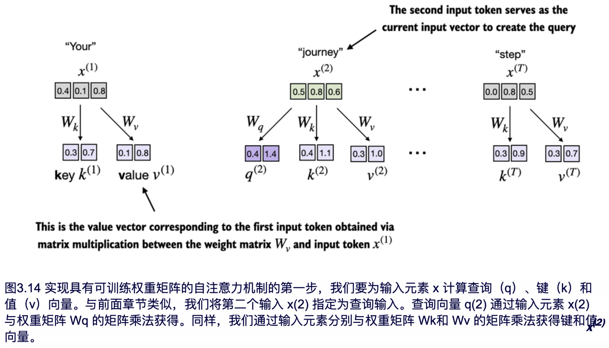

在 3.3.1 节中，我们将第二个输入元素 x<sup>(2)</sup> 定义为查询（query），通过计算简化的注意力权重来得到上下文向量 z<sup>(2)</sup>。随后，在第 3.3.2 节中，我们将这一过程推广到整个输入句子 "Your journey starts with one step"，为这六个词的输入句子计算所有的上下文向量 z<sup>(1)</sup> 到 z<sup>(T)</sup>。
同样地，为了便于说明，我们将先计算一个上下文向量 z<sup>(2)</sup>。接下来，我们将修改代码以计算所有的上下文向量。让我们从定义一些变量开始：

```python
x_2 = inputs[1]                                                   #A
d_in = inputs.shape[1]                                            #B
d_out = 2                                                         #C


#A 第二个输入元素
#B 输入维度， d_in=3
#C 输出维度， d_out=2
```

请注意，在 GPT 类模型中，输入维度和输出维度通常是相同的。不过，为了便于说明和更清楚地展示计算过程，我们在此选择了不同的输入（d_in=3）和输出（d_out=2）维度。

接下来，我们初始化图3.14中所示的三个权重矩阵W<sub>q</sub>、W<sub>k</sub>和W<sub>v</sub>：

```python
torch.manual_seed(123)
W_query = torch.nn.Parameter(torch.rand(d_in, d_out), requires_grad=False)
W_key   = torch.nn.Parameter(torch.rand(d_in, d_out), requires_grad=False)
W_value = torch.nn.Parameter(torch.rand(d_in, d_out), requires_grad=False)
```

请注意，这里我们将 `requires_grad` 设置为 `False`，以便在输出结果中减少不必要的信息，从而使演示更加清晰。但如果要将这些权重矩阵用于模型训练，则需要将 `requires_grad` 设置为 `True`，以便在模型训练过程中更新这些矩阵。

接下来，我们计算之前在图 3.14 中展示的 query、key 和 value 向量：

```python
query_2 = x_2 @ W_query
key_2 = x_2 @ W_key
value_2 = x_2 @ W_value
print(query_2)
```

以上代码的输出是一个二维向量，因为我们将对应的输出权重矩阵的列数通过 `d_out` 参数设置为 2：

```python
 tensor([0.4306, 1.4551])
```

> [!NOTE]
>
> **权重参数 VS 注意力权重**
>
> 请注意，在权重矩阵 W 中，术语“权重”是“权重参数”的缩写，指的是神经网络在训练过程中被优化的数值参数。这与注意力权重不同，注意力权重用于确定上下文向量对输入文本的不同部分的依赖程度，即神经网络对输入不同部分的关注程度。
>
> 总之，权重参数是神经网络的基本学习系数，用于定义网络层之间的连接关系，而注意力权重则是根据上下文动态生成的特定值，用于衡量不同词语或位置在当前上下文中的重要性。

尽管我们当前的目标仅仅是计算一个上下文向量 z<sup>(2)</sup>，但仍然需要获取所有输入元素的 key 和 value 向量，因为它们将参与与查询向量 q<sup>(2)</sup> 一起计算注意力权重的过程，如图 3.14 所示。

我们可以通过矩阵乘法获取所有元素的key和value向量：

```python
keys = inputs @ W_key
values = inputs @ W_value
print("keys.shape:", keys.shape)
print("values.shape:", values.shape)
```

从输出结果可以看出，我们成功地将 6 个输入 token 从 3 维嵌入空间投影到 2 维嵌入空间：

```python
keys.shape: torch.Size([6, 2])
values.shape: torch.Size([6, 2])
```

接下来的第二步是计算注意力得分（如图 3.15 所示）。

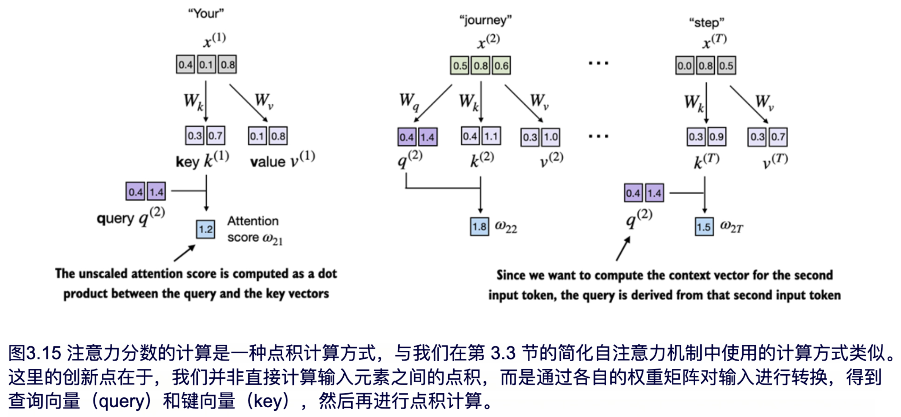

首先，我们计算注意力得分ω<sub>22</sub> ：

```python
keys_2 = keys[1]                                                  #A
attn_score_22 = query_2.dot(keys_2)
print(attn_score_22)

#A 请牢记在Python中索引从0开始
```

由此得到以下未经归一化的注意力得分：

```python
 tensor(1.8524)
```

> [!TIP]
>
> **个人思考：** 之前一直有一个疑惑，相同的两个词在不同句子中语义相关度可能完全不同，那么它们的注意力得分是如何做到在不同的上下文中分数不一样的。例如考虑以下两个句子：
>
> + 句子1："The cat drank the milk because it was hungry."
> + 句子2："The cat drank the milk because it was sweet."
>
> 很明显，在这两个句子中，`it`的指代不同，第一个句子中，`it`指代`cat`,而在第二个句子中，`it`指代`milk`。
>
> 根据以下注意力得分的公式（Q<sub>cat</sub>和K<sub>it</sub>分别为`cat`和`it`的查询向量和键向量）可知，句子1中`score_cat_it`是要大于句子2中的`score_cat_it`，因为句子1中，`it`和`cat`的相关度更高，但是从公式中如何推断出实现呢？
>
> **score_cat_it = Q<sub>cat</sub> · K<sub>it</sub>**
>
> 我们继续将公式拆解：
>
> **Q<sub>cat</sub>= W<sub>q</sub> * (E<sub>cat</sub> + Pos<sub>cat</sub>)**
>
> **K<sub>it</sub> = W<sub>k</sub> * (E<sub>it</sub> + Pos<sub>it</sub>)**
>
> 其中 **E<sub>cat</sub>**和**E<sub>it</sub>**是这两个词的嵌入向量，表示该词的基本语义信息，在不同的上下文中是固定的，根据公式可知，要使最终算出的**score_cat_it**与上下文语义相关，最重要的是**W<sub>q</sub>** 和**W<sub>k</sub>**这两个权重参数应该能反映出不同上下文语义的相关性。在标准的自注意力机制中，W、K、V向量都是固定的，然而，由于 GPT 模型是由多层自注意力模块堆叠而成，每一层都会根据当前输入和上下文信息，动态调整查询、键和值向量的权重矩阵。因此，即使初始的词嵌入和权重矩阵是固定的，经过多层处理后，模型能够生成与当前上下文相关的 Q、K、V 向量权重矩阵，最终计算出的Q、K、V 向量也就能反映出上下文的语义了。GPT多层的实现的细节后文会详述。

我们可以再次通过矩阵乘法将其应用到所有注意力得分的计算：

```python
attn_scores_2 = query_2 @ keys.T # All attention scores for given query
print(attn_scores_2)
```

可以看到，输出中的第二个元素与我们之前计算的 `attn_score_22` 相同：

```python
tensor([1.2705, 1.8524, 1.8111, 1.0795, 0.5577, 1.5440])
```

第三步是将注意力得分转换为注意力权重，如图 3.16 所示。

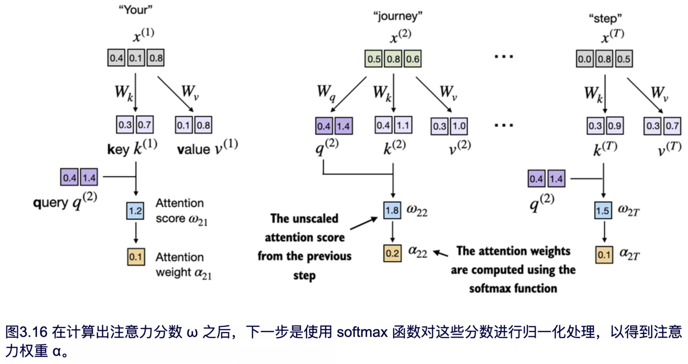

接下来，如图 3.16 所示，我们通过缩放注意力得分并使用前面提到的 softmax 函数来计算注意力权重。与之前的不同之处在于，现在我们通过将注意力得分除以`keys`嵌入维度的平方根来进行缩放（注意，取平方根在数学上等同于指数为 0.5 的运算）。

```python
d_k = keys.shape[-1]
attn_weights_2 = torch.softmax(attn_scores_2 / d_k**0.5, dim=-1)
print(attn_weights_2)
```

结果如下：

```python
tensor([0.1500, 0.2264, 0.2199, 0.1311, 0.0906, 0.1820])
```

> [!NOTE]
>
> **缩放点积注意力机制的原理**
>
> 对嵌入维度大小进行归一化的原因是为了避免出现小梯度，从而提高训练性能。例如，当嵌入维度增大时（在 GPT 类大型语言模型中通常超过一千），较大的点积在反向传播中应用 softmax 函数后，可能会导致非常小的梯度。随着点积的增大，softmax 函数的行为会更加类似于阶跃函数，导致梯度接近于零。这些小梯度可能会显著减慢学习速度，甚至导致训练停滞。
>
> 通过嵌入维度的平方根进行缩放，正是自注意力机制被称为‘缩放点积注意力’的原因。

> [!TIP]
>
> **个人思考：** 这里再稍微解释一下上述关于缩放点积注意力的机制。在自注意力机制中，查询向量（Query）与键向量（Key）之间的点积用于计算注意力权重。然而，当嵌入维度（embedding dimension）较大时，点积的结果可能会非常大。那么大的点积对接下来的计算有哪些具体影响呢？
>
> + **Softmax函数的特性**：在计算注意力权重时，点积结果会通过Softmax函数转换为概率分布。而Softmax函数对输入值的差异非常敏感，当输入值较大时，Softmax的输出会趋近于0或1，表现得类似于阶跃函数（step function）。
> + **梯度消失问题**：当Softmax的输出接近0或1时，其梯度会非常小，接近于零（可以通过3.3.1小节中提到的Softmax公式推断）。这意味着在反向传播过程中，梯度更新幅度会很小，导致模型学习速度减慢，甚至训练停滞。
>
> 为了解决上述问题，在计算点积后，将结果除以嵌入维度的平方根（即 $` \sqrt{dk} `$），其中 d<sub>k</sub> 是键向量的维度。这样可以将点积结果缩放到适当的范围，避免Softmax函数进入梯度平缓区，从而保持梯度的有效性，促进模型的正常训练。

好了，我们只剩最后一步，也就是计算上下文向量，如图3.17所示。

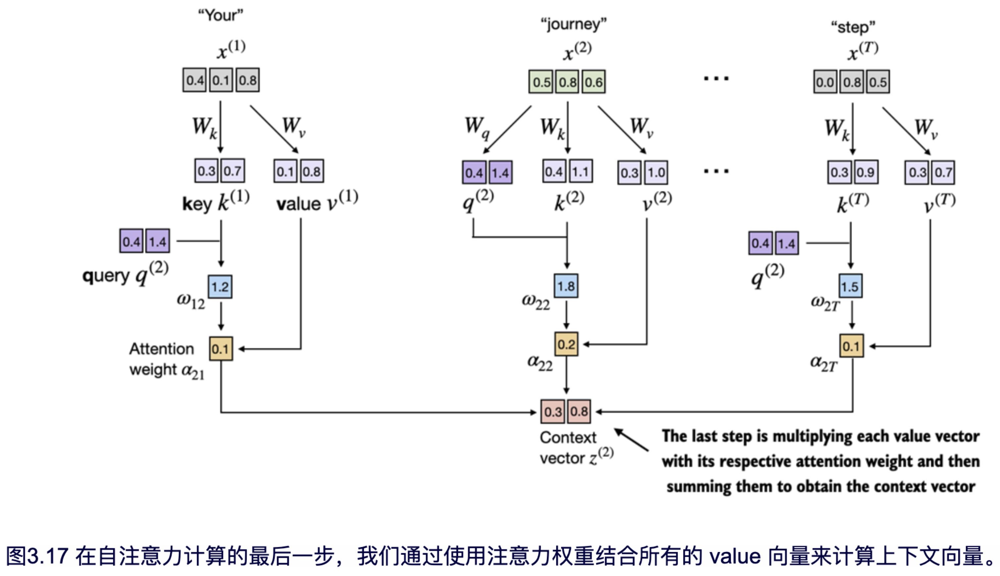

与第 3.3 节中我们通过输入向量的加权和来计算上下文向量相似，现在我们通过值向量的加权和来计算上下文向量。这里，注意力权重作为加权因子，用于衡量每个值向量的重要性。与第 3.3 节类似，我们可以通过矩阵乘法一步得到输出结果：

```python
context_vec_2 = attn_weights_2 @ values
print(context_vec_2)
```

结果如下：

```python
tensor([0.3061, 0.8210])
```

到目前为止，我们只计算了一个上下文向量 z<sup>(2)</sup>。在下一节中，我们将完善代码，以计算输入序列中的所有上下文向量，从 z<sup>(1)</sup> 到 z<sup>(T)</sup>。

> [!NOTE]
>
> **为什么使用`Q`、`K`和`V`向量？**
>
> 在注意力机制的上下文中，“键”（key）、“查询”（query）和“值”（value）这些术语来源于信息检索和数据库领域，在这些领域中也使用类似的概念来存储、搜索和检索信息
>
> **查询**（query）类似于数据库中的搜索查询。它代表模型当前关注或试图理解的项（如句子中的某个词或 token）。通过查询，模型可以探查输入序列中的其他部分，以确定对它们应关注的程度。
>
> **键**（key）类似于数据库中用于索引和查找的键。在注意力机制中，输入序列的每个元素（例如句子中的每个单词）都对应一个关联的‘键’。这些‘键’用于与‘查询’进行匹配。
>
> **值**（value）类似于数据库中的键值对中的“值”。它表示输入项的实际内容或表示。当模型确定哪些键（即输入中的哪些部分）与查询（当前的关注项）最相关时，就会检索出对应的值。


### 3.4.2 实现一个简洁的自注意力机制 Python 类

在前面的章节中，我们逐步讲解了计算自注意力输出的多个步骤。这样做主要是为了便于分步骤展示每个环节的细节。在实际应用中，考虑到下一章将介绍的大语言模型的实现，采用如下方式将这段代码组织到一个 Python 类中会更为有利：

```python
# Listing 3.1 A compact self-attention class
import torch.nn as nn
class SelfAttention_v1(nn.Module):
    def __init__(self, d_in, d_out):
        super().__init__()
        self.d_out = d_out
        self.W_query = nn.Parameter(torch.rand(d_in, d_out))
        self.W_key   = nn.Parameter(torch.rand(d_in, d_out))
        self.W_value = nn.Parameter(torch.rand(d_in, d_out))

    def forward(self, x):
        keys = x @ self.W_key
        queries = x @ self.W_query
        values = x @ self.W_value
        attn_scores = queries @ keys.T # omega
        attn_weights = torch.softmax(
            attn_scores / keys.shape[-1]**0.5, dim=-1)
        context_vec = attn_weights @ values
        return context_vec
```

在这段 PyTorch 代码中，`SelfAttention_v1` 是一个从 `nn.Module` 派生的类。`nn.Module` 是 PyTorch 模型的基础组件，提供了创建和管理模型层所需的必要功能。

`__init__` 方法初始化了用于计算查询（query）、键（key）和值（value）的可训练权重矩阵（`W_query`、`W_key` 和 `W_value`），每个矩阵都将输入维度 `d_in` 转换为输出维度 `d_out`。

前向传播过程在 forward 方法中实现，我们通过将查询（query）和键（key）相乘来计算注意力得分（attn_scores），并使用 softmax 对这些得分进行归一化。最后，我们使用这些归一化的注意力得分对值（value）加权，生成上下文向量。

我们可以按如下方式使用这个类：

```python
torch.manual_seed(123)
sa_v1 = SelfAttention_v1(d_in, d_out)
print(sa_v1(inputs))
```

由于输入包含六个嵌入向量，因此会生成一个用于存储这六个上下文向量的矩阵:

```python
tensor([[0.2996, 0.8053],
        [0.3061, 0.8210],
        [0.3058, 0.8203],
        [0.2948, 0.7939],
        [0.2927, 0.7891],
        [0.2990, 0.8040]], grad_fn=<MmBackward0>)
```

观察以上的输出，注意第二行 ([0.3061, 0.8210]) 的内容与上一节中的 `context_vec_2` 内容一致。

图 3.18 概述了我们刚刚实现的自注意力机制。

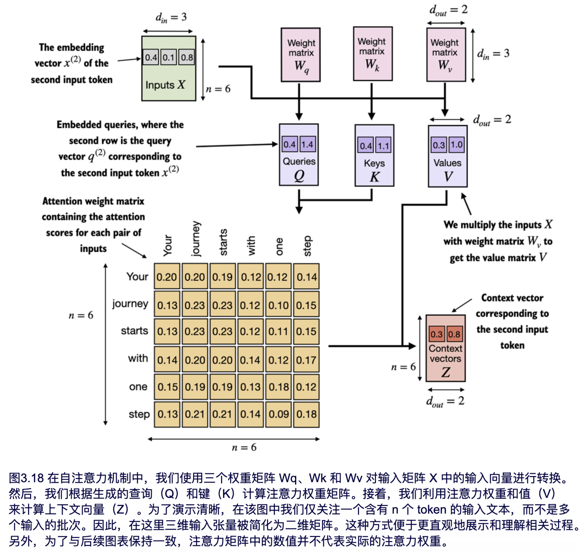

如图3.18所示，自注意力机制涉及可训练的权重矩阵 W<sub>q</sub>、W<sub>k</sub> 和 W<sub>v</sub>。这些矩阵将输入数据转换为查询、键和值，它们是自注意力机制的重要组成部分。随着训练过程中数据量的增加，模型会不断调整这些可训练的权重，在后续章节中我们会学习相关细节。

我们可以通过使用 PyTorch 的 `nn.Linear` 层来进一步改进 SelfAttention_v1 的实现。当禁用偏置单元时，`nn.Linear` 层可以有效地执行矩阵乘法。此外，使用 `nn.Linear` 替代手动实现的 `nn.Parameter(torch.rand(...))` 的一个显著优势在于，`nn.Linear` 具有优化的权重初始化方案，从而有助于实现更稳定和更高效的模型训练。

```python
#  Listing 3.2 A self-attention class using PyTorch's Linear layers
class SelfAttention_v2(nn.Module):
    def __init__(self, d_in, d_out, qkv_bias=False):
        super().__init__()
        self.d_out = d_out
        self.W_query = nn.Linear(d_in, d_out, bias=qkv_bias)
        self.W_key   = nn.Linear(d_in, d_out, bias=qkv_bias)
        self.W_value = nn.Linear(d_in, d_out, bias=qkv_bias)

    def forward(self, x):
        keys = self.W_key(x)
        queries = self.W_query(x)
        values = self.W_value(x)
        attn_scores = queries @ keys.T
        attn_weights = torch.softmax(attn_scores / keys.shape[-1]**0.5, dim=-1)
        context_vec = attn_weights @ values
        return context_vec
```

SelfAttention_v2 的使用方法和 SelfAttention_v1 一样：

```python
torch.manual_seed(789)
sa_v2 = SelfAttention_v2(d_in, d_out)
print(sa_v2(inputs))
```

输出如下：

```python
tensor([[-0.0739,  0.0713],
        [-0.0748,  0.0703],
        [-0.0749,  0.0702],
        [-0.0760,  0.0685],
        [-0.0763,  0.0679],
        [-0.0754,  0.0693]], grad_fn=<MmBackward0>)
```

`SelfAttention_v1` 和` SelfAttention_v2` 的输出不同，因为它们的权重矩阵使用了不同的初始权重，根本原因在于 `nn.Linear` 层采用了一种更复杂的权重初始化方案。

> [!NOTE]
>
> **练习 3.1：比较`SelfAttention_v1`和 `SelfAttention_v2`**
>
> 请注意，`SelfAttention_v2` 中的 `nn.Linear` 层使用了一种不同的权重初始化方式，而 `SelfAttention_v1` 则使用 `nn.Parameter(torch.rand(d_in, d_out))` 进行初始化。这导致两种机制生成的结果有所不同。为了验证 `SelfAttention_v1` 和 `SelfAttention_v2` 的其他部分是否相似，我们可以将 `SelfAttention_v2` 对象中的权重矩阵转移到 `SelfAttention_v1` 中，从而使两者生成相同的结果。
>
> 你的任务是将 `SelfAttention_v2` 实例中的权重正确分配给 `SelfAttention_v1` 实例。为此，你需要理解两个版本中权重之间的关系。（提示：`nn.Linear` 存储的是转置形式的权重矩阵。）分配完成后，你应该能观察到两个实例生成相同的输出。

在下一节中，我们将对自注意力机制进行增强，重点加入因果和多头机制。因果属性涉及对注意力机制的修改，防止模型访问序列中的后续信息。这在语言建模等任务中至关重要，因为在这些任务中，每个词的预测只能依赖之前的词。

多头组件将注意力机制分解为多个‘头’。每个头能够学习数据的不同方面，使模型能够同时关注来自不同表示子空间的不同位置的信息。这提高了模型在复杂任务中的性能。


## 3.5 使用因果注意力机制来屏蔽后续词

在本节中，我们将标准自注意力机制修改为因果注意力机制，这对于后续章节中开发大语言模型至关重要。

因果注意力（也称为掩蔽注意力）是一种特殊的自注意力形式。它限制模型在处理任何给定的 token 时，只能考虑序列中的前一个和当前输入，而不能看到后续的内容。这与标准的自注意力机制形成对比，后者允许模型同时访问整个输入序列。

因此，在计算注意力分数时，因果注意力机制确保模型只考虑当前 token 或之前的 token。

在 GPT 类大语言模型中，要实现这一点，我们需要对每个处理的 token 屏蔽其后续 token，即在输入文本中当前词之后的所有词，如图 3.19 所示。

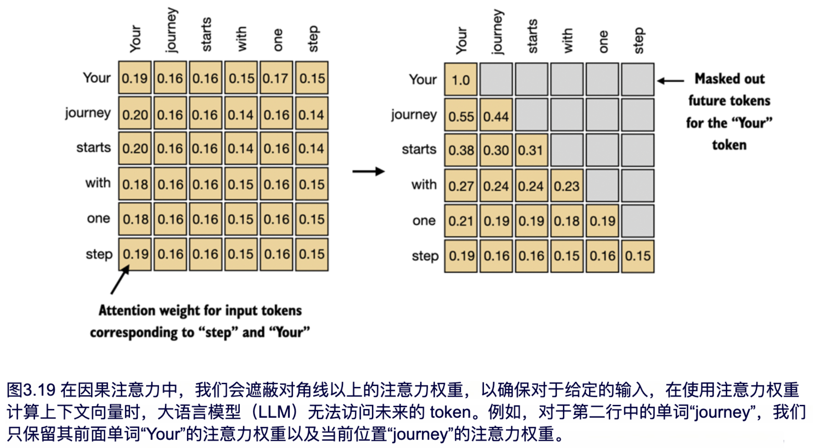

如图 3.19 所示，我们对注意力权重的对角线上方部分进行了掩码操作，并对未掩码的注意力权重进行归一化，使得每一行的注意力权重之和为 1。在下一节中，我们将用代码实现这个掩码和归一化过程。


### 3.5.1 应用因果注意力掩码

在本节中，我们将编码实现因果注意力掩码。我们首先按照图 3.20 中总结的步骤开始。

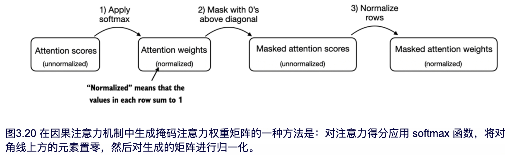

如图3.20总结，我们可以利用上一节的注意力得分和权重来实现因果注意力机制，以获得掩码后的注意力权重。

在图 3.20 所示的第一步中，我们使用 softmax 函数计算注意力权重，如在前几节中所做的那样：

```python
queries = sa_v2.W_query(inputs)                                   #A
keys = sa_v2.W_key(inputs)
attn_scores = queries @ keys.T
attn_weights = torch.softmax(attn_scores / keys.shape[-1]**0.5, dim=1)
print(attn_weights)

#A 为了方便起见，我们复用上一节中 SelfAttention_v2 对象的query和key权重矩阵。
```

这会得到以下注意力权重：

```python
tensor([[0.1921, 0.1646, 0.1652, 0.1550, 0.1721, 0.1510],
        [0.2041, 0.1659, 0.1662, 0.1496, 0.1665, 0.1477],
        [0.2036, 0.1659, 0.1662, 0.1498, 0.1664, 0.1480],
        [0.1869, 0.1667, 0.1668, 0.1571, 0.1661, 0.1564],
        [0.1830, 0.1669, 0.1670, 0.1588, 0.1658, 0.1585],
        [0.1935, 0.1663, 0.1666, 0.1542, 0.1666, 0.1529]],
       grad_fn=<SoftmaxBackward0>)
```

我们可以使用 PyTorch 的 `tril` 函数来实现图 3.20 中的步骤 2，该函数生成一个掩码矩阵，使对角线以上的值为零：

```python
context_length = attn_scores.shape[0]
mask_simple = torch.tril(torch.ones(context_length, context_length))
print(mask_simple)
```

生成的掩码如下所示：

```python
tensor([[1., 0., 0., 0., 0., 0.],
        [1., 1., 0., 0., 0., 0.],
        [1., 1., 1., 0., 0., 0.],
        [1., 1., 1., 1., 0., 0.],
        [1., 1., 1., 1., 1., 0.],
        [1., 1., 1., 1., 1., 1.]])
```

现在，我们可以将这个掩码矩阵与注意力权重相乘，从而将对角线以上的值置零。

```python
masked_simple = attn_weights*mask_simple
print(masked_simple)
```

可以看到，对角线以上的元素已成功被置零：

```python
tensor([[0.1921, 0.0000, 0.0000, 0.0000, 0.0000, 0.0000],
        [0.2041, 0.1659, 0.0000, 0.0000, 0.0000, 0.0000],
        [0.2036, 0.1659, 0.1662, 0.0000, 0.0000, 0.0000],
        [0.1869, 0.1667, 0.1668, 0.1571, 0.0000, 0.0000],
        [0.1830, 0.1669, 0.1670, 0.1588, 0.1658, 0.0000],
        [0.1935, 0.1663, 0.1666, 0.1542, 0.1666, 0.1529]],
       grad_fn=<MulBackward0>)
```

图 3.20 中的第三步是将注意力权重重新归一化，使得每一行的权重和再次等于 1。我们可以通过将每一行中的每个元素除以该行的总和来实现这一点：

```python
row_sums = masked_simple.sum(dim=1, keepdim=True)
masked_simple_norm = masked_simple / row_sums
print(masked_simple_norm)
```

最终得到的注意力权重矩阵具有以下特性：主对角线以上的注意力权重被置零，每一行的权重和为 1：

```python
tensor([[1.0000, 0.0000, 0.0000, 0.0000, 0.0000, 0.0000],
        [0.5517, 0.4483, 0.0000, 0.0000, 0.0000, 0.0000],
        [0.3800, 0.3097, 0.3103, 0.0000, 0.0000, 0.0000],
        [0.2758, 0.2460, 0.2462, 0.2319, 0.0000, 0.0000],
        [0.2175, 0.1983, 0.1984, 0.1888, 0.1971, 0.0000],
        [0.1935, 0.1663, 0.1666, 0.1542, 0.1666, 0.1529]],
       grad_fn=<DivBackward0>)
```

> [!NOTE]
>
> **信息泄露**
>
> 当我们应用掩码并重新归一化注意力权重时，乍一看似乎未来的 token（即我们打算掩盖的部分）仍可能影响当前 token，因为它们的值仍然参与了 softmax 计算。然而，关键在于，当我们在掩码之后重新归一化注意力权重时，本质上是在一个更小的子集上重新计算 softmax（因为被掩盖的位置不会贡献到 softmax 的计算值中）。
>
> softmax 算法的优雅之处在于，尽管最初所有位置都包含在分母中，但经过掩码处理和重新归一化后，被掩盖的位置的影响被抵消了——它们在任何实质性意义上都不会影响 softmax 得分。
>
> 简而言之，在应用掩码和重新归一化之后，注意力权重的分布就像一开始只在未被掩码的位置上计算的一样。这确保了不会有来自未来（或其他掩码位置）的信息泄露，从而实现了我们的预期。

尽管通过上文的方式我们已经完成了因果注意力的实现，但我们还可以利用 softmax 函数的数学特性，更高效地计算掩码后的注意力权重，减少计算步骤，具体实现如图 3.21 所示。

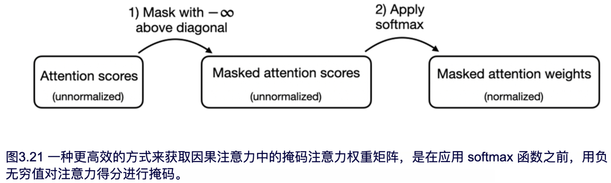

Softmax 函数将输入值转换为概率分布。当一行中存在负无穷值（-∞）时，Softmax 函数会将这些值视为零概率。（从数学上讲，这是因为 e<sup>−∞</sup> 接近于 0。）

我们可以通过创建一个对角线以上全为 1 的掩码，然后将这些 1 替换为负无穷大（-inf）值，从而实现这种更高效的掩码技巧：

```python
mask = torch.triu(torch.ones(context_length, context_length), diagonal=1)
masked = attn_scores.masked_fill(mask.bool(), -torch.inf)
print(masked)
```

由此生成以下掩码：

```python
tensor([[0.2899,   -inf,   -inf,   -inf,   -inf,    -inf],
        [0.4656, 0.1723,    -inf,   -inf,   -inf,   -inf],
        [0.4594, 0.1703, 0.1731,    -inf,   -inf,   -inf],
        [0.2642, 0.1024, 0.1036,  0.0186,   -inf,   -inf],
        [0.2183, 0.0874, 0.0882,  0.0177,  0.0786,  -inf],
        [0.3408, 0.1270, 0.1290, 0.0198, 0.1290, 0.0078]],
        grad_fn=<MaskedFillBackward0>)
```

现在我们只需要对这些掩码后的结果应用 softmax 函数，就可以完成了：

```python
attn_weights = torch.softmax(masked / keys.shape[-1]**0.5, dim=1)
print(attn_weights)
```

如输出所示，每一行的值之和为 1，因此不再需要进一步的归一化：

```python
tensor([[1.0000, 0.0000, 0.0000, 0.0000, 0.0000, 0.0000],
        [0.5517, 0.4483, 0.0000, 0.0000, 0.0000, 0.0000],
        [0.3800, 0.3097, 0.3103, 0.0000, 0.0000, 0.0000],
        [0.2758, 0.2460, 0.2462, 0.2319, 0.0000, 0.0000],
        [0.2175, 0.1983, 0.1984, 0.1888, 0.1971, 0.0000],
        [0.1935, 0.1663, 0.1666, 0.1542, 0.1666, 0.1529]],
       grad_fn=<SoftmaxBackward0>)
```

现在，我们可以使用修改后的注意力权重，通过 `context_vec = attn_weights @ values` 来计算上下文向量，这在第 3.4 节中介绍过。不过，在下一节中，我们将首先介绍一个对因果注意力机制的细微调整，这一调整在训练大语言模型时有助于减少过拟合现象。


### 3.5.2 使用 dropout 遮掩额外的注意力权重

Dropout 在深度学习中是一种技术，即在训练过程中随机忽略一些隐藏层单元，实际上将它们“丢弃”。这种方法有助于防止过拟合，确保模型不会过于依赖任何特定的隐藏层单元组合。需要特别强调的是，Dropout 仅在训练过程中使用，训练结束后则会禁用。

在 Transformer 架构中（包括 GPT 等模型），注意力机制中的 Dropout 通常应用于两个特定区域：计算注意力得分之后，或将注意力权重应用于 value 向量之后。

在这里，我们会在计算完注意力权重之后应用 dropout 掩码（如图 3.22 所示），因为在实际应用中这是更为常见的做法。

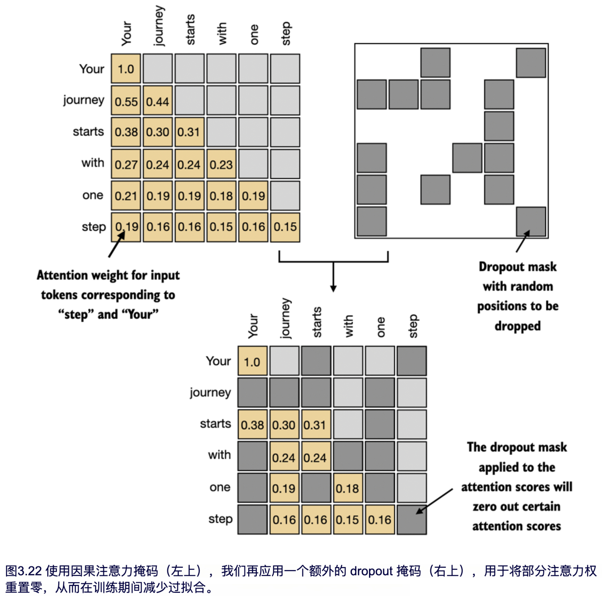

在以下代码示例中，我们使用了50%的 dropout 率，这意味着屏蔽掉一半的注意力权重。（在后续章节中训练 GPT 模型时，我们将使用更低的 dropout 率，比如 0.1 或 0.2）

在以下代码中，我们首先将 PyTorch 的 dropout 实现应用于一个由 1 组成的 6×6 张量以作说明：

```python
torch.manual_seed(123)
dropout = torch.nn.Dropout(0.5)                                   #A
example = torch.ones(6, 6)                                        #B
print(dropout(example))


#A 我们使用的dropout率为0.5
#B 创建一个由1组成的矩阵
```

如我们所见，约一半的数值被置零：

```python
tensor([[2., 2., 0., 2., 2., 0.],
        [0., 0., 0., 2., 0., 2.],
        [2., 2., 2., 2., 0., 2.],
        [0., 2., 2., 0., 0., 2.],
        [0., 2., 0., 2., 0., 2.],
        [0., 2., 2., 2., 2., 0.]])
```

当对注意力权重矩阵应用 50% 的 dropout 时，矩阵中一半的元素会被随机设置为零。为了补偿有效元素的减少，矩阵中剩余元素的值会被放大 1/0.5 = 2 倍。这个缩放操作至关重要，可以在训练和推理阶段保持注意力机制的整体权重平衡，确保注意力机制在这两个阶段的平均影响保持一致。

> [!TIP]
>
> **个人思考：** 读到这一段时，我有些不解，Dropout相当于丢弃一定比例的注意力权重，这表明对输入中的某些token关注度降为0了（完全不关注），这样的处理方式难道对最终的预测效果没有影响么？另外如何理解Dropout之后的缩放操作是为了保持注意力在不同阶段的平衡？
>
> 经过查阅额外的资料及深度思考，我觉得可以从以下几个方面理解上述的疑问：
>
> 1. **Dropout 的目的：提高模型的泛化能力**
>
>    dropout 的设计初衷是**提高模型的泛化能力**。通过随机丢弃一部分神经元或注意力权重，dropout 迫使模型在每次训练时学习略有不同的表示方式，而不是依赖某一特定的注意力模式。这种随机化的训练方式可以帮助模型在**面对新数据时更具鲁棒性**，减少过拟合的风险。
>
> 2. **注意力机制的冗余性**
>
>    在 Transformer 的注意力机制中，模型通常会对多个 token 进行注意力计算，实际上会有一些冗余信息。也就是说，**不同 token 之间的信息通常会有部分重叠**，并且模型能够从多个来源获取类似的信息。在这种情况下，dropout 随机丢弃一部分注意力权重并不会完全破坏模型的性能，因为模型可以依赖于其他未被丢弃的注意力路径来获取所需信息。
>
> 3. **缩放操作的作用**
>
>    在应用 dropout 时，一部分注意力权重被随机置零（假设 dropout 率为 p）。剩余的权重会被放大，其放大倍数为 $` \frac{1}{1-p}  `$。放大后的权重记为 z′：
>
>    $$z_{i}^{\prime}=\frac{z_{i}}{1-p} \quad \text { (对于未被置零的权重) }$$
>
>    此时，未被置零的注意力权重 z′\mathbf{z}'z′ 将作为 Softmax 的输入。因此，dropout 后的缩放对 Softmax 有两个主要影响：
>
>    + **增大未遮盖值的相对差异**：放大剩余权重后，它们的数值相对于被置零的权重增大，从而拉大了非零元素之间的相对差异。这使得在 Softmax 计算中（通过前文提过的Softmax公式推导，输入值的**差异越大**，输出分布就会**越尖锐**；而输入值差异越小，输出分布就会越**平滑**），剩下的值之间的对比更明显。
>    + **影响 Softmax 输出的分布形态**：当未被置零的权重值被放大后，它们在 Softmax 输出中会更具代表性，注意力分布会更集中（即更尖锐），让模型更关注特定的 token。
>
>    缩放后的 Softmax 输入导致注意力分布更倾向于少数的高权重 token，使得模型在当前步骤更关注这些 token 的信息。这对模型的影响包括：
>
>    + **增强模型的选择性关注**：在训练中，模型会在每个步骤中随机选择不同的 token 进行更高的关注，这使模型在学习时不会依赖特定 token 的注意力。
>    + **确保总注意力强度保持一致**：即便经过 dropout 丢弃了一部分权重，缩放保证了剩余权重在 Softmax 后的分布与未应用 dropout 时类似。
>
> 4. **训练过程中多次迭代弥补信息丢失**
>
>    在训练过程中，每个 batch 中的 dropout 掩码都是随机生成的。也就是说，在每次训练时被丢弃的注意力权重是随机的，并不会始终忽略相同的 token。这种**随机性确保了在训练过程中，模型会在多个迭代中多次关注到每个 token**。因此，即便某个 token 在当前的训练步中被忽略，在未来的训练步骤中它仍然会被关注到，从而在整体上避免了信息丢失的问题。

现在，让我们将 dropout 应用于注意力权重矩阵本身：

```python
torch.manual_seed(123)
print(dropout(attn_weights))
```

由此生成的注意力权重矩阵中，部分元素被置零，剩余的元素重新进行了缩放：

```python
tensor([[2.0000, 0.0000, 0.0000, 0.0000, 0.0000, 0.0000],
        [0.0000, 0.0000, 0.0000, 0.0000, 0.0000, 0.0000],
        [0.7599, 0.6194, 0.6206, 0.0000, 0.0000, 0.0000],
        [0.0000, 0.4921, 0.4925, 0.0000, 0.0000, 0.0000],
        [0.0000, 0.3966, 0.0000, 0.3775, 0.0000, 0.0000],
        [0.0000, 0.3327, 0.3331, 0.3084, 0.3331, 0.0000]],
       grad_fn=<MulBackward0>
```

请注意，由于操作系统的不同，生成的 dropout 输出可能看起来有所差异；您可以在 PyTorch 问题跟踪页面上查看更多关于此不一致性的信息，网址为：[https://github.com/pytorch/pytorch/issues/121595](https://github.com/pytorch/pytorch/issues/121595)。

在理解了因果注意力和 dropout 掩码的基础上，接下来的部分中我们将开发一个简洁的 Python 类，以便高效应用这两种技术。


### 3.5.3 实现一个简洁的因果注意力类

在本节中，我们将把因果注意力和 dropout 的修改整合到在 3.4 节开发的 `SelfAttention` Python 类中。该类将作为模板，用于接下来一节中开发多头注意力（多头注意力将是我们在本章实现的最后一个注意力类）。

但在开始之前，还需确保代码能够处理由多个输入组成的批次，以便 `CausalAttention` 类能够支持我们在第 2 章中实现的数据加载器所生成的批次输出。

为了简单起见，我们复制输入文本示例以模拟批量输入：

```python
batch = torch.stack((inputs, inputs), dim=0)
print(batch.shape)                                              #A

#A 2个输入，每个输入有6个token，每个token的嵌入维度为3
```

以上代码生成一个三维张量，包含 2 个输入文本，每个文本包含 6 个 token，每个 token 表示为一个 3 维嵌入向量：

```python
torch.Size([2, 6, 3])
```

以下的 CausalAttention 类与我们之前实现的 SelfAttention 类类似，不同之处在于我们现在添加了dropout和因果掩码组件，如以下代码所示：

```python
# Listing 3.3 A compact causal attention class
class CausalAttention(nn.Module):
    def __init__(self, d_in, d_out, context_length, dropout, qkv_bias=False):
        super().__init__()
        self.d_out = d_out
        self.W_query = nn.Linear(d_in, d_out, bias=qkv_bias)
        self.W_key   = nn.Linear(d_in, d_out, bias=qkv_bias)
        self.W_value = nn.Linear(d_in, d_out, bias=qkv_bias)
        self.dropout = nn.Dropout(dropout)                        #A
        self.register_buffer(
           'mask',
           torch.triu(torch.ones(context_length, context_length),
           diagonal=1)
        )                                                         #B

    def forward(self, x):
        b, num_tokens, d_in = x.shape                             #C
        keys = self.W_key(x)
        queries = self.W_query(x)
        values = self.W_value(x)
        attn_scores = queries @ keys.transpose(1, 2)              #C
        attn_scores.masked_fill_(                                 #D
            self.mask.bool()[:num_tokens, :num_tokens], -torch.inf)
        attn_weights = torch.softmax(attn_scores / keys.shape[-1]**0.5, dim=-1)
        attn_weights = self.dropout(attn_weights)
        context_vec = attn_weights @ values
        return context_vec


#A 与之前的 SelfAttention_v1 类相比，我们添加了一个 dropout 层
#B register_buffer 调用也是新添加的内容（后续内容会提供更多相关信息）
#C 我们交换第 1 和第 2 个维度，同时保持批次维度在第1个位置（索引0）
#D 在 PyTorch 中，带有下划线后缀的操作会在原有内存空间执行，直接修改变量本身，从而避免不必要的内存拷贝
```

虽然新增的代码行与之前章节介绍的内容基本一致，但我们现在在 `__init__` 方法中添加了 `self.register_buffer()` 的调用。`register_buffer` 在 PyTorch 中并非所有情况下都必须使用，但在这里有其独特的优势。例如，当我们在大语言模型（LLM）中使用 `CausalAttention` 类时，buffer 会自动随模型迁移到合适的设备（CPU 或 GPU）。这意味着我们无需手动确保这些张量与模型参数在同一设备上，从而避免设备不匹配错误。

我们可以按如下方式使用 `CausalAttention` 类（类似于之前的 `SelfAttention`）：

```python
torch.manual_seed(123)
context_length = batch.shape[1]
ca = CausalAttention(d_in, d_out, context_length, 0.0)
context_vecs = ca(batch)
print("context_vecs.shape:", context_vecs.shape)
```

生成的上下文向量是一个三维张量，其中每个 token 现在都表示为一个二维嵌入：

```python
context_vecs.shape: torch.Size([2, 6, 2])
```

图 3.23 提供了一个概念框架，总结了我们迄今为止完成的内容。

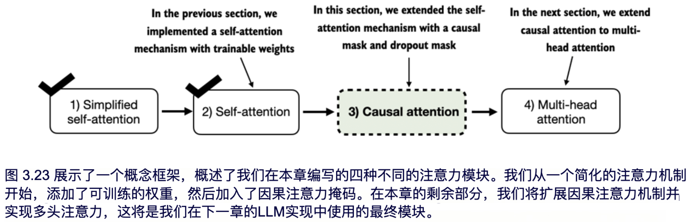

如图 3.23 所示，本节我们重点介绍了神经网络中的因果注意力的概念和实现。在下一节中，我们将进一步扩展这一概念，实现一个多头注意力模块，该模块可以并行实现多个因果注意力机制。


## 3.6 从单头注意力扩展到多头注意力

在本章的最后一部分中，我们将之前实现的因果注意力类扩展为多头形式，这也称为多头注意力。

多头’一词指的是将注意力机制划分为多个‘头’，每个头独立运作。在这种情况下，单个因果注意力模块可以视为单头注意力，即只有一组注意力权重用于按顺序处理输入。

在接下来的小节中，我们将讨论从因果注意力扩展到多头注意力的过程。第一小节将通过堆叠多个因果注意力模块，直观地构建一个多头注意力模块以作说明。第 2 小节将以一种更复杂但计算效率更高的方式实现相同的多头注意力模块。


### 3.6.1 堆叠多层单头注意力层

在实际应用中，实现多头注意力需要创建多个自注意力机制的实例（在 3.4.1 节的图 3.18 中已有展示），每个实例都具有独立的权重，然后将它们的输出合并。多个自注意力机制实例的应用属于计算密集型（CPU密集型）操作，但它对于识别复杂模式至关重要，这是基于 Transformer 的大语言模型所擅长的能力之一。

图3.24展示了多头注意力模块的结构，该模块由多个单头注意力模块组成，如图3.18所示，彼此堆叠在一起。

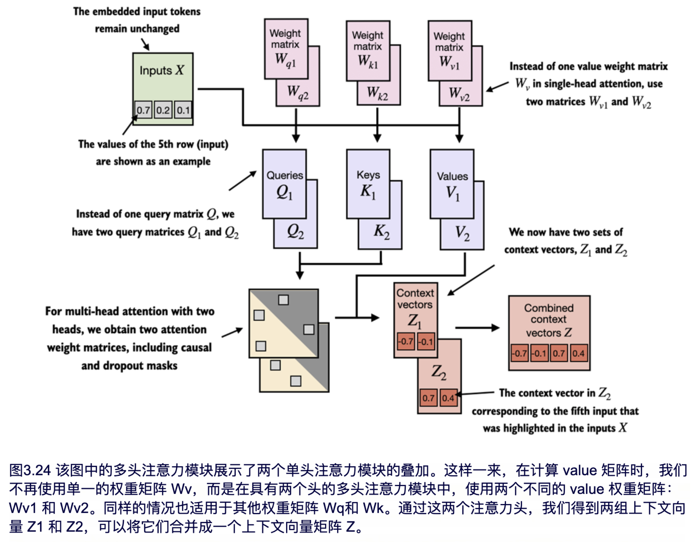

如前所述，多头注意力机制的核心思想是在并行运行多个注意力机制的过程中，对输入数据（如注意力机制中的 query、key 和 value 向量）使用不同的、可学习的线性投影。具体来说，就是将这些输入数据与权重矩阵相乘，得到不同的投影结果。

在代码中，我们可以通过实现一个简单的 `MultiHeadAttentionWrapper` 类来实现这一点，该类会堆叠多个我们之前实现的 `CausalAttention` 模块的实例：

```python
# Listing 3.4 A wrapper class to implement multi-head attention
class MultiHeadAttentionWrapper(nn.Module):
    def __init__(self, d_in, d_out, context_length,
                 dropout, num_heads, qkv_bias=False):
        super().__init__()
        self.heads = nn.ModuleList(
            [CausalAttention(d_in, d_out, context_length, dropout, qkv_bias)
             for _ in range(num_heads)]
        )
    def forward(self, x):
        return torch.cat([head(x) for head in self.heads], dim=-1)
```

例如，如果我们使用这个 MultiHeadAttentionWrapper 类，并通过设置 num_heads=2 使用两个注意力头，同时将 CausalAttention 的输出维度 d_out 设置为 2，那么生成的上下文向量将是 4 维的（d_out*num_heads=4），如图 3.25 所示。

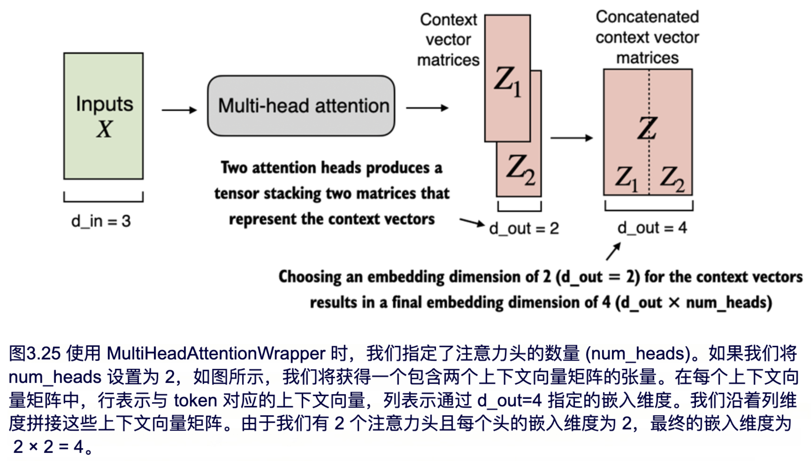

为了通过一个具体的例子进一步说明图 3.25，我们可以按如下方式使用 MultiHeadAttentionWrapper 类（使用方式类似于之前的 CausalAttention 类）：

```python
torch.manual_seed(123)
context_length = batch.shape[1] # This is the number of tokens
d_in, d_out = 3, 2
mha = MultiHeadAttentionWrapper(d_in, d_out, context_length, 0.0, num_heads=2)
context_vecs = mha(batch)
print(context_vecs)
print("context_vecs.shape:", context_vecs.shape)
```

以上代码输出的上下文向量如下所示：

```python
tensor([[[-0.4519,  0.2216,  0.4772,  0.1063],
         [-0.5874,  0.0058,  0.5891,  0.3257],
         [-0.6300, -0.0632,  0.6202,  0.3860],
         [-0.5675, -0.0843,  0.5478,  0.3589],
         [-0.5526, -0.0981,  0.5321,  0.3428],
         [-0.5299, -0.1081,  0.5077,  0.3493]],

        [[-0.4519,  0.2216,  0.4772,  0.1063],
         [-0.5874,  0.0058,  0.5891,  0.3257],
         [-0.6300, -0.0632,  0.6202,  0.3860],
         [-0.5675, -0.0843,  0.5478,  0.3589],
         [-0.5526, -0.0981,  0.5321,  0.3428],
         [-0.5299, -0.1081,  0.5077,  0.3493]]], grad_fn=<CatBackward0>)
context_vecs.shape: torch.Size([2, 6, 4])
```

由此生成的 context_vecs 张量的第一个维度是 2，因为我们有两个输入文本（输入文本被复制，因此它们的上下文向量完全相同）。第二个维度对应每个输入中的 6 个 token。第三个维度对应每个 token 的 4 维嵌入向量。

> [!NOTE]
>
> **练习 3.2：返回二维嵌入向量**
>
> 更改 `MultiHeadAttentionWrapper(..., num_heads=2)` 调用中的输入参数，使输出的上下文向量为 2 维而不是 4 维，同时保持 `num_heads=2` 的设置。提示：无需修改类的实现，只需更改其中一个输入参数即可。

在本节中，我们实现了一个 `MultiHeadAttentionWrapper`，用于组合多个单头注意力模块。不过需要注意的是，在 `forward` 方法中，这些模块是通过 `[head(x) for head in self.heads]` 串行处理的。我们可以通过并行处理各个注意力头来优化该实现。实现这一目标的一种方法是，通过矩阵乘法同时计算所有注意力头的输出，我们将在下一节中详细探讨。


### 3.6.2 通过权重分割实现多头注意力机制

在前一节中，我们创建了一个 MultiHeadAttentionWrapper，通过堆叠多个单头注意力模块来实现多头注意力。这是通过实例化并组合多个 CausalAttention 对象实现的。

与其维护两个独立的类 MultiHeadAttentionWrapper 和 CausalAttention，我们可以将这两个概念合并为一个 MultiHeadAttention 类。此外，除了简单地合并 MultiHeadAttentionWrapper 和 CausalAttention 的代码外，我们还会进行一些额外的修改，以更高效地实现多头注意力机制。

在 `MultiHeadAttentionWrapper` 中，多头机制是通过创建一个包含多个 `CausalAttention` 对象的列表（`self.heads`）来实现的，每个对象代表一个独立的注意力头。`CausalAttention` 类独立执行注意力机制，每个头的结果最终被拼接起来。相比之下，接下来的 `MultiHeadAttention` 类则将多头功能集成在一个单一的类中。它通过对变换后的query、key和value张量进行重塑，将输入分割成多个头，并在计算注意力后将这些头的结果组合在一起。

在进一步讨论之前，让我们先看一下 MultiHeadAttention 类的实现：

```python
# Listing 3.5 An efficient multi-head attention class
class MultiHeadAttention(nn.Module):
    def __init__(self, d_in, d_out,
                 context_length, dropout, num_heads, qkv_bias=False):
        super().__init__()
        assert d_out % num_heads == 0, "d_out must be divisible by num_heads"
        self.d_out = d_out
        self.num_heads = num_heads
        self.head_dim = d_out // num_heads                        #A
        self.W_query = nn.Linear(d_in, d_out, bias=qkv_bias)
        self.W_key = nn.Linear(d_in, d_out, bias=qkv_bias)
        self.W_value = nn.Linear(d_in, d_out, bias=qkv_bias)
        self.out_proj = nn.Linear(d_out, d_out)                   #B
        self.dropout = nn.Dropout(dropout)
        self.register_buffer(
            'mask',
             torch.triu(torch.ones(context_length, context_length), diagonal=1)
        )


    def forward(self, x):
        b, num_tokens, d_in = x.shape
        keys = self.W_key(x)                                      #C
        queries = self.W_query(x)                                 #C
        values = self.W_value(x)                                  #C

        keys = keys.view(b, num_tokens, self.num_heads, self.head_dim)       #D
        values = values.view(b, num_tokens, self.num_heads, self.head_dim)   #D
        queries = queries.view(b, num_tokens, self.num_heads, self.head_dim) #D

        keys = keys.transpose(1, 2)                               #E
        queries = queries.transpose(1, 2)                         #E
        values = values.transpose(1, 2)                           #E

        attn_scores = queries @ keys.transpose(2, 3)              #F
        mask_bool = self.mask.bool()[:num_tokens, :num_tokens]    #G

        attn_scores.masked_fill_(mask_bool, -torch.inf)           #H

        attn_weights = torch.softmax(
            attn_scores / keys.shape[-1]**0.5, dim=-1)
        attn_weights = self.dropout(attn_weights)

        context_vec = (attn_weights @ values).transpose(1, 2)     #I

        context_vec = context_vec.contiguous().view(b, num_tokens, self.d_out)  #J
        context_vec = self.out_proj(context_vec)                  #K
        return context_vec


#A 将投影维度缩小，以匹配期望的输出维度
#B 使用线性层组合头部输出
#C 张量形状：(b, num_tokens, d_out)
#D 我们通过添加 num_heads 维度来隐式地拆分矩阵。然后展开最后一个维度，使其形状从 (b, num_tokens, d_out) 转换为 (b, num_tokens, num_heads, head_dim)
#E 将张量的形状从 (b, num_tokens, num_heads, head_dim) 转置为 (b, num_heads, num_tokens, head_dim)
#F 对每个注意力头进行点积运算
#G 掩码被截断到 token 的数量
#H 使用掩码填充注意力分数
#I 张量形状：（b, num_tokens, n_heads, head_dim）
#J 将多个注意力头的输出结果合并，其中输出维度 self.d_out 等于注意力头数 self.num_heads 与每个头的维度 self.head_dim 的乘积
#K 添加一个可选的线性投影层
```

尽管 `MultiHeadAttention` 类中张量的重塑（.view）和转置（.transpose）操作看起来非常复杂，但从数学角度来看，`MultiHeadAttention` 类与之前的 `MultiHeadAttentionWrapper` 类实现的概念是相同的。

从宏观层面上看，在之前的 MultiHeadAttentionWrapper 中，我们通过堆叠多个单头注意力层的方式来组合成一个多头注意力层。而 MultiHeadAttention 类采用了一种集成的方法：它从一个多头注意力层开始，并在内部将该层分解为各个独立的注意力头，如图 3.26 所示。

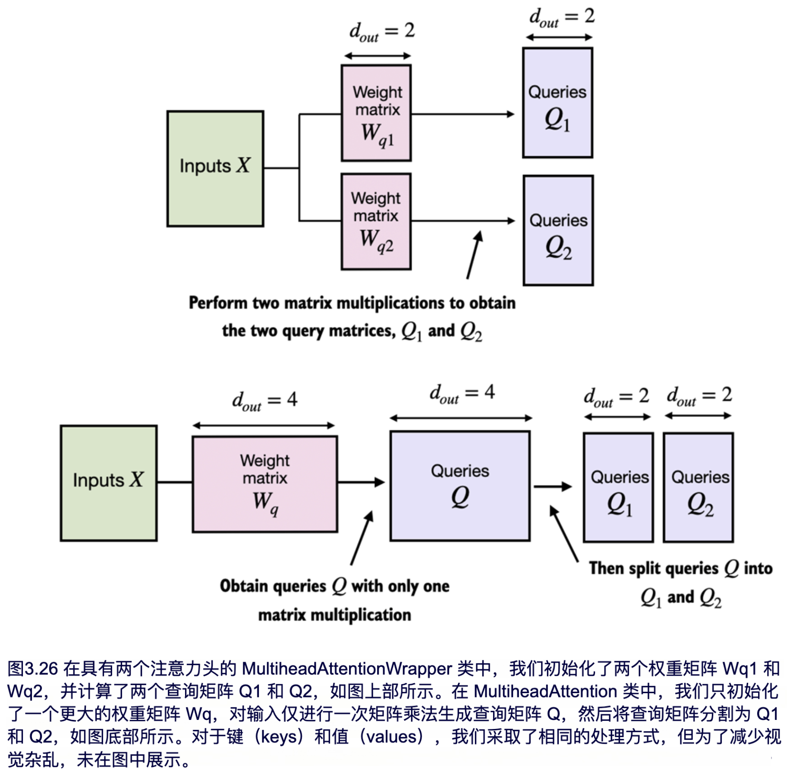

如图 3.26 所示，query、key 和 value 张量的拆分是通过张量的重塑和转置操作实现的，这些操作分别使用了 PyTorch 的 `.view` 和 `.transpose` 方法。首先，通过线性层对输入进行投影（分别生成 query、key 和 value），然后将其重塑为多个注意力头的形式。

关键操作是将 `d_out` 维度拆分成 `num_heads` 和 `head_dim`，其中 `head_dim = d_out / num_heads`。这种拆分通过 `.view` 方法实现：将形状为 `(b, num_tokens, d_out)` 的张量重塑为 `(b, num_tokens, num_heads, head_dim)`。

接下来对张量进行转置操作，将 `num_heads` 维度移动到 `num_tokens` 维度之前，使其形状变为 `(b, num_heads, num_tokens, head_dim)`。这种转置对于在不同注意力头之间正确对齐查询（queries）、键（keys）和值（values），并高效执行批量矩阵乘法至关重要。

为了说明这种批量矩阵乘法，假设我们有如下示例张量：

```python
a = torch.tensor([[[[0.2745, 0.6584, 0.2775, 0.8573],             #A
                    [0.8993, 0.0390, 0.9268, 0.7388],
                    [0.7179, 0.7058, 0.9156, 0.4340]],
                   [[0.0772, 0.3565, 0.1479, 0.5331],
                    [0.4066, 0.2318, 0.4545, 0.9737],
                    [0.4606, 0.5159, 0.4220, 0.5786]]]])

#A 该张量的形状为 (b, num_heads, num_tokens, head_dim) = (1, 2, 3, 4)
```

接下来，我们在张量本身与张量的一个视图之间执行批量矩阵乘法操作，其中张量的视图将最后两个维度（num_tokens 和 head_dim）进行了转置：

```python
print(a @ a.transpose(2, 3))
```

结果如下：

```python
tensor([[[[1.3208, 1.1631, 1.2879],
          [1.1631, 2.2150, 1.8424],
          [1.2879, 1.8424, 2.0402]],
         [[0.4391, 0.7003, 0.5903],
          [0.7003, 1.3737, 1.0620],
          [0.5903, 1.0620, 0.9912]]]])
```

在这种情况下，PyTorch 中的矩阵乘法实现能够处理四维输入张量，因此矩阵乘法会在输入张量的最后两个维度（即 `num_tokens` 和 `head_dim`）之间执行，并对每个注意力头重复该操作。

上述方法成为了一种更简洁的方式，可以单独计算每个头的矩阵乘法：

```python
first_head = a[0, 0, :, :]
first_res = first_head @ first_head.T
print("First head:\n", first_res)
second_head = a[0, 1, :, :]
second_res = second_head @ second_head.T
print("\nSecond head:\n", second_res)
```

该结果与我们之前使用批量矩阵乘法 `print(a @ a.transpose(2, 3))` 时获得的结果完全相同：

```python
First head:
 tensor([[1.3208, 1.1631, 1.2879],
        [1.1631, 2.2150, 1.8424],
        [1.2879, 1.8424, 2.0402]])
Second head:
 tensor([[0.4391, 0.7003, 0.5903],
        [0.7003, 1.3737, 1.0620],
        [0.5903, 1.0620, 0.9912]])
```

在多头注意力机制中，计算完注意力权重和上下文向量之后，将所有头的上下文向量转置回形状 `(b, num_tokens, num_heads, head_dim)`。然后将这些向量重新塑形（展平）为 `(b, num_tokens, d_out)` 的形状，从而有效地将所有头的输出组合在一起。

此外，我们在多头注意力机制中添加了一个称为输出投影层（self.out_proj）的模块，用于在组合多个头的输出后进行投影。而在因果注意力类中并没有这个投影层。这个输出投影层并非绝对必要（详见附录 B 的参考部分），但由于它在许多 LLM 架构中被广泛使用，因此我们在这里加上以保持完整性。

尽管 `MultiHeadAttention` 类由于额外的张量重塑和转置操作看起来比 `MultiHeadAttentionWrapper` 更复杂，但它更加高效。原因在于，我们只需执行一次矩阵乘法即可计算键（keys），对于查询（queries）和值（values）也是如此。而在 `MultiHeadAttentionWrapper` 中，我们需要对每个注意力头重复执行这一矩阵乘法操作，这种计算方式的开销非常大。

MultiHeadAttention 类的用法与我们之前实现的 SelfAttention 和 CausalAttention 类类似：

```python
torch.manual_seed(123)
batch_size, context_length, d_in = batch.shape
d_out = 2
mha = MultiHeadAttention(d_in, d_out, context_length, 0.0, num_heads=2)
context_vecs = mha(batch)
print(context_vecs)
print("context_vecs.shape:", context_vecs.shape)
```

从结果可以看出，输出维度是由`d_out`参数直接控制的：

```python
tensor([[[0.3190, 0.4858],
         [0.2943, 0.3897],
         [0.2856, 0.3593],
         [0.2693, 0.3873],
         [0.2639, 0.3928],
         [0.2575, 0.4028]],
        [[0.3190, 0.4858],
         [0.2943, 0.3897],
         [0.2856, 0.3593],
         [0.2693, 0.3873],
         [0.2639, 0.3928],
         [0.2575, 0.4028]]], grad_fn=<ViewBackward0>)
context_vecs.shape: torch.Size([2, 6, 2])
```

在本节中，我们实现了 MultiHeadAttention 类，这将在后续章节实现和训练 LLM 时使用。请注意，虽然代码功能齐全，但我们使用了较小的嵌入维度和注意力头数，以便让输出结果更易于阅读。

作为对比，最小的 GPT-2 模型（1.17 亿参数）具有 12 个注意力头和 768 的上下文向量嵌入大小。而最大的 GPT-2 模型（15 亿参数）则具有 25 个注意力头和 1600 的上下文向量嵌入大小。请注意，在 GPT 模型中，token 输入的嵌入大小与上下文嵌入大小是相同的（`d_in = d_out`）。

> [!NOTE]
>
> **练习 3.3：初始化 GPT-2 规模的注意力模块**
>
> 使用 MultiHeadAttention 类初始化一个多头注意力模块，该模块的注意力头数量与最小的 GPT-2 模型相同（12 个注意力头）。同时确保输入和输出的嵌入大小与 GPT-2 相似（768 维）。请注意，最小的 GPT-2 模型支持的上下文长度为 1024 个 tokens。


## 3.7 本章摘要

+ 注意力机制将输入元素转换为增强的上下文向量表示，其中包含了所有输入的信息。
+ 自注意力机制通过对输入的加权求和来计算上下文向量表示。
+ 在简化的注意力机制中，注意力权重是通过点积计算的。
+ 点积仅仅是对两个向量逐元素相乘后求和的一种简洁方式。
+ 矩阵乘法虽然并不是绝对必要的，但通过替换嵌套的 for 循环，它帮助我们更高效和简洁地计算。
+ 在 LLM 中使用的自注意力机制，也称为缩放点积注意力，我们引入可训练的权重矩阵，以计算输入的中间转换：查询、值和键。
+ 在使用从左到右读取和生成文本的 LLM 时，我们添加一个因果注意力掩码，以防止模型访问未来的 token。
+ 除了通过因果注意力掩码将注意力权重置为零之外，我们还可以添加 dropout 掩码，以减少 LLM 中的过拟合现象。
+ 基于Transformer的 LLM 中的注意力模块包含多个因果注意力实例，这被称为多头注意力。
+ 我们可以通过堆叠多个因果注意力模块的实例来创建一个多头注意力模块。
+ 创建多头注意力模块的一种更高效的方法是采用批量矩阵乘法。

> [!TIP]
>
> **个人思考：** 毫无疑问，本章的注意力机制是整本书中最重要的内容，也是最难的内容 ，这里强烈建议读者能多读几遍，按照文中的示例代码完整地实现一遍，对于不理解的地方多去查阅相关资料及深入思考，力求真正理解和掌握每个细节点。

