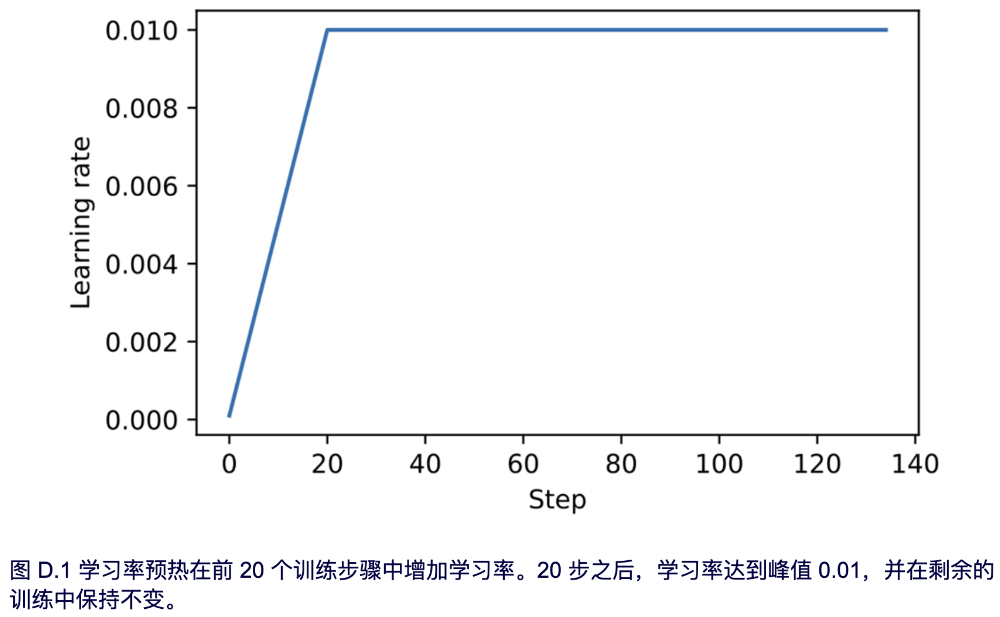
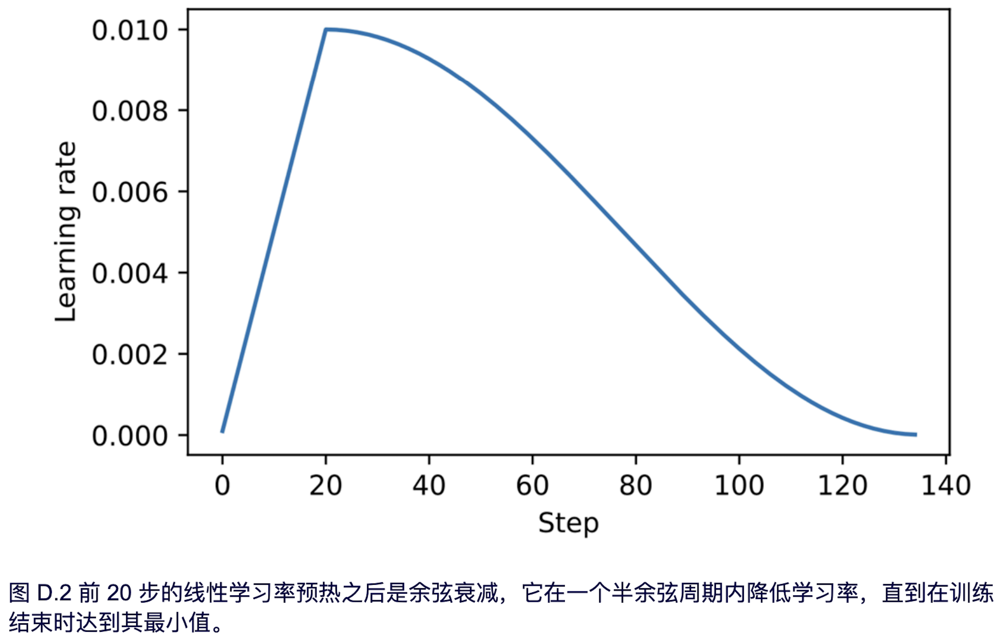

# 附录D. 给训练循环添加高级技巧

- [D.1 学习率预热](#d1-学习率预热)
- [D.2 余弦衰减](#d2-余弦衰减)
- [D.3 梯度裁剪](#d3-梯度裁剪)
- [D.4 修改后的训练函数](#d4-修改后的训练函数)

-----
在本附录中，我们将增强第 5-7 章中介绍过的预训练和微调过程的训练函数。特别是前三部分内容，将涵盖学习率预热、余弦衰减和梯度裁剪等高级技巧。

最后一部分将这些技巧整合到在第 5 章开发的训练函数中，并预训练一个大语言模型 (LLM)。

为使本附录中的代码自成一体，我们重新初始化了在第5章中训练的模型。 

```python
import torch
from previous_chapters import GPTModel

GPT_CONFIG_124M = {
    "vocab_size": 50257, # Vocabulary size
    "ctx_len": 256, # Shortened context length (orig: 1024)
    "emb_dim": 768, # Embedding dimension
    "n_heads": 12, # Number of attention heads
    "n_layers": 12, # Number of layers
    "drop_rate": 0.1, # Dropout rate
    "qkv_bias": False # Query-key-value bias
}
device = torch.device("cuda" if torch.cuda.is_available() else "cpu")
torch.manual_seed(123)
model = GPTModel(GPT_CONFIG_124M)
model.eval()
```

在初始化模型之后，我们还需要初始化第 5 章中使用的 data loader。首先，我们加载短篇小说《The Verdict》：

```python
import os
import urllib.request

file_path = "the-verdict.txt"
url = "https://raw.githubusercontent.com/rasbt/LLMs-from-scratch/main/ch02/01_mainchapter-code/the-verdict.txt"

if not os.path.exists(file_path):
    with urllib.request.urlopen(url) as response:
    		text_data = response.read().decode('utf-8')
    with open(file_path, "w", encoding="utf-8") as file:
    		file.write(text_data)
else:
    with open(file_path, "r", encoding="utf-8") as file:
    		text_data = file.read()
        
# Next, we load the text_data into the data loaders:
from previous_chapters import create_dataloader_v1

train_ratio = 0.90
split_idx = int(train_ratio * len(text_data))
torch.manual_seed(123)
train_loader = create_dataloader_v1(
    text_data[:split_idx],
    batch_size=2,
    max_length=GPT_CONFIG_124M["ctx_len"],
    stride=GPT_CONFIG_124M["ctx_len"],
    drop_last=True,
    shuffle=True
)
val_loader = create_dataloader_v1(
    text_data[split_idx:],
    batch_size=2,
    max_length=GPT_CONFIG_124M["ctx_len"],
    stride=GPT_CONFIG_124M["ctx_len"],
    drop_last=False,
    shuffle=False
)
```

现在我们已经重新实例化了第 5 章中使用的模型和 data loader，接下来一节将介绍我们对训练函数所做的增强。


## D.1 学习率预热

我们介绍的第一个技巧是学习率预热。实施学习率预热可以稳定复杂模型（如 LLM）的训练。这个过程包括将学习率从一个非常低的初始值 (initial_lr) 逐渐增加到用户指定的最大值 (peak_lr)。以较小的权重更新开始训练可以降低模型在其训练阶段遇到大的、不稳定的更新的风险。

假设我们计划以 15 个 epoch 训练一个 LLM，初始学习率为 0.0001，并将其增加到最大学习率 0.01。此外，我们定义了 20 个预热步骤，以便在前 20 个训练步骤中将初始学习率从 0.0001 增加到 0.01：

```python
n_epochs = 15
initial_lr = 0.0001
peak_lr = 0.01
warmup_steps = 20
```

接下来，我们实现一个简单的训练循环模板来演示这个预热过程：

```python
optimizer = torch.optim.AdamW(model.parameters(), weight_decay=0.1)
lr_increment = (peak_lr - initial_lr) / warmup_steps         #A

global_step = -1
track_lrs = []

for epoch in range(n_epochs):                                #B
    for input_batch, target_batch in train_loader:
        optimizer.zero_grad()
        global_step += 1
        
        if global_step < warmup_steps:                       #C
        		lr = initial_lr + global_step * lr_increment
        else:
       		 lr = peak_lr
            
        for param_group in optimizer.param_groups:           #D
        		param_group["lr"] = lr
        track_lrs.append(optimizer.param_groups[0]["lr"])    #E
        
        
#A 此增量决定了在 20 个预热步骤中的每一步，我们将 initial_lr 增加多少。
#B 执行一个典型的训练循环，在每个 epoch 中遍历训练 loader 中的批次。
#C 如果我们仍在预热阶段，则更新学习率。
#D 将计算出的学习率应用于优化器。
#E 在一个完整的训练循环中，损失和模型更新将在此处计算，为了简单起见，本示例中省略了这些。
```

运行上述代码后，我们来可视化学习率是如何被上面的训练循环更改，从而验证学习率预热是否按预期工作：

```python
import matplotlib.pyplot as plt
plt.ylabel("Learning rate")
plt.xlabel("Step")
total_training_steps = len(train_loader) * n_epochs
plt.plot(range(total_training_steps), track_lrs);
plt.show()
```

结果图如图 D.1 所示。



如图 D.1 所示，学习率从一个较低的值开始，并在 20 步内逐步增加，直到在 20 步后达到最大值。

在下一节中，我们将进一步修改学习率，使其在达到最大学习率后下降，这有助于进一步改进模型训练。


## D.2 余弦衰减

另一种广泛应用于训练复杂深度神经网络和 LLM 的技术是余弦衰减。此方法在整个训练周期中调整学习率，使其在预热阶段后遵循余弦曲线。

在其流行的变体中，余弦衰减将学习率降低（或衰减）至接近于零，模仿半个余弦周期的轨迹。余弦衰减中学习率的逐渐降低旨在减缓模型更新其权重的速度。这一点非常重要，因为它有助于最大限度地降低在训练过程中越过最小损失值的风险，这对于确保训练在其后期阶段的稳定性至关重要。

我们可以修改上一节中的训练循环模板，通过以下方式添加余弦衰减：

```python
import math

min_lr = 0.1 * initial_lr
track_lrs = []
lr_increment = (peak_lr - initial_lr) / warmup_steps
global_step = -1

for epoch in range(n_epochs):
    for input_batch, target_batch in train_loader:
        optimizer.zero_grad()
        global_step += 1
        
        if global_step < warmup_steps:
       			lr = initial_lr + global_step * lr_increment
        else:
            progress = ((global_step - warmup_steps) /
                        (total_training_steps - warmup_steps))
            lr = min_lr + (peak_lr - min_lr) * 0.5 * (1 + math.cos(math.pi * progress))
        
        for param_group in optimizer.param_groups:
        		param_group["lr"] = lr
        track_lrs.append(optimizer.param_groups[0]["lr"])
```

同样，为了验证学习率是否按预期变化，我们绘制学习率的变化曲线：

```python
plt.ylabel("Learning rate")
plt.xlabel("Step")
plt.plot(range(total_training_steps), track_lrs)
plt.show()
```

学习率曲线如图 D.2 所示。



如图 D.2 所示，学习率以线性预热阶段开始，在前 20 步内增加，直到在 20 步后达到最大值。在 20 步线性预热之后，余弦衰减开始起作用，逐渐降低学习率，直到达到最小值。


## D.3 梯度裁剪

在本节中，我们将介绍梯度裁剪，这是另一种用于增强 LLM 训练期间稳定性的重要技术。该方法涉及设置一个阈值，当梯度超过该阈值时，会被缩小到预定的最大幅度。这个过程确保了反向传播期间模型参数的更新保持在一个可控的范围内。

例如，在 PyTorch 的 `clip_grad_norm_` 函数中应用 `max_norm=1.0` 设置可以确保梯度的范数不超过 1.0。这里，“范数”一词表示梯度向量在模型参数空间中的长度或大小的度量，具体指的是 L2 范数，也称为欧几里得范数。

用数学术语来说，对于一个由分量组成的向量 v = [v<sub>1</sub>, v<sub>2</sub>, ..., v<sub>n</sub>]，L2 范数描述为：

$$|v|\_{2}=\sqrt{v_{1}^{2}+v_{2}^{2}+\ldots+v_{n}^{2}}$$

这种计算方法也适用于矩阵。例如，考虑以下梯度矩阵：

$$G=\left[\begin{array}{ll}
1 & 2 \\
2 & 4
\end{array}\right]$$

如果我们的目的是将这些梯度裁剪到最大范数 1，可以首先计算这些梯度的 L2 范数，即为：

$$|G|_{2}=\sqrt{1^{2}+2^{2}+2^{2}+4^{2}}=\sqrt{25}=5$$

鉴于 |G|<sub>2</sub> = 5 超过了我们的最大范数 1，我们需缩小梯度以确保它们的范数恰好等于 1。这是通过一个缩放因子实现的，该因子计算为 max_norm/|G|<sub>2</sub> = 1/5。因此，调整后的梯度矩阵 G' 变为：

$$G^{\prime}=\frac{1}{5} \times G\left[\begin{array}{ll}
1 / 1 & 2 / 5 \\
2 / 5 & 4 / 5
\end{array}\right\rceil$$

为了演示这个梯度裁剪过程，我们将首先初始化一个新模型并计算一个训练批次的损失，类似于标准训练循环中的过程：

```python
from previous_chapters import calc_loss_batch
torch.manual_seed(123)
model = GPTModel(GPT_CONFIG_124M)
loss = calc_loss_batch(input_batch, target_batch, model, device)
loss.backward()
```

在调用前面代码片段中的 `.backward()` 方法后，PyTorch 计算损失梯度并将它们存储在每个模型权重（参数）张量的 `.grad` 属性中。

为了便于演示，我们可以定义以下 `find_highest_gradient` 函数，在调用 `.backward()` 之后，通过该函数扫描模型权重张量的所有 `.grad` 属性来识别最高的梯度值：

```python
def find_highest_gradient(model):
    max_grad = None
    for param in model.parameters():
        if param.grad is not None:
            grad_values = param.grad.data.flatten()
            max_grad_param = grad_values.max()
            if max_grad is None or max_grad_param > max_grad:
            		max_grad = max_grad_param
    return max_grad
print(find_highest_gradient(model))
```

以上代码识别出的最大梯度值如下：

```python
tensor(0.0373)
```

现在让我们应用梯度裁剪，它可以通过一行代码来实现，并观察它如何影响最大的梯度值:

```python
torch.nn.utils.clip_grad_norm_(model.parameters(), max_norm=1.0)
print(find_highest_gradient(model))
```

在应用最大范数为 1 的梯度裁剪之后，最大的梯度值比之前小得多：

```python
tensor(0.0166)
```

在下一节中，我们将把本附录中迄今为止涵盖的所有概念付诸实践，并修改 LLM 训练函数。


## D.4 修改后的训练函数

在本附录的最后一部分，我们通过添加之前介绍的三个概念来改进我们在第 5 章中使用的 `train_model_simple` 训练函数：线性预热、余弦衰减和梯度裁剪。这些方法都有助于稳定 LLM 训练。

代码如下，相对于 `train_model_simple` 的改动已进行注释：

```python
from previous_chapters import evaluate_model, generate_and_print_sample

def train_model(model, train_loader, val_loader, optimizer, device, n_epochs,
								eval_freq, eval_iter, start_context, warmup_steps=10,initial_lr=3e-05, min_lr=1e-6):
		train_losses, val_losses, track_tokens_seen, track_lrs = [], [], [], []
		tokens_seen, global_step = 0, -1
    
    peak_lr = optimizer.param_groups[0]["lr"] 						#A
		total_training_steps = len(train_loader) * n_epochs 	#B
		lr_increment = (peak_lr - initial_lr) / warmup_steps	#C
    
    for epoch in range(n_epochs):
        model.train()
        for input_batch, target_batch in train_loader:
            optimizer.zero_grad()
            global_step += 1
            
            if global_step < warmup_steps:                #D
           		 lr = initial_lr + global_step * lr_increment
            else:
                progress = ((global_step - warmup_steps) /
                            (total_training_steps - warmup_steps))
                lr = min_lr + (peak_lr - min_lr) * 0.5 * (
                    1 + math.cos(math.pi * progress))
                
            for param_group in optimizer.param_groups:    #E
               param_group["lr"] = lr
            track_lrs.append(lr)
            loss = calc_loss_batch(input_batch, target_batch, model, device)
            loss.backward()

            if global_step > warmup_steps:                #F
               torch.nn.utils.clip_grad_norm_(model.parameters(), max_norm=1.0)    #G
        
            optimizer.step()
            tokens_seen += input_batch.numel()
            
            if global_step % eval_freq == 0:
                train_loss, val_loss = evaluate_model(
                    model, train_loader, val_loader,
                    device, eval_iter
                )
                train_losses.append(train_loss)
                val_losses.append(val_loss)
                track_tokens_seen.append(tokens_seen)
                print(f"Ep {epoch+1} (Iter {global_step:06d}): "
                			f"Train loss {train_loss:.3f}, Val loss {val_loss:.3f}")
                
    generate_and_print_sample(
        model, train_loader.dataset.tokenizer,
        device, start_context
    )
    
return train_losses, val_losses, track_tokens_seen, track_lrs


#A 从优化器检索初始学习率，假设我们将其用作峰值学习率
#B 计算训练过程中的总迭代次数
#C 计算预热阶段的学习率增量
#D 根据当前阶段（预热或余弦退火）调整学习率
#E 将计算出的学习率应用于优化器
#F 在预热阶段后应用梯度裁剪以避免梯度爆炸
#G 与第 5 章中使用的 train_model_simple 函数相比，此行以下的所有内容保持不变
```

在定义了 `train_model` 函数之后，我们可以使用它来训练模型，用法与第 5 章中的 `train_model_simple` 方法类似：

```python
torch.manual_seed(123)
model = GPTModel(GPT_CONFIG_124M)
model.to(device)
peak_lr = 5e-4
optimizer = torch.optim.AdamW(model.parameters(), weight_decay=0.1)

n_epochs = 15
train_losses, val_losses, tokens_seen, lrs = train_model(
    model, train_loader, val_loader, optimizer, device, n_epochs=n_epochs,
    eval_freq=5, eval_iter=1, start_context="Every effort moves you",
    warmup_steps=10, initial_lr=1e-5, min_lr=1e-5
)
```

在 MacBook Air 或类似的笔记本电脑上，训练大约需要 5 分钟才能完成，并打印以下输出：

```python
Ep 1 (Iter 000000): Train loss 10.934, Val loss 10.939
Ep 1 (Iter 000005): Train loss 8.529, Val loss 8.843
Every effort moves you,,,,,,,,,,,,,,,,,,,,,,,,,,,,,,,,,,,,,,,,,,,,,,,,,,
Ep 2 (Iter 000010): Train loss 6.400, Val loss 6.825
Ep 2 (Iter 000015): Train loss 6.116, Val loss 6.861
Every effort moves you,,,,,,,,,,,,,,,,,,,,,,,,,,,,,,,,,,,,,,,,,,,,,,,,,,
...
the irony. She wanted him vindicated--and by me!" He laughed again, and threw back his
head to look up at the sketch of the donkey. "There were days when I
Ep 15 (Iter 000130): Train loss 0.101, Val loss 6.707
Every effort moves you?" "Yes--quite insensible to the irony. She wanted him
vindicated--and by me!" He laughed again, and threw back his head to look up at the
sketch of the donkey. "There were days when I
```

与第 5 章类似，由于数据集非常小，并且我们对其进行了多次迭代，因此模型在几个 epoch 后开始过拟合。然而，我们可以看到该函数正在工作，因为它最小化了训练集损失。

这里鼓励读者在更大的文本数据集上训练模型，并将使用这种更复杂的训练函数获得的结果与第 5 章中使用的 `train_model_simple` 函数获得的结果进行比较。

