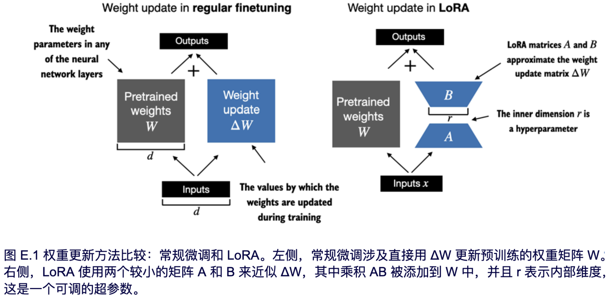
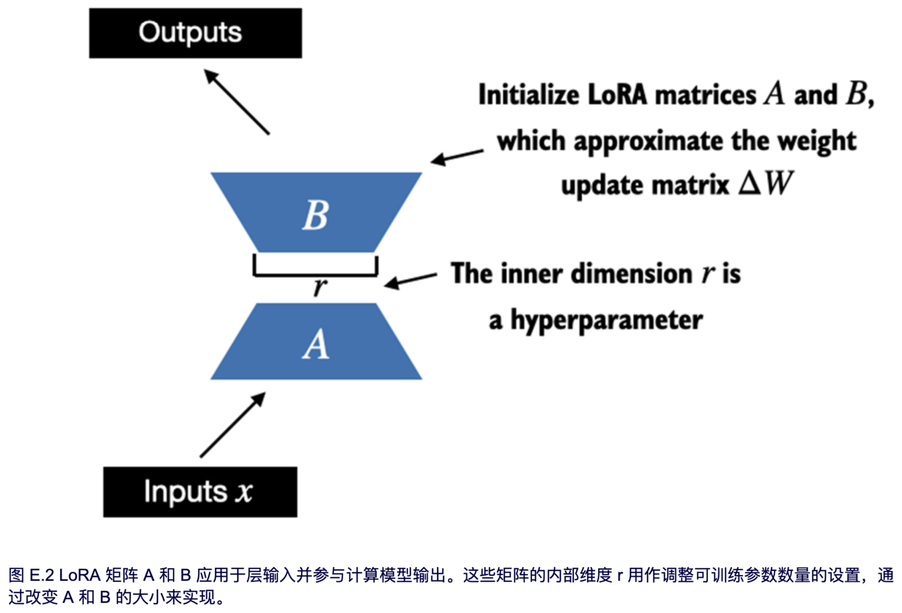
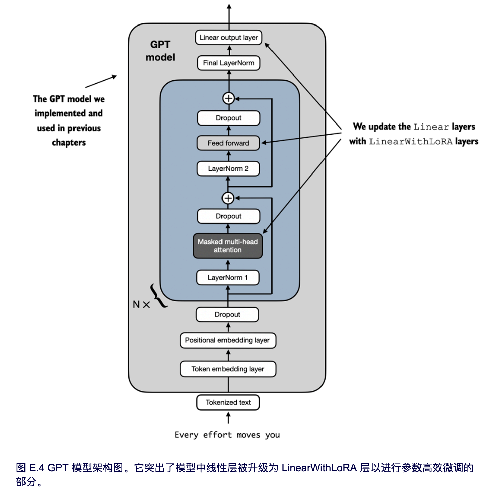
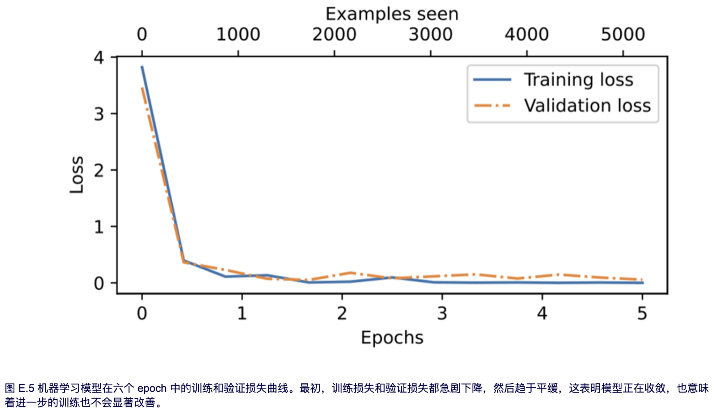

# 附录E. 使用LoRA的参数高效微调

本附录介绍低秩适应 (LoRA)，这是最广泛使用的参数高效微调技术之一。在解释 LoRA 背后的主要思想之后，本附录将基于第 6 章中的垃圾邮件分类微调示例并对 LLM 进行微调。然而，需要注意的是，LoRA 微调也适用于第 7 章中讨论的有监督的指令微调。

-----

- [E.1 LoRA 简介](#e1-lora-简介)
- [E.2 准备数据集](#e2-准备数据集)
- [E.3 初始化模型](#e3-初始化模型)
- [E.4 使用 LoRA 高效微调](#e4-使用-lora-高效微调)

-----

## E.1 LoRA 简介

LoRA，即低秩适应，是一种仅调整模型权重参数的一小部分，就可以让预训练模型更好地适应特定（通常较小）数据集的技术。“低秩”指的是将模型调整限制在总权重参数空间的一个较小维度子空间的数学概念，这有效地捕获了训练期间权重参数变化的最具影响力的方向。

> [!TIP]
>
> **个人思考：** LoRA技术现在用的比较多，我们该怎么理解LoRA，想象你有一个非常厉害的工具箱（预训练模型），里面有很多工具，可以做各种各样的事情。现在你只想用这个工具箱来修自行车（特定任务）。
>
> LoRA 就像是给你的工具箱增加了一些专门用来修自行车的“小工具”（模型的一小部分权重参数）。你不需要把整个工具箱里的工具都换掉或者重新学习怎么使用它们，只需要学会用这些新增的“小工具”就行了。
>
> “低秩”的意思是，这些新增的“小工具”并不是全新的、非常复杂的工具。它们是在已有的工具基础上进行了一些简单的调整或者组合，就能很好地完成修自行车的任务。这就好比你不需要重新发明轮子，只需要给现有的扳手加个特殊的套筒就能拧紧自行车上的螺丝。
>
> 所以，LoRA 的好处就是，它能让预训练模型快速适应新的任务，而且只需要学习和调整很少的“小工具”，这样就更高效、更省资源。

LoRA 方法之所以有用且受欢迎，是因为它能够高效地在特定任务的数据上对大型模型进行微调，从而显著降低了传统微调方法所需的计算成本和资源。

为了解释 LoRA 的工作原理，假设存在一个与特定层相关联的大型权重矩阵 W。LoRA 可以应用于 LLM 中的所有线性层（稍后将会看到），为了说明，我们先关注单个层。

在训练深度神经网络时，在反向传播过程中，我们会学习到一个 ΔW 矩阵，它包含了关于我们如何更新原始权重参数的信息，以便在训练过程中最小化损失函数。在本附录的其余部分，我们将使用术语“权重”作为模型权重参数的简称。

在传统训练和微调中，权重更新矩阵定义如下：

W<sub>updated</sub> = W + ΔW

Hu等人提出的 LoRA 方法 (https://arxiv.org/abs/2106.09685) 提供了一种更有效的计算权重更新ΔW的替代方法，它学习的是ΔW的近似值：
ΔW ≈ AB

其中 A 和 B 是两个远小于 W 的矩阵， AB 表示 A 和 B 之间的矩阵乘法积。使用 LoRA，我们现在可以按如下方式重新定义权重更新矩阵：
W<sub>updated</sub> = W + AB

图 E.1 并排展示了完整微调和 LoRA 的权重更新公式。



如果你仔细观察，你可能会注意到图 E.1 中完整微调和 LoRA 的视觉表示与之前呈现的公式略有不同。这种差异归因于矩阵乘法的分配律，该定律允许我们分离原始权重和更新后的权重，而不是将它们组合在一起。例如，在进行常规微调的情况下，以 x 作为输入数据，我们可以将计算按如下表示:

x ( W + ΔW) = xW + xΔW

同样，我们也可以将 LoRA 按如下表示：

x ( W + AB) = xW + xAB

除了能减少训练期间需要更新的权重数量之外，将 LoRA 权重矩阵与原始模型权重分离的能力使得 LoRA 的实用性更强。这意味着预训练模型的权重可以保持不变，而 LoRA 权重矩阵在训练后使用模型时则可以被动态地应用。

> [!TIP]
>
> **个人思考：** 这段描述的关键在于强调**LoRA 的权重是独立于原始模型权重的**，这带来了很多实际的好处。你可以这样理解：
>
> 想象你已经拥有一个非常庞大的、功能强大的模型，它就像一个已经掌握了很多知识和技能的“超级大脑”。现在你想让这个“超级大脑”专注于解决某个特定的问题，比如识别图片中的猫。
>
> **传统的微调**就像是直接调整这个“超级大脑”内部的很多连接和参数，让它更擅长识别猫。这个过程可能会比较复杂，需要大量的计算资源，而且可能会影响它之前学到的其他知识。
>
> **LoRA 的做法则更聪明：**
>
> 它不是直接修改“超级大脑”原有的结构，而是在它的基础上**增加了一些非常小的、专门用于识别猫的“插件”或者“补丁”**。这些“插件”就是 LoRA 的权重矩阵（A 和 B）。
>
> 关键在于，这些“插件”是**独立**于“超级大脑”本身的核心知识（原始模型权重）的。这意味着：
>
> 1. **原始的“超级大脑”保持不变：** 它仍然拥有之前学到的所有通用知识。你不需要担心为了让它识别猫而忘记了其他技能。
> 2. **“插件”很小，训练起来更快更省资源：** 因为 LoRA 只训练这些新增的“插件”，它们的参数量比原始模型小得多，所以训练起来更快，需要的计算资源也更少。
> 3. **可以灵活地切换任务：** 想象一下，你不仅想让这个“超级大脑”识别猫，还想让它识别狗。使用 LoRA，你可以在同一个原始模型的基础上，训练出另一个专门识别狗的“插件”。当你需要识别猫时，就加载猫的“插件”；需要识别狗时，就加载狗的“插件”。原始的“超级大脑”本身不需要改变。
> 4. **部署和存储更方便：** 因为原始模型很大，而 LoRA 的“插件”很小，所以你只需要存储原始模型一次，然后为不同的任务存储不同的“插件”就可以了，这样可以节省大量的存储空间。

在实践中，将 LoRA 权重分开非常有用，因为它可以在不需要存储 LLM 的多个完整版本的情况下实现模型定制。这显著降低了存储需求并提高了可伸缩性，因为当为每个特定的客户或应用程序定制 LLM 时，只需要调整和保存较小的 LoRA 矩阵。

目前我们已经讨论了 LoRA 的全部内容，在接下来的章节中，让我们看看如何使用它来微调 LLM 以进行垃圾邮件分类，类似于第 6 章中的微调示例。


## E.2 准备数据集

在将 LoRA 应用于第 6 章中的垃圾邮件分类示例之前，我们必须加载将要使用的数据集和预训练模型。

本节中的代码复用了第 6 章中的数据准备工作。（请注意，除了在本节中复用代码之外，我们还可以打开并运行第 6 章的 notebook，然后将 E.4 节中的 LoRA 代码插入到那里。）

首先，我们下载数据集并将其保存为 CSV 文件：

```python
# Listing E.1 Downloading and preparing the dataset

from pathlib import Path
import pandas as pd
from ch06 import (
    download_and_unzip_spam_data,
    create_balanced_dataset,
    random_split
)

url = "https://archive.ics.uci.edu/static/public/228/sms+spam+collection.zip"
zip_path = "sms_spam_collection.zip"
extracted_path = "sms_spam_collection"
data_file_path = Path(extracted_path) / "SMSSpamCollection.tsv"

download_and_unzip_spam_data(url, zip_path, extracted_path, data_file_path)

df = pd.read_csv(data_file_path, sep="\t", header=None, names=["Label", "Text"])
balanced_df = create_balanced_dataset(df)
balanced_df["Label"] = balanced_df["Label"].map({"ham": 0, "spam": 1})

train_df, validation_df, test_df = random_split(balanced_df, 0.7, 0.1)
train_df.to_csv("train.csv", index=None)
validation_df.to_csv("validation.csv", index=None)
test_df.to_csv("test.csv", index=None)
```

接着，我们来创建 `SpamDataset` 实例：

```python
# Listing E.2 Instantiating PyTorch datasets

import torch
from torch.utils.data import Dataset
import tiktoken
from previous_chapters import SpamDataset

tokenizer = tiktoken.get_encoding("gpt2")
train_dataset = SpamDataset("train.csv", max_length=None, tokenizer=tokenizer)
val_dataset = SpamDataset("validation.csv", max_length=train_dataset.max_length,
tokenizer=tokenizer)
test_dataset = SpamDataset("test.csv", max_length=train_dataset.max_length,
tokenizer=tokenizer)
```

在创建 PyTorch 数据集对象之后，我们开始实例化数据加载器：

```python
# Listing E.3 Creating PyTorch data loaders

from torch.utils.data import DataLoader

num_workers = 0
batch_size = 8

torch.manual_seed(123)

train_loader = DataLoader(
    dataset=train_dataset,
    batch_size=batch_size,
    shuffle=True,
    num_workers=num_workers,
    drop_last=True,
)

val_loader = DataLoader(
    dataset=val_dataset,
    batch_size=batch_size,
    num_workers=num_workers,
    drop_last=False,
)

test_loader = DataLoader(
    dataset=test_dataset,
    batch_size=batch_size,
    num_workers=num_workers,
    drop_last=False,
)
```

作为验证步骤，我们遍历数据加载器并检查每个批次是否包含 8 个训练示例，其中每个训练示例包含 120 个 token：

```python
print("Train loader:")
for input_batch, target_batch in train_loader:
		pass
  
print("Input batch dimensions:", input_batch.shape)
print("Label batch dimensions", target_batch.shape)
```

输出如下：

```python
Train loader:
Input batch dimensions: torch.Size([8, 120])
Label batch dimensions torch.Size([8])
```

最后，我们打印每个数据集中的总批次数：

```python
print(f"{len(train_loader)} training batches")
print(f"{len(val_loader)} validation batches")
print(f"{len(test_loader)} test batches")
```

在这种情况下，我们每个数据集拥有的批次数如下：

```python
130 training batches
19 validation batches
38 test batches
```


## E.3 初始化模型

本节将复用第 6 章中的代码来加载和准备预训练的 GPT 模型。我们首先下载模型权重，然后将它们加载到 `GPTModel` 类中：

```python
# Listing E.4 Loading a pretrained GPT model

from gpt_download import download_and_load_gpt2
from previous_chapters import GPTModel, load_weights_into_gpt

CHOOSE_MODEL = "gpt2-small (124M)"
INPUT_PROMPT = "Every effort moves"

BASE_CONFIG = {
    "vocab_size": 50257, # Vocabulary size
    "context_length": 1024, # Context length
    "drop_rate": 0.0, # Dropout rate
    "qkv_bias": True # Query-key-value bias
}

model_configs = {
    "gpt2-small (124M)": {"emb_dim": 768, "n_layers": 12, "n_heads": 12},
    "gpt2-medium (355M)": {"emb_dim": 1024, "n_layers": 24, "n_heads": 16},
    "gpt2-large (774M)": {"emb_dim": 1280, "n_layers": 36, "n_heads": 20},
    "gpt2-xl (1558M)": {"emb_dim": 1600, "n_layers": 48, "n_heads": 25},
}

BASE_CONFIG.update(model_configs[CHOOSE_MODEL])

model_size = CHOOSE_MODEL.split(" ")[-1].lstrip("(").rstrip(")")
settings, params = download_and_load_gpt2(model_size=model_size, models_dir="gpt2")

model = GPTModel(BASE_CONFIG)
load_weights_into_gpt(model, params)
model.eval()
```

为了确保模型已正确加载，让我们再次检查它是否能生成连贯的文本：

```python
from previous_chapters import (
    generate_text_simple,
    text_to_token_ids,
    token_ids_to_text
)

text_1 = "Every effort moves you"

token_ids = generate_text_simple(
    model=model,
    idx=text_to_token_ids(text_1, tokenizer),
    max_new_tokens=15,
    context_size=BASE_CONFIG["context_length"]
)

print(token_ids_to_text(token_ids, tokenizer))
```

如下所示，该模型生成了连贯的文本，这表明模型权重已正确加载：

```python
Every effort moves you forward.
The first step is to understand the importance of your work
```

接着，我们准备模型以进行分类微调，类似于第 6 章那样替换掉输出层：

```python
torch.manual_seed(123)
num_classes = 2
model.out_head = torch.nn.Linear(in_features=768, out_features=num_classes)
device = torch.device("cuda" if torch.cuda.is_available() else "cpu")
model.to(device)
```

最后，让我们计算未微调模型的初始分类准确率（我们预计大概为 50%，这意味着该模型尚无法可靠地区分垃圾邮件和非垃圾邮件）：

```python
from ch06 import calc_accuracy_loader

torch.manual_seed(123)
train_accuracy = calc_accuracy_loader(train_loader, model, device, num_batches=10)
val_accuracy = calc_accuracy_loader(val_loader, model, device, num_batches=10)
test_accuracy = calc_accuracy_loader(test_loader, model, device, num_batches=10)

print(f"Training accuracy: {train_accuracy*100:.2f}%")
print(f"Validation accuracy: {val_accuracy*100:.2f}%")
print(f"Test accuracy: {test_accuracy*100:.2f}%")
```

初始预测准确率如下：

```python
Training accuracy: 46.25%
Validation accuracy: 45.00%
Test accuracy: 48.75%
```


## E.4 使用 LoRA 高效微调

在本节中，我们将使用 LoRA 修改和微调 LLM。我们首先初始化一个 `LoRALayer`，该层会创建矩阵 A 和 B，以及 alpha 缩放因子和秩 (r) 设置。

该层可以接受一个输入并计算相应的输出，如图 E.2 所示。



我们可以通过以下代码来实现图 E.2 中描述的 LoRA 层：

```python
# Listing E.5 Implementing a LoRA layer

import math

class LoRALayer(torch.nn.Module):
    def __init__(self, in_dim, out_dim, rank, alpha):
        super().__init__()
        self.A = torch.nn.Parameter(torch.empty(in_dim, rank))
        torch.nn.init.kaiming_uniform_(self.A, a=math.sqrt(5))      #A
        self.B = torch.nn.Parameter(torch.zeros(rank, out_dim))
        self.alpha = alpha
    
    def forward(self, x):
        x = self.alpha * (x @ self.A @ self.B)
        return x
      
      
#A 使用与 PyTorch 中线性层相同的初始化方式
```

在以上代码中，秩决定了矩阵 A 和 B 的内部维度。本质上，这一设置确定了 LoRA 引入的额外参数的数量，用于在模型的适应性和其效率之间通过使用的参数数量进行平衡。

另一个重要的设置 alpha，用作低秩适应输出的缩放因子。它主要决定了来自适应层的输出对原始层输出的影响程度。这可以看作是一种调节低秩适应对层输出影响的方式。

> [!TIP]
>
> **个人思考：** 关于LoRA的重要设置参数，这里讲的不是很清楚，其实这段话解释了 LoRA 方法中两个非常重要的设置：**秩 (rank)** 和 **Alpha**。可以这样理解它们：
>
> **秩 (Rank):**
>
> + **决定了 LoRA “小工具” 的大小:** 还记得之前我们把 LoRA 比作给预训练模型添加一些专门的“小工具”吗？这里的“秩”就决定了这些“小工具”（更具体地说是矩阵 A 和 B）的内部大小。你可以想象成，秩越大，“小工具”就越复杂，包含的信息就越多。
> + **影响额外学习的参数数量:** 秩越大，LoRA 引入的需要学习的额外参数就越多。反之，秩越小，需要学习的参数就越少。
> + **平衡模型的学习能力和效率:**
>   - **秩高一点:** 模型可以学习到更复杂、更细致的针对特定任务的调整，性能可能会更好。但是，需要学习的参数也更多，训练起来可能更慢，更耗费资源。
>   - **秩低一点:** 模型学习的参数更少，训练速度更快，更节省资源。但是，如果秩太低，模型可能没有足够的“能力”来学习到足够好的调整，导致性能不够理想。
>   - **就像给自行车加辅助轮:** 秩就像辅助轮的大小。大的辅助轮（高秩）更容易保持平衡，但可能不够灵活。小的辅助轮（低秩）更灵活，但可能需要更高的骑行技巧。你需要找到一个合适的平衡点。
>
> **Alpha:**
>
> + **LoRA “小工具” 输出的音量调节器:** Alpha 可以看作是一个调节 LoRA 带来的改变有多大的“音量旋钮”。它是一个数字，用来乘以 LoRA “小工具” 的输出结果。
> + **控制适应层对原始层的影响:** Alpha 的大小决定了 LoRA 学习到的调整对原始模型输出的影响程度。
>   + **Alpha 大一点:** LoRA 带来的改变会更明显，模型会更倾向于学习新的任务。
>   + **Alpha 小一点:** LoRA 带来的改变会更微妙，模型更多地还是依赖于它原本学到的知识，只是做一些微小的调整。
>   + **就像调味品:** Alpha 就像你做菜时放的盐。盐放多了（Alpha 大了），菜的味道变化就大；盐放少了（Alpha 小了），菜的味道变化就小。你需要根据你的口味来调整。
>
> **总结一下：**
>
> + **秩 (Rank)** 决定了 LoRA 可以学习多少新的信息，以及需要多少额外的参数。
> + **Alpha** 决定了 LoRA 学习到的信息对最终结果的影响有多大。
>
> 这两个参数都需要根据具体的任务和模型进行调整，以达到最佳的性能和效率。

我们目前实现的 `LoRALayer` 类使我们能够转换层的输入。

在 LoRA 中，典型的目标是替换现有的线性层，从而允许将权重更新直接应用于预先存在的预训练权重，如图 E.3 所示。


为了集成图 E.3 所示的原始线性层权重，我们现在创建一个 `LinearWithLoRA` 层。该层利用了之前实现的 `LoRALayer`，旨在替换神经网络中现有的线性层，例如 `GPTModel` 中的自注意力模块或前馈模块：

```python
# Listing E.6 A LinearWithLora layer to replace Linear layers

class LinearWithLoRA(torch.nn.Module):
    def __init__(self, linear, rank, alpha):
        super().__init__()
        self.linear = linear
        self.lora = LoRALayer(
            linear.in_features, linear.out_features, rank, alpha
        )

    def forward(self, x):
   		 return self.linear(x) + self.lora(x)
```

前面的代码将一个标准的线性层与 `LoRALayer` 结合在一起。`forward` 方法通过将原始线性层和 LoRA 层的输出相加来计算最终输出。

由于权重矩阵 B（在 `LoRALayer` 中是 `self.B`）被初始化为零值，矩阵 A 和 B 的乘积将得到一个零矩阵。这确保了该乘法不会改变原始权重，因为加零不会改变它们。

为了将 LoRA 应用于之前定义的 `GPTModel`，我们还引入了一个 `replace_linear_with_lora` 函数。该函数会将模型中所有现有的线性层替换为新创建的 `LinearWithLoRA` 层：

```python
def replace_linear_with_lora(model, rank, alpha):
    for name, module in model.named_children():
        if isinstance(module, torch.nn.Linear):               #A
            setattr(model, name, LinearWithLoRA(module, rank, alpha))
        else:                                                 #B
            replace_linear_with_lora(module, rank, alpha)
            
    
#A 将线性层替换为 LinearWithLoRA
#B 将相同的函数递归地应用于子模块
```

我们现在已经实现了所有必要的代码，以将 `GPTModel` 中的线性层替换为新开发的 `LinearWithLoRA` 层，从而实现参数高效微调。在接下来的章节中，我们将把 `LinearWithLoRA` 升级应用于 `GPTModel` 的多头注意力模块、前馈模块和输出层中的所有线性层，如图 E.4 所示。



在我们应用如图 E.4 所示的 `LinearWithLoRA` 层升级之前，我们首先需要冻结原始模型的参数：

```python
total_params = sum(p.numel() for p in model.parameters() if p.requires_grad)
print(f"Total trainable parameters before: {total_params:,}")

for param in model.parameters():
		param.requires_grad = False
    
total_params = sum(p.numel() for p in model.parameters() if p.requires_grad)
print(f"Total trainable parameters after: {total_params:,}")
```

运行代码，可以看到，该模型的所有 1.24 亿个参数现在都不可训练：

```python
Total trainable parameters before: 124,441,346
Total trainable parameters after: 0
```

接着，我们使用 `replace_linear_with_lora` 函数来替换线性层：

```python
replace_linear_with_lora(model, rank=16, alpha=16)
total_params = sum(p.numel() for p in model.parameters() if p.requires_grad)
print(f"Total trainable LoRA parameters: {total_params:,}")
```

添加 LoRA 层后，可训练参数的数量如下：

```python
Total trainable LoRA parameters: 2,666,528
```

如我们所见，使用 LoRA 后，可训练参数的数量减少了近 50 倍。秩和 alpha 一般都默认设置为 16 ，但通常也会增加秩的大小，这从而增加可训练参数的数量。Alpha 通常选择为秩的一半、两倍或相等。

现在可以通过打印模型架构来验证这些层是否已按预期修改：

```python
device = torch.device("cuda" if torch.cuda.is_available() else "cpu")
model.to(device)
print(model)
```

输出如下：

```python
GPTModel(
  (tok_emb): Embedding(50257, 768)
  (pos_emb): Embedding(1024, 768)
  (drop_emb): Dropout(p=0.0, inplace=False)
  (trf_blocks): Sequential(
		...
    (11): TransformerBlock(
    	(att): MultiHeadAttention(
   		 (W_query): LinearWithLoRA(
   			 (linear): Linear(in_features=768, out_features=768, bias=True)
    		 (lora): LoRALayer()
    	 )
      (W_key): LinearWithLoRA(
        (linear): Linear(in_features=768, out_features=768, bias=True)
        (lora): LoRALayer()
      )
      (W_value): LinearWithLoRA(
        (linear): Linear(in_features=768, out_features=768, bias=True)
        (lora): LoRALayer()
      )
      (out_proj): LinearWithLoRA(
        (linear): Linear(in_features=768, out_features=768, bias=True)
        (lora): LoRALayer()
      )
			(dropout): Dropout(p=0.0, inplace=False)
		)
    (ff): FeedForward(
      (layers): Sequential(
        (0): LinearWithLoRA(
          (linear): Linear(in_features=768, out_features=3072, bias=True)
          (lora): LoRALayer()
        )
        (1): GELU()
        (2): LinearWithLoRA(
          (linear): Linear(in_features=3072, out_features=768, bias=True)
          (lora): LoRALayer()
        )
    	)
    )
    (norm1): LayerNorm()
    (norm2): LayerNorm()
    (drop_resid): Dropout(p=0.0, inplace=False)
	 )
 )
 (final_norm): LayerNorm()
 (out_head): LinearWithLoRA(
   (linear): Linear(in_features=768, out_features=2, bias=True)
   (lora): LoRALayer()
 )
)
```

通过输出可以看到，模型现在包含了新的 `LinearWithLoRA` 层，这些层本身包含原始的线性层（我们已将其设置为不可训练）以及我们将要微调的新 LoRA 层。

然而，在开始微调模型之前，我们先计算一下初始分类准确率：

```python
torch.manual_seed(123)
train_accuracy = calc_accuracy_loader(train_loader, model, device, num_batches=10)
val_accuracy = calc_accuracy_loader(val_loader, model, device, num_batches=10)
test_accuracy = calc_accuracy_loader(test_loader, model, device, num_batches=10)

print(f"Training accuracy: {train_accuracy*100:.2f}%")
print(f"Validation accuracy: {val_accuracy*100:.2f}%")
print(f"Test accuracy: {test_accuracy*100:.2f}%")
```

得到的准确率值如下：

```python
Training accuracy: 46.25%
Validation accuracy: 45.00%
Test accuracy: 48.75%
```

如果将这些准确率与第 6 章中的初始值进行比较，我们会发现它们是相同的。这是因为我们将 LoRA 矩阵 B 初始化为零。因此，矩阵 AB 的乘积得到一个零矩阵。这确保了在开始微调之前，该乘法不会改变原始权重，因为加零不会改变它们。

现在，让我们进入激动人心的部分，使用第 6 章中的训练函数来微调模型。在 M3 MacBook Air 笔记本电脑上，训练大约需要 15 分钟；而在 V100 或 A100 GPU 上，则不到半分钟：

```python
# Listing E.7 Finetuning a model with LoRA layers

import time
from ch06 import train_classifier_simple

start_time = time.time()
torch.manual_seed(123)
optimizer = torch.optim.AdamW(model.parameters(), lr=5e-5, weight_decay=0.1)

num_epochs = 5
train_losses, val_losses, train_accs, val_accs, examples_seen = train_classifier_simple(
    model, train_loader, val_loader, optimizer, device,
    num_epochs=num_epochs, eval_freq=50, eval_iter=5,
    tokenizer=tokenizer
)

end_time = time.time()
execution_time_minutes = (end_time - start_time) / 60
print(f"Training completed in {execution_time_minutes:.2f} minutes.")
```

在训练过程中可以看到如下输出：

```python
Ep 1 (Step 000000): Train loss 3.820, Val loss 3.462
Ep 1 (Step 000050): Train loss 0.396, Val loss 0.364
Ep 1 (Step 000100): Train loss 0.111, Val loss 0.229
Training accuracy: 97.50% | Validation accuracy: 95.00%
Ep 2 (Step 000150): Train loss 0.135, Val loss 0.073
Ep 2 (Step 000200): Train loss 0.008, Val loss 0.052
Ep 2 (Step 000250): Train loss 0.021, Val loss 0.179
Training accuracy: 97.50% | Validation accuracy: 97.50%
Ep 3 (Step 000300): Train loss 0.096, Val loss 0.080
Ep 3 (Step 000350): Train loss 0.010, Val loss 0.116
Training accuracy: 97.50% | Validation accuracy: 95.00%
Ep 4 (Step 000400): Train loss 0.003, Val loss 0.151
Ep 4 (Step 000450): Train loss 0.008, Val loss 0.077
Ep 4 (Step 000500): Train loss 0.001, Val loss 0.147
Training accuracy: 100.00% | Validation accuracy: 97.50%
Ep 5 (Step 000550): Train loss 0.007, Val loss 0.094
Ep 5 (Step 000600): Train loss 0.000, Val loss 0.056
Training accuracy: 100.00% | Validation accuracy: 97.50%
    
    
Training completed in 12.10 minutes.  
```

请注意，使用 LoRA 训练模型比第 6 章中不使用 LoRA 训练模型花费更长的时间，因为 LoRA 层在正向传播过程中引入了额外的计算。然而，对于更大的模型，当反向传播的成本变得更高时，模型使用LoRA训练的速度通常比不使用LoRA更快。

可以看到，该模型获得了完美的训练准确率和非常高的验证准确率。我们还可以将损失曲线可视化，以更好地观察训练是否已经收敛。

```python
from ch06 import plot_values

epochs_tensor = torch.linspace(0, num_epochs, len(train_losses))
examples_seen_tensor = torch.linspace(0, examples_seen, len(train_losses))

plot_values(epochs_tensor, examples_seen_tensor, train_losses, val_losses, label="loss")
```

结果如图 E.5 所示。



除了基于图 E.5 中显示的损失曲线评估模型外，我们还要计算在完整训练集、验证集和测试集上的准确率（在训练过程中，我们通过 `eval_iter=5` 设置从 5 个批次中近似计算了训练集和验证集的准确率）：

```python
from previous_chapters import calc_accuracy_loader

train_accuracy = calc_accuracy_loader(train_loader, model, device)
val_accuracy = calc_accuracy_loader(val_loader, model, device)
test_accuracy = calc_accuracy_loader(test_loader, model, device)

print(f"Training accuracy: {train_accuracy*100:.2f}%")
print(f"Validation accuracy: {val_accuracy*100:.2f}%")
print(f"Test accuracy: {test_accuracy*100:.2f}%")
```

最终得到的准确率值如下：

```python
Training accuracy: 100.00%
Validation accuracy: 96.64%
Test accuracy: 98.00%
```

最终得到的准确率表明，该模型在训练集、验证集和测试集上都表现良好。训练准确率达到 100%，表明该模型已完美地学习了训练数据。然而，略低的验证集和测试集准确率（分别为 96.64% 和 97.33%）表明存在轻微的过拟合，因为与训练集相比，该模型在新数据上的泛化能力稍差。总的来说，考虑到我们只微调了相对较少数量的模型权重（270 万个 LoRA 权重，而不是原来的 1.24 亿个模型权重），这个结果已经非常不错。


